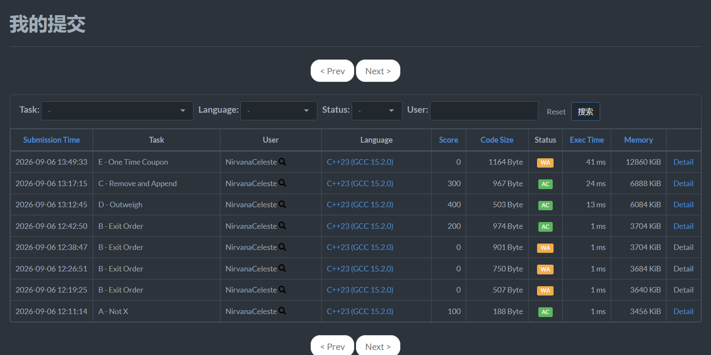
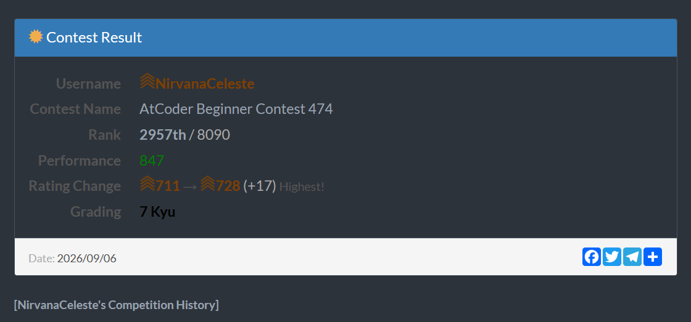

军训熬夜过后的第二天中午不睡觉打的，直接开始犹如蟒蛇缠绕般的窒息感。还是太菜了，代码调试能力依托。

## A
https://atcoder.jp/contests/abc474/tasks/abc474_a

> 给定一个正整数 $x$（$1 \le x \le 3$），如果 $x = 1$ 输出 $2$，否则输出 $1$。

**输入**

输入一个整数 $x$。

**输出**

输出一个整数。

```cpp
#include <bits/stdc++.h>
using namespace std;
const int maxn = 102;
int x;

//1h39min
int main(){
	cin>>x;
	if(x==1) cout<<2;
	if(x==2) cout<<1;
	if(x==3) cout<<1;
	return 0;
}
```
/*
比赛时 1 小时 39 分钟完成。直接判断输出即可。
*/

## B
https://atcoder.jp/contests/abc474/tasks/abc474_b

> 电影院有 $n$ 个座位（编号 $1$ 到 $n$），每个座位坐一位客人。按拥挤对策规则退场：按座位号从小到大每 $10$ 人分成一组（最后一组可能不足 $10$ 人）；座位号小的组先退场，**同组内的退场顺序任意**。已知第 $i$ 个退场的客人坐座位 $P_i$，判断整场退场是否可能符合规则。

**输入**

第一行包含整数 $n$（$10 \le n \le 100$）。
第二行包含 $n$ 个整数 $P_i$，保证是 $1$ 到 $n$ 的排列。

**输出**

符合规则输出 `Yes`，否则输出 `No`。

```cpp
#include <bits/stdc++.h>
using namespace std;
#define ll long long
const int maxn = 110;
int n;
int p[maxn];
void solve(){
	int cnt = 0,minn = maxn,maxx = 0;
	for(int i=1;i<=n;i++){
		if(cnt == 10) cnt = 0,minn = maxn,maxx = 0;
		cnt++;
		if(minn > p[i]) minn = p[i];
		if(maxx < p[i]) maxx = p[i];
		if(maxx - minn >= 10){
			cout<<"No";
			return;
		}
	}
	cout<<"Yes";
	return;
}
//1h 31min solve
//1h 24min solve2
//1h 13min solve2
//1h 08min solve2
void solve2(){
	for(int i=1;i*10<=n;i++) sort(p+1+(i-1)*10,p+1+i*10);
//	if(n%10 != 0) sort(p+1+(n/10)*10+1,p+1+n);我是猪
	if(n%10 != 0) sort(p+1+(n/10)*10,p+1+n);
//	for(int i=2;i<=n;i++){
//		if(p[i] < p[i-1]){
//			cout<<"No";
//			return;
//		}
//	}
	for(int i=1;i<=n;i++){
		if(p[i] != i){
			cout<<"No";
			return;
		}
	}
	cout<<"Yes";
	
}
int main(){
	ios::sync_with_stdio(false);
	cin.tie(0);
	cin>>n;
	for(int i=1;i<=n;i++) cin>>p[i];
	solve2();
	return 0;
}
```
/*
赛时写了多个版本，最终使用 solve2。合法 ⟺ 把退场序列 $P$ 按顺序切成每段 $10$ 个（最后一段取剩余），每段排序后恰好拼成 $1,2,\dots,n$——组内是「对应座位区间」的排列、组间按区间递增。
几把，排序边界写错了，solve1没有保证检测每一块是否按照值的大小来排序
*/

## C
https://atcoder.jp/contests/abc474/tasks/abc474_c

> 给定一个长度为 $n$ 的排列 $p$ 和 $q$ 次操作。每次操作给定一个数 $a$，表示将元素 $a$ 从排列中取出并追加到**末尾**。求最终排列。

**输入**

第一行包含两个整数 $n, q$（$1 \le n, q \le 2 \times 10^5$）。
第二行包含 $n$ 个整数 $p_i$，保证是一个排列。
接下来 $q$ 行，每行一个整数 $a$。

**输出**

输出最终的排列。

```cpp
#include <bits/stdc++.h>
using namespace std;
#define ll long long
const int maxn = 2e5+1;
//set<int> s;
int n,q,a,now;
int ans[maxn];
int id[maxn],tv[maxn];
//直接模拟肯定会超时 O(n^2*q)
//思考 怎么利用排列的特殊性质? 好像优化不了
//通过提示想到不关心数组中间态 只关心结果
//49min 开始 写不出来 跳过去写D
//35min 在帮助下完成
struct node{
    int vlu,tim;
}p[maxn];
//bool cmp(const node &x,const node &y){if(x.tim != y.tim){return x.tim<y.tim;}}

int main(){
    ios::sync_with_stdio(false);
    cin.tie(0);
    cin>>n>>q;
    for(int i=1;i<=n;i++) cin>>now,p[i].vlu = now,p[i].tim = 0,id[now] = i;
    for(int i=1;i<=q;i++) cin>>a,p[id[a]].tim = i;
    for(int i=1;i<=n;i++) if(p[i].tim > 0) tv[p[i].tim] = p[i].vlu;
    for(int i=1;i<=n;i++) if(p[i].tim == 0) cout<<p[i].vlu<<' ';
    for(int t=1;t<=q;t++) if(tv[t] != 0) cout<<tv[t]<<' ';
    cout<<'\n';
    return 0;
}
```
/*
49 分钟开始写，写不出来跳去写 D，35 分钟在帮助下完成。直接模拟会超时，正确思路是：记录每个元素最后一次被查询的时间。未被查询的元素保持原顺序输出，被查询过的元素按查询时间先后输出。
这个映射超级费时间。
*/

## D
https://atcoder.jp/contests/abc474/tasks/abc474_d

> 高桥和青木都收集石头，共 $n$ 种；第 $i$ 种石头每一颗重量相同。高桥有 $A_i$ 颗第 $i$ 种，青木有 $B_i$ 颗。请确定是否存在正整数重量序列 $W=(W_1,\dots,W_N)$（$1 \le W_i \le 10^{18}$），使得**高桥石头的总重量严格大于**青木的总重量；存在则构造一组，否则输出 `No`。

**输入**

第一行包含整数 $n$（$1 \le n \le 10^5$）。
第二行包含 $n$ 个整数 $A_i$，第三行包含 $n$ 个整数 $B_i$（$0 \le A_i, B_i \le 10^9$）。

**输出**

无解输出 `No`；有解第一行输出 `Yes`，第二行输出 $n$ 个整数 $W_i$。

```cpp
#include <bits/stdc++.h>
using namespace std;
#define ll long long
const int maxn = 1e5+1;
int n,cnt;
ll w[maxn],a[maxn],b[maxn];

//简单构造 写的超级快 贪心一下即可
//38min
int main(){
	ios::sync_with_stdio(false);
	cin.tie(0);
	cin>>n;
	for(int i=1;i<=n;i++) cin>>a[i];
	for(int i=1;i<=n;i++) cin>>b[i];
	for(int i=1;i<=n;i++){
		if(a[i] <= b[i]) cnt++,w[i] = 1;
		else w[i] = 1e18;
	}
	if(cnt == n) cout<<"No";
	else{
		cout<<"Yes"<<'\n';
		for(int i=1;i<=n;i++) cout<<w[i]<<' ';
	}
	return 0;
}
```
/*
跳过C先写的D，也许是昨天晚上全是构造题的拷打？赛时 38 分钟完成，简单构造。若所有 $a_i \le b_i$，差值恒 $\le 0$，无解；否则 $a_i > b_i$ 的位置取 $w_i = 10^{18}$ 放大正差，其余取 $w_i = 1$ 压小负差，高桥的总重必严格大于青木。
*/

## E
https://atcoder.jp/contests/abc474/tasks/abc474_e

> 商店里有 $n$ 种商品，每种可以**购买任意多次**。第 $i$ 种商品有两种买法：不使用优惠券，花 $A_i$ 元购买，同时**获得一张优惠券**；或使用一张优惠券，花 $B_i$ 元购买（$B_i < A_i$）。初始一张优惠券也没有。每种商品至少买一次，求最小总花费。

**输入**

每个测试点包含多个测试用例。第一行包含整数 $t$（$1 \le t \le 10^4$）— 测试用例数。
每个测试用例第一行包含整数 $n$（$1 \le n \le 2 \times 10^5$）。
接下来 $n$ 行，每行两个整数 $a_i, b_i$。
所有测试用例的 $n$ 之和不超过 $2 \times 10^5$。

**输出**

对于每个测试用例，输出一个整数表示最小总花费。

---

**解题思路（赛时，事后证明是错的）**：

这道题赛时想复杂了。第一种思路试图用贪心模拟，但逻辑混乱。这个公式漏了一个关键自由度：**商品可以买任意多次**——可以反复购买 $A$ 最便宜的商品刷优惠券。以样例 1 为例（$(A,B)$ = $(11,6),(6,5),(2,1),(8,3),(7,4)$，答案 $23$）：枚举公式的最优是 $24$；正解 $23$ 省下的 $1$ 来自「第 5 种不付 $A_5=7$，改成再买一次第 3 种（$A=2$）刷一张券、再花 $B_5=4$ 用券买」，$2+4=6<7$。正确建模必须允许「补票刷券」，赛时公式和事后贪心都没过。
最后也没写对，服了，AI不可靠啊，我的思路其实是把a和b混合排序之后，简单贪心，判断一段可行区间（包括所有人）是否满足票够不够用(A的数量>=B的数量),可惜没时间了

**代码一**：

```cpp
#include <bits/stdc++.h>
using namespace std;
#define ll long long
const int maxn = 2e5+1;
int n,t;
ll ans;
bool pd[maxn];
struct A{
	ll vlu,id;
}a[maxn];
struct B{
	ll vlu,id;
}b[maxn];
bool cmp1(const A &x,const A &y){return x.vlu<y.vlu;}
bool cmp2(const B &x,const B &y){return x.vlu<y.vlu;}
//贪心的想 尽可能用优惠券 如果买 A 尽可能买便宜的 
//关键在于 有 a 和 b 混合计算的时候贪心逻辑不明确
//想想 正面的贪心不好想 有没有二分判断？
//不对，的确有一种简单的贪心,不对 不能仅仅简单的按照a b旦增去买 因为实际上是在找出尽可能单增的 a,b片段拼合到一起 而且还要满足优惠券；
//哦！！ 实际上我们不关心购买顺序 只要券的数量满足即可
//想想怎么去描述这个想法
//6min 在帮助下写出
void solve(){
	sort(a+1,a+1+n,cmp1);
		sort(b+1,b+1+n,cmp2);
	int cnt = 0,quan = 0,i = 1,j = 1;
		while(cnt < n){
			cout<<n<<" qwq "<<cnt<<'\n';
			if(quan){
				while(j <= n && pd[b[j].id]) j++;
				if(j <= n) ans += b[j].vlu,pd[b[j].id] = 1,j++,cnt++,quan = 0;
			}else{
				while(i <= n && pd[a[i].id]) i++;
				if(i <= n) ans += a[i].vlu,pd[a[i].id] = 1,j++,cnt++,quan++;
			}
		}
}
int main(){
	ios::sync_with_stdio(false);
	cin.tie(0);
	cin>>t;
	while(t--){
		ans = 0;
		cin>>n;
		memset(pd,0,sizeof(pd));
		for(int i=1;i<=n;i++) cin>>a[i].vlu>>b[i].vlu,a[i].id = i,b[i].id = i;
		
//		ll l = 0,r = LLONG_MAX,mid;
//		while(l <= r){
//			mid = l + (r - l) / 2;
//			if(check(mid)) ans = mid,r = mid - 1;
//			else l = mid + 1;
//		}
		
		cout<<ans<<'\n';
	}
	return 0;
}
```

**代码二**：

```cpp
#include <bits/stdc++.h>
using namespace std;
#define ll long long
const int maxn = 2e5+5;
int n,t;
ll ans;
struct Node{
    ll a,b;
}p[maxn];

void solve(){
    vector<ll> A(n+1), B(n+1);
    for(int i=1;i<=n;i++){
        A[i] = p[i].a;
        B[i] = p[i].b;
    }
    sort(A.begin()+1, A.end());
    sort(B.begin()+1, B.end());
    
    // 前缀和
    vector<ll> preA(n+1,0), preB(n+1,0);
    for(int i=1;i<=n;i++){
        preA[i] = preA[i-1] + A[i];
        preB[i] = preB[i-1] + B[i];
    }
    
    ll ans = LLONG_MAX;
    // x: 原价购买的商品数，也是用券购买的商品数
    for(int x = (n+1)/2; x <= n; x++){
        ans = min(ans, preA[x] + preB[x]);
    }
    cout << ans << '\n';
}

int main(){
    ios::sync_with_stdio(false);
    cin.tie(0);
    cin>>t;
    while(t--){
        cin>>n;
        for(int i=1;i<=n;i++){
            cin>>p[i].a>>p[i].b;
        }
        solve();
    }
    return 0;
}
```
/*
赛时 6 分钟在帮助下完成。分别排序 a 和 b，枚举 x 从 ceil(n/2) 到 n，取 preA[x] + preB[x] 的最小值。思路：选择 x 个商品原价，x 个商品用券，并集覆盖全部 n 个商品。
*/

## F
https://atcoder.jp/contests/abc474/tasks/abc474_f

```cpp
#include <bits/stdc++.h>
using namespace std;
#define ll long long
const int maxn = 102;

int main(){
	ios::sync_with_stdio(false);
	cin.tie(0);
	
	return 0;
}
```

## G
https://atcoder.jp/contests/abc474/tasks/abc474_g

```cpp
#include <bits/stdc++.h>
using namespace std;
#define ll long long
const int maxn = 102;

int main(){
	ios::sync_with_stdio(false);
	cin.tie(0);
	
	return 0;
}
```