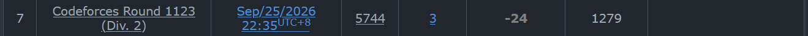
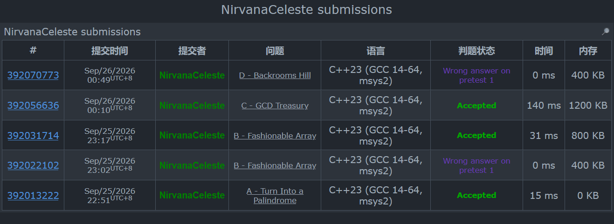

比赛时间：2026-09-25 22:35 ~ 00:50（UTC+8，共 2h15min）｜排名 5631｜rating 1303 → 1279（−24）

**做题情况**

- 22:51 A 过（开局 16 min）
- 23:02 B WA 一发，看错题了
- 23:17 B 过
- 00:10 C 过（卡了五十来分钟）
- 00:49 D 剩 15 秒压哨交一发，WA on pretest 1
- E 之后题面都没点开（下面 E~G 的题面是复盘时补档的）

熬大夜连打。D 方向全对贪心写挂，一分没捞着还倒扣 24。赛后拿样例实测了两个修法都不对，坑记在 D 那里。

## A. Turn Into a Palindrome
https://codeforces.com/contest/2267/problem/A

> Ali 有一个长度为 $n$ 的小写字符串 $s$，还有一个固定的小写字母 $c$。花一枚硬币可以把任意一个位置的字符替换成 $c$。求把 $s$ 变成回文串所需的最少硬币数。

**输入**

第一行包含整数 $t$（$1 \le t \le 500$）— 测试用例数。
每个测试用例第一行包含整数 $n$ 和字母 $c$（$1 \le n \le 100$）。
第二行是长度为 $n$ 的字符串 $s$。

**输出**

对于每个测试用例，输出最少硬币数。

**思路**：

一对一对看。$s_i$ 和 $s_{n-i-1}$ 相等就跳过；不相等的时候，有一个已经是 $c$ 就改另一个，$1$ 枚；都不是 $c$ 就俩全改成 $c$，$2$ 枚。奇数长度中间那个字符不用管。签到题，过。

```cpp
#include <bits/stdc++.h>
using namespace std;
#define ll long long
const int maxn = 1e5+1;
int n,t;
char c;
string s;
int ans;

//总时间 2h 15 min 剩余时间 1h 58 min

void solve(){
	for(int i=0;i<=((n&1)?n/2:n/2-1);i++){
		if(i == n-i-1) break;
		if(s[i] == s[n-i-1]) continue;
		if(s[i] == c || s[n-i-1] == c) ans += 1;
		else ans += 2;
	}
	return;
}

int main(){
	ios::sync_with_stdio(false);
	cin.tie(0);
	cin>>t;
	while(t--){
		cin>>n;
		cin>>c;
		cin>>s;
		ans = 0;
		solve();
	//	if(n & 1) for(int i=0;i<=n/2;i++) ans += ((s[i] == c || s[n-i] == c) ? ((s[i] == s[n-i]) ? 0 : 1) : ((s[i] == s[n-i]) ? 0 : 2));
	//	else for(int i=0;i<n/2;i++) ans += ((s[i] == c || s[n-i] == c) ? ((s[i] == s[n-i]) ? 0 : 1) : ((s[i] == s[n-i]) ? 0 : 2));
		cout<<ans<<'\n';
	}
	return 0;	
}
```
/*
22:51 AC，开局 16 分钟。
*/

## B. Fashionable Array
https://codeforces.com/contest/2267/problem/B

> 定义数组的**众数**为出现次数最多的数；若并列，取其中最大的那个（$[1,1,2]$ 的众数是 $1$，$[3,4]$ 的众数是 $4$）。给定数组 $a$，可以任意重排，使**所有前缀的众数之和**最大。输出一种最优的排列。

**输入**

第一行包含整数 $t$（$1 \le t \le 500$）— 测试用例数。
每个测试用例第一行包含整数 $n$（$1 \le n \le 100$）。
第二行包含 $n$ 个整数 $a_i$（$1 \le a_i \le 100$）。

**输出**

对于每个测试用例，输出重排后的数组（任意一组最优解）。

**思路**：

最大值塞第一个，这样后面每个前缀的众数都不会超过它。剩下的按「轮」摆：每轮把还剩的所有不同值从大到小各放一个。第一轮大家都是一次，前缀众数一直是已出现的最大值；后面每轮大值先把次数巩固上去，并列的时候众数取最大还是它。$[1,1,2,3,4,4]$ 摆成 $4\ 3\ 2\ 1\ 4\ 1$，每个前缀的众数全是 $4$。

```cpp
#include <bits/stdc++.h>
using namespace std;
#define ll long long
const int maxn = 1e5+1;
int n,t;
int a[maxn],b[maxn];
long long ans;

//总时间 2h 15 min 剩余时间 1h 32 min
//看错题目糖逼

void solve(){
//	map<int,int> check;
	int tot[101];
	memset(tot,0,sizeof(tot));
	for(int i=n;i>=1;i--){
//		check[a[i]]++;
//		auto it = check.lower_bound({101,101});
//		ans += it->second;
		tot[a[i]]++;
		int maxx = 0,tmp = 0;
		for(int i=1;i<=100;i++) if(maxx <= tot[i]) maxx = tot[i],tmp = i;
		ans += tmp;
	}
	return;
}

void solve2(){
	int cnt = 0,last = 0;
	int vis[101];
	memset(vis,0,sizeof(vis));
	for(int i=1;i<=n;i++){
		bool ok = 0;
		last = 0;
		for(int j=n;j>=1;j--){
//			if(vis[a[j]] <= i) ok = 1,b[++cnt] = a[j],vis[a[j]]++;
			if(vis[j] || last == a[j]) continue;
			ok = 1;
			vis[j] = 1;
			last = a[j];
			b[++cnt] = a[j];
//			cout<<a[j]<<' ';
		}
		if(!ok) break;
	}
	return;
}

int main(){
	ios::sync_with_stdio(false);
	cin.tie(0);
	cin>>t;
	while(t--){
		cin>>n;
		for(int i=1;i<=n;i++) cin>>a[i];
		sort(a+1,a+1+n);
//		ans = 0;
//		solve();
//		cout<<ans<<'\n';
		solve2();
//		for(int i=n;i>=1;i--) cout<<a[i]<<' ';
		for(int i=1;i<=n;i++) cout<<b[i]<<' ';
		cout<<'\n';
	}
	return 0;	
}
```
/*
23:02 WA：把题看成了输出那个最大的和，代码里注释掉的 solve() 就是错误理解的产物。重读题发现要输出排列本身，23:17 重写 solve2 过。看错题白给一发罚时，糖逼。
*/

## C. GCD Treasury
https://codeforces.com/contest/2267/problem/C

> 有 $n$ 堆金币，第 $i$ 堆有 $a_i$ 枚；海盗 Dimash 手里还有一个数 $x$。不断重复：选一个满足 $a_i > 0$ 且 $\gcd(a_i, x) \ne 1$ 的堆，设 $g = \gcd(a_i, x)$，从这堆里**恰好偷走 $g$ 枚**，然后令 $x \leftarrow g$；不存在合法的堆时被迫停下。求最多能偷多少枚。

**输入**

第一行包含整数 $t$（$1 \le t \le 10^4$）— 测试用例数。
每个测试用例第一行包含整数 $n$ 和 $x$（$1 \le n, x \le 3 \times 10^5$）。
第二行包含 $n$ 个整数 $a_i$（$1 \le a_i \le 3 \times 10^5$），所有测试用例的 $n$ 之和不超过 $3 \times 10^5$。

**输出**

对于每个测试用例，输出最多能偷走的金币总数。

**思路**：

一开始想硬模拟，但是偷几次之后 x 变、a[i] 也变，根本不知道会走到哪。

注意到一个东西就通了：每次偷走的都是当前 x（叫它 u）的倍数，所以第 i 堆的当前值和初始值模 u 同余，那新 x = gcd(当前a[i], u) = gcd(初始a[i], u)；又因为 u 一定是初始 x 的因子，gcd(初始a[i], u) = gcd(gcd(初始a[i], 初始x), u)。也就是说预处理出 g[i] = gcd(a[i], x)，后面整个流程只跟这些 g 走，跟 a[i] 偷剩多少没有关系。

哪些 u 可达？从初始 x 开始，每次抓一个 g 出来 gcd 一下，变出来的数 > 1 就接着抓，BFS 把可达集合全找出来。停在每个 u 上的时候，u 的倍数堆都能反复偷到空（偷 u 之后堆还是 u 的倍数，x 也还是 u）。

最后算每个 u 偷多少：u 一定是某个 g 的因子，把 sum[g] 枚举因子摊到 w[d] 上，w[u] 就是 u 的倍数堆的金币总和。答案 = 可达的 u>1 里 w[u] 的最大值。好难，主要是同余那一步想不到。

```cpp
#include <bits/stdc++.h>
using namespace std;
#define ll long long
const int maxn = 3e5+1;
int n,x,t;
int a[maxn];
map<int, ll> sum; //所有gcd=g币总和
map<int, ll> w;   //所有d|a[i]币总和？
vector<int> gs;   //所有不同的g？
set<int> reach;   //可达的？当前x值
queue<int> q;

//总时间 2h 15 min 剩余时间 40 min 好难

//首先想 对于现在的x或者说g 我们把所有金币中的关于g的倍数拿走是不影响g而且还最优的
//你们关键在于怎么寻找下一个x或者说g
//喵的 好瞌睡
//我们想到gcd的性质 这题一直在多次gcd 那么他其实是若干个数共同的gcd
//猜想 可以通过预处理来提前对这些数字进行分类？
//如果当前手里的数叫 u 对第 i 堆操作后新的 x 是 gcd(当前的 a[i], u)
//但是当前的 a[i] 和初始的 a[i] 模 u 是同余的 因为之前偷走的都是 u 的倍数
//所以 gcd(当前a[i], u) = gcd(初始a[i], u)
//又因为 u 一定是初始 x 的因子 所以 gcd(初始a[i], u) = gcd(gcd(初始a[i], 初始x), u)
//令 g[i] = gcd(a[i], x) 那么新的 x 就是 gcd(u, g[i])
//这样就不用管当前 a[i] 变成多少了 只看预处理的 g 就行？
//嘶 但是这有什么用？
//如果最终停在 d 那么所有 d 的倍数堆都能被偷完 因为 gcd(a[i], d)=d 偷 d 后 a[i] 还是 d 的倍数 x 还是 d
//这和我们一开始想的一样 能反复偷直到清空
//怎么去想哪些 d是相互可达的？ 他们之间影响什么？
//为什么有可达性？
//好困

//注意到！！从初始 x 出发 每次可以跳到 gcd(当前u, g[i]) 因为 g[i] 是固定的 所以能到达的 u 都是 x 的因子 
//到底怎么知道哪些 u 是可达的？？？
//我们可以从 x 开始 每次拿一个 g 去 gcd 一下 看看能变出什么新数
//变出来的数如果 >1 就说明还能继续偷 就继续拿去 gcd
//这个过程一直重复 直到没有新数出现为止
//BFS？
//如果停在 u 那 u 的倍数堆都能偷完
//那怎么算 u 的倍数堆一共有多少金币
//暴力的想直接对每个 u 扫一遍 a[i] 看能不能整除 但这样太慢了
//然后发现 u 一定是某个 g 的因子 而 g 是 gcd(a[i],x)
//d|a[i] 且 d|x 等价于 d|gcd(a[i],x)=g
//所以只要枚举 g 的因子 d 把 sum[g] 加到 w[d] 上！！！！！！！！！
//这样 w[d] 就是所有 d 的倍数堆的金币总和了
//那答案不就是所有可达的 u>1 里面 w[u] 最大的那个吗
//妈呀 好难好难 TWTWTWT

int gcd(int a,int b){return a%b==0? b:gcd(b,a%b);}

int main(){
	ios::sync_with_stdio(false);
	cin.tie(0);
	
	cin>>t;
	while(t--){
		cin>>n>>x;
		for(int i=1;i<=n;i++) cin>>a[i];
		sum.clear();
		w.clear();
		gs.clear();
		reach.clear();
		while(!q.empty()) q.pop();
		
		for(int i=1;i<=n;i++) sum[gcd(a[i], x)] += a[i];
		for(auto p : sum) gs.push_back(p.first);
		for(auto p : sum){
			int g = p.first;
			ll s = p.second;
			for(int d=1; d*d<=g; d++){
				if(g % d == 0){
					w[d] += s;
					if(d * d != g) w[g/d] += s;
				}
			}
		}
		
		reach.insert(x);
		q.push(x);
		while(!q.empty()){
			int u = q.front();
			q.pop();
			for(int g : gs){
				int v = gcd(u, g);
				if(v > 1 && !reach.count(v)){
					reach.insert(v);
					q.push(v);
				}
			}
		}
		
		ll ans = 0;
		for(int u : reach) if(u > 1) ans = max(ans, w[u]);
		cout<<ans<<'\n';
	}
	return 0;	
}
```
/*
00:10 AC，正好剩 40 分钟。全场最磨人的一题，从没头绪到 BFS 想通用了一个小时不到，同余那步想通之前一直在绕。细节都在代码注释里。
*/

## D. Backrooms Hill
https://codeforces.com/contest/2267/problem/D

> 若存在 $k$（$1 \le k \le m$）使数组 $b$ 的前 $k$ 个元素严格递增、后 $m-k+1$ 个元素严格递减，则称 $b$ 为**山丘（hill）**数组。给定 $1 \sim n$ 的一个排列 $a$，每次操作可以交换 $a_i$ 与 $a_{i+2}$（$1 \le i \le n-2$），次数不限。判断能否把 $a$ 变成山丘数组。

**输入**

第一行包含整数 $t$（$1 \le t \le 10^4$）— 测试用例数。
每个测试用例第一行包含整数 $n$（$1 \le n \le 2 \times 10^5$）。
第二行包含 $n$ 个不同的整数 $a_i$（$1 \le a_i \le n$），所有测试用例的 $n$ 之和不超过 $2 \times 10^5$。

**输出**

对于每个测试用例，输出 `YES` 或 `NO`。

**思路**：

交换距离是 2，所以奇数位的数只能在奇数位里面换，偶数位同理（冒泡排序的结论，打的第一场 CF 的 T3 就用过）。拆成奇偶两个数组分别排序。

峰值肯定是全局最大值，k 的奇偶直接被最大值在哪个集合定死。左边严格递增，从两个集合最小的开始交错取；右边严格递减，去掉峰值之后从最大开始交错取，起始集合跟 k 的奇偶走。预处理出两边最长能取多长，枚举合法奇偶的 k，O(1) 判断完事。

方向是对的，挂在贪心上——而且赛后实测没有想象中好修，见下面。

```cpp
#include <bits/stdc++.h>
using namespace std;
#define ll long long
const int maxn = 1e5+1;
int n,t;
int a[maxn];
vector<int> o,e;
vector<int> o2,e2;  //去掉峰值的奇偶
int mx;
bool mxinodd;       //峰值是否来自奇

//总时间 2h 15 min 剩余时间 1 min 压哨

//这个D看起来就比C要好写 我们能不能去枚举每一个 k 然后分别对两个子数组
//(因为相邻交换可以视为冒泡排序 这个结论我在打的第一场CF T3就写出来了)进行两个方向的排序 然后合并到一起来判断可不可以？
//但是这个时间复杂度似乎是超的 O(n^2logn)？
//能不能用堆排序去优化这个过程？这样每次插入一个新元素就是logn的 但是问题在于没法快速获取排好序的元素 和 删除一个元素
//除非手写四个堆么?
//还是说通过一次数据结构的预处理（树状数组 线段树存当前的排名？）来优化这个排序的过程？
//好难 呜呜呜呜呜 我想睡觉 已经0:21了 还在医院旁边
//哦还有 当前美剧的k鸡还是偶也会影响答案的判断 这里需要分类讨论一下
//莫非真的要手写四个堆吗 我真想不出来其他解法了
//先把数组拆分 然后在美剧k 然后再分四段排序 然后再合并 是否可行？
//等一下 好像不需要拆成四段 他们不能随便排吗 那不两段直接分开拍一次 然后再美剧k的时候直接正着读取前k哥 然后倒着读取后k个
//等一下 为什么一定要整段整段的操作呢 我们为什么不用两个指针来枚举奇偶两个段的情况？哦 好像是需要满足k的原因
//不对啊 双指针不也可以满足这个吗？
//妈的 好困
//！！其实只要拆成奇偶两段分别排序就够了
//因为交换i和i+2只能同奇偶互换 所以奇数位元素只能在奇数位重排 偶数位同理
//那峰值k的奇偶必须和全局最大值所在集合一致 不然峰值就放不到k上
//左侧要严格递增 那就从最小的开始交错取(奇位取o 偶位取e 或者反)
//右侧要严格递减 那就从最大的开始交错取 但注意去掉峰值
//两种起始奇偶对应k的奇偶 预处理出最长长度 然后枚举k O(1)判断

int main(){
	ios::sync_with_stdio(false);
	cin.tie(0);
	
	cin>>t;
	while(t--){
		cin>>n;
		o.clear(); e.clear();
		for(int i=1;i<=n;i++){
			cin>>a[i];
			if(i&1) o.push_back(a[i]);
			else e.push_back(a[i]);
		}
		sort(o.begin(),o.end());
		sort(e.begin(),e.end());
		mx = max(o.back(), e.back());
		mxinodd = (o.back() == mx);
		
		//左侧:从小往大交错取 最长严格递增长度
		int maxleft = 0;
		{
			int i=0, j=0;
			int pre = INT_MIN;
			int pos = 1;
			while(1){
				int cur;
				if(pos&1){
					if(i>=(int)o.size()) break;
					cur = o[i++];
				}else{
					if(j>=(int)e.size()) break;
					cur = e[j++];
				}
				if(cur <= pre) break;
				pre = cur;
				maxleft++;
				pos++;
			}
		}
		
		o2.clear(); e2.clear();
		if(mxinodd){
			o2.assign(o.begin(), o.end()-1);
			e2 = e;
		}else{
			o2 = o;
			e2.assign(e.begin(), e.end()-1);
		}
		
		//右侧第一个是奇 k为偶
		int maxrighta = 0;
		int i=(int)o2.size()-1, j=(int)e2.size()-1;
		int pre = INT_MAX;
		bool turnodd = true;
		while(1){
			int cur;
			if(turnodd){
				if(i<0) break;
				cur = o2[i--];
			}else{
				if(j<0) break;
				cur = e2[j--];
			}
			if(cur >= pre) break;
			pre = cur;
			maxrighta++;
			turnodd = !turnodd;
		}
		
		//右侧第一个是偶 k为奇
		int maxrightb = 0;
		int i2=(int)o2.size()-1, j2=(int)e2.size()-1;
		int pre2 = INT_MAX;
		bool turnodd2 = false;
		while(1){
			int cur;
			if(turnodd2){
				if(i2<0) break;
				cur = o2[i2--];
			}else{
				if(j2<0) break;
				cur = e2[j2--];
			}
			if(cur >= pre2) break;
			pre2 = cur2;
			maxrightb++;
			turnodd2 = !turnodd2;
		}	
		
		bool ok = false;
		int startk = mxinodd ? 1 : 2;// k的奇偶和峰值一致
		for(int k=startk;k<=n;k+=2){//注意这里是k+2 峰值 k的奇偶必须和最大值一致 所以 k 只能取一种奇偶!!!!!!!!!!!
			int L = k-1,R = n-k;
			if(L > maxleft) continue;
			if(k&1){
				if(R <= maxrightb) ok = true;
			}else{
				if(R <= maxrighta) ok = true;
			}
			if(ok) break;
		}
		cout<<(ok?"YES":"NO")<<'\n';
	}
	return 0;	
}
```
/*
00:49 剩 15 秒压哨交的，WA on pretest 1。赛后拿样例实测：样例 3（5 3 4 6 2 1，答案 YES）输出 NO——贪心交错取数的时候，当前集合下一个接不上不该直接 break。但是把 break 改成集合内跳过之后，样例 3 过了、样例 7 又输出 YES（答案 NO）：左右两条贪心链是抢同一批元素的，各自算最长再拼起来不行。正解得让两边一起划分元素，留坑待补。
*/

## E. Clean Substrings
https://codeforces.com/contest/2267/problem/E

> 称长度为 $m$ 的二进制串 $t$ 是**干净的（clean）**，若 $t_i = t_{i+1}$ 对所有 $1 \le i < m$ 成立（即整串字符相同）。机器人花一枚硬币可以执行一次操作：选 $t$ 的任意一个**干净子串**，把其中所有字符取反（$0 \leftrightarrow 1$）。定义 $t$ 的**美丽值**为把它变成干净串所需的最少硬币数；定义 $t$ 的**能量**为它**所有子串**的美丽值之和。给定长度为 $n$ 的二进制串 $s$ 和 $q$ 次修改，每次把某个 $s_i$ 取反。求修改前和每次修改后的 $s$ 的能量。

**输入**

第一行包含整数 $t$（$1 \le t \le 10^4$）— 测试用例数。
每个测试用例第一行包含整数 $n$ 和 $q$（$1 \le n, q \le 2 \times 10^5$）。
第二行是二进制串 $s$。
接下来 $q$ 行每行一个整数 $i$（$1 \le i \le n$）。所有测试用例的 $n$、$q$ 之和均不超过 $2 \times 10^5$。

**输出**

对于每个测试用例，输出 $q + 1$ 个数 — 修改前和每次修改后的能量。

```cpp
#include <bits/stdc++.h>
using namespace std;
#define ll long long
const int maxn = 1e5+1;
int n,t;

//总时间 2h 15 min 剩余时间 2h 15 min

int main(){
	ios::sync_with_stdio(false);
	cin.tie(0);
	
	cin>>t;
	while(t--){
		cin>>n;
		
	}
	return 0;	
}
```

## F1. XOR Transformations (Easy Version)
https://codeforces.com/contest/2267/problem/F1

> 定义数组 $b$（$m$ 个数）的一次**变换**：写出所有 $b_i \oplus b_j$（$1 \le i < j \le m$，$\oplus$ 为按位异或），取其中最小的 $m$ 个替换原数组。例如 $[6, 7, 8, 9, 15]$ 的两两异或是 $1,1,6,7,8,9,14,14,15,15$，取最小的 $5$ 个后变成 $[1,1,6,7,8]$。给定 $n$ 个非负整数组成的数组 $a$，$q$ 次询问，每次给一个 $x$：求数组做 $x$ 次变换后的 $\max(a) - \min(a)$。询问相互独立（每次询问前数组恢复原状）。

**输入**

第一行包含整数 $t$（$1 \le t \le 100$）— 测试用例数。
每个测试用例第一行包含整数 $n$ 和 $q$（$5 \le n \le 2000$，$1 \le q \le 2000$）。
第二行包含 $n$ 个非负整数 $a_1, \dots, a_n$。

**输出**

对于每次询问，输出对应的 $\max(a) - \min(a)$。

```cpp
#include <bits/stdc++.h>
using namespace std;
#define ll long long
const int maxn = 1e5+1;
int n,t;

//总时间 2h 15 min 剩余时间 2h 15 min

int main(){
	ios::sync_with_stdio(false);
	cin.tie(0);
	
	cin>>t;
	while(t--){
		cin>>n;
		
	}
	return 0;	
}
```

## F2. XOR Transformations (Hard Version)
https://codeforces.com/contest/2267/problem/F2

> 题意与 F1 完全相同，只是 $n$、$q$ 的范围更大。

**输入**

第一行包含整数 $t$（$1 \le t \le 10^4$）— 测试用例数。
每个测试用例第一行包含整数 $n$ 和 $q$（$5 \le n \le 10^5$，$1 \le q \le 10^5$）。
第二行包含 $n$ 个非负整数 $a_1, \dots, a_n$。

**输出**

对于每次询问，输出对应的 $\max(a) - \min(a)$。

```cpp
#include <bits/stdc++.h>
using namespace std;
#define ll long long
const int maxn = 1e5+1;
int n,t;

//总时间 2h 15 min 剩余时间 2h 15 min

int main(){
	ios::sync_with_stdio(false);
	cin.tie(0);
	
	cin>>t;
	while(t--){
		cin>>n;
		
	}
	return 0;	
}
```

## G. New LRT
https://codeforces.com/contest/2267/problem/G

> 城市新开了一条轻轨，沿一条直线运行。给定 $n$、$m$ 和一个由 $m$ 个整数组成的数组 $c$。你从位置 $0$ 出发，要去位置 $n$：在位置 $i$ 时，可以选任意满足 $m \,\&\, x = x$ 的正整数 $x$（$\&$ 为按位与），移动到 $i + x$，支付 $c_x$ 枚硬币。一次**旅行**指从 $0$ 到 $n$ 的完整移动过程，移动顺序或移动本身不同即为不同的旅行。求所有可能旅行的总代价之和，对 $10^9 + 7$ 取模。

**输入**

第一行包含整数 $t$（$1 \le t \le 10^4$）— 测试用例数。
每个测试用例第一行包含整数 $n$ 和 $m$（$1 \le n, m < 2^{20}$）。
第二行包含 $m$ 个整数 $c_1, \dots, c_m$（$1 \le c_i \le 10^9$）。
保证所有测试用例的 $n$ 之和与 $m$ 之和均不超过 $2^{20}$。

**输出**

对于每个测试用例，输出答案对 $10^9 + 7$ 取模。

```cpp
#include <bits/stdc++.h>
using namespace std;
#define ll long long
const int maxn = 1e5+1;
int n,t;

//总时间 2h 15 min 剩余时间 2h 15 min

int main(){
	ios::sync_with_stdio(false);
	cin.tie(0);
	
	cin>>t;
	while(t--){
		cin>>n;
		
	}
	return 0;	
}
```
