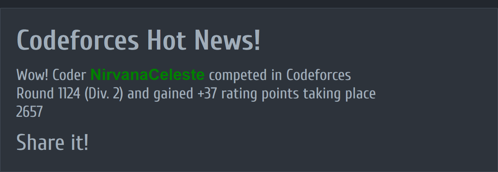
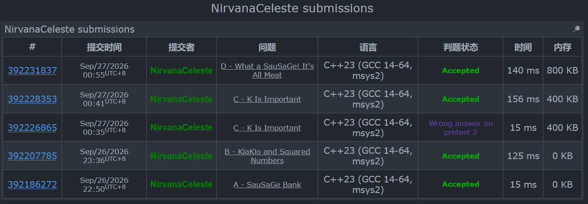

比赛时间：2026-09-26 22:35 ~ 01:05（UTC+8，共 2h30min）｜排名 2613｜rating 1279 → 1316（+37）

昨晚刚掉 24 分，今晚场子就找回来了：A~D 四题全过（C WA 了一发），排名 2613，+37。唯一不爽的是 A 被机翻的中文题面坑了一手，读错题写慢——以后还是老老实实读英文原题。

## A. SauSaGe Bank
https://codeforces.com/contest/2269/problem/A

> Hamed 往银行里存了 $1$ 元。每一天依次发生：**早上**余额翻倍；**晚上**他可以选择取走全部余额（取走后账户立刻重置为 $1$ 元，第二天继续翻倍），也可以不取。银行只开 $n$ 天，他要**恰好**在 $k$ 个不同的晚上取钱。求第 $n$ 天结束后卡上最多的钱数（留在银行里的钱作废）。

**输入**

第一行包含整数 $t$（$1 \le t \le 500$）— 测试用例数。
每个测试用例一行两个整数 $n$ 和 $k$（$1 \le k \le n \le 30$）。

**输出**

对于每个测试用例，输出卡上金额的最大值。

**数学推导**：

前 $n-k$ 个晚上忍住不取，余额一路翻倍到 $2^{n-k+1}$，第 $n-k+1$ 个晚上全部取走；剩下 $k-1$ 个晚上按「重置为 $1$ → 早上翻倍成 $2$ → 取走 $2$」循环，每天稳拿 $2$。答案 $= 2^{n-k+1} + 2(k-1)$。本质上是 $2^x$ 的增长在 $x \ge 3$ 时严格吊打「每天取 $2$」的线性积累。

```cpp
#include <bits/stdc++.h>
using namespace std;
#define ll long long
const int maxn = 1e5+1;
int n,k,t;
long long ans;

//总时间 2h 30 min 剩余时间 2h 14 min
//2^x <= 2*x
//被傻逼翻译坑了 读错题目写慢
//糖逼还挑了一会代码 我是猪


void pre(){
	for(int i=0;i<=30;i++) if((1 << i) <= 2 * i) cout<<i<<' ';
	return;
}

int main(){
//	pre();
	ios::sync_with_stdio(false);
	cin.tie(0);
	cin>>t;
	while(t--){
		cin>>n>>k;
		ans = 0;
//		ans = ((1LL * 1) << (n - k + 1));
		ans = ((1LL * 1) << (n - k + 1));
//		ans += 2*k;
		ans += 2*(k-1);
		cout<<ans<<'\n';
	}
	return 0;	
}
```
/*
22:50 AC，开局 15 分钟。被机翻题面坑了几分钟读错题，不然能更快。
*/

## B. KiaKio and Squared Numbers
https://codeforces.com/contest/2269/problem/B

> 有 $n$ 座灯塔，第 $i$ 座今晚显示数字 $a_i$。每一夜所有灯塔同时把显示的数替换成**各位数字的平方和**（例如 $23 \to 2^2+3^2=13$），永远进行下去。两座灯塔 $i, j$ 称为**合拍**的，如果存在某夜之后它们每晚显示的数完全相同（比如 $2$ 和 $20$ 合拍：第一夜都变成 $4$；而 $4$ 和 $2$ 不合拍：进了同一个圈但相位错开，永远对不齐）。数出合拍的无序对 $(i, j)$（$i < j$）的数量。

**输入**

第一行包含整数 $t$（$1 \le t \le 1000$）— 测试用例数。
每个测试用例第一行包含整数 $n$（$1 \le n \le 1000$）。
第二行包含 $n$ 个整数 $a_i$（$1 \le a_i \le 10^9$），所有测试用例的 $n$ 之和不超过 $1000$。

**输出**

对于每个测试用例，输出合拍的无序对数量。

**数学推导**：

迭代「各位平方和」很快就会进入不动点 $1$，或者那个著名的圈 $4 \to 16 \to 37 \to 58 \to 89 \to 145 \to 42 \to 20 \to 4$。两座灯塔合拍 $\iff$ 足够多步之后显示的数相同（同圈且同相位）。$a_i \le 10^9$，迭代一次后值 $\le 9 \times 81 = 729$，打表发现收敛轮数最多 $20$ 左右——保险起见统一迭代 $20000$ 次，然后统计每个最终值的出现次数 $cnt$，答案 $= \sum \binom{cnt}{2}$。

```cpp
#include <bits/stdc++.h>
using namespace std;
#define ll long long
const int maxn = 1001;
int n,t;
ll a[maxn];
ll ans;
int vlu[10] = {0,1,4,9,16,25,36,49,64,81};

//总时间 2h 30 mn 剩余时间 1h 27 min
//可以轻松的证明除非是个位数 每一次绝对是减少的 因为十进制的幂次 大于乘以 0-9
//好像不对 再想想 先尝试写个打表程序 看看最大的重复轮数是多少？
//1 h 43 min 暂时跳过
//中间还糖逼了 用了C的样例看了半天才发现
//

inline ll nxt(ll x){
	ll now = 0;
	while(x){
		now += vlu[x%10];
		x /= 10;
	}
	return now;
}
void pre(){
//	bool vis[1000000001];
	int cnt = 0,maxx = 0;
	for(int i=0;i<=1000000000;i++){
//		memset(vis,0,sizeof(vis));
		unordered_map<int,int> check;
		check.clear();
		cnt = 0;
		int now = i;
		while(!check[now]){
			check[now] = 1;
//			now = nxt(i);唐比打表还花这么久时间调代码
			now = nxt(now);
//			cout<<now<<' '<<((vis[now])?"YES":"NO")<<'\n';
			cnt++;
			maxx = max(cnt,maxx);	
		}
		
		if(i%100000 == 0) cout<<maxx<<'\n';//发现是20？？ 是否存在溢出的可能？
	
//		cout<<i<<" qwq : ";
//		for(int j=0;j<=100000;j++) if(vis[j]) cout<<j<<' ';
//		cout<<'\n';	
	}
	cout<<maxx;
	return;
}

int main(){
	
//	pre();

	ios::sync_with_stdio(false);
	cin.tie(0);
	cin>>t;
	while(t--){
		cin>>n;
		for(int i=1;i<=n;i++) cin>>a[i];
		for(int i=1;i<=20000;i++){//打表发现基本上都是20 这里保险起见用了 20000 O(20000*1000)
			for(int j=1;j<=n;j++){
//				a[i] = nxt(a[i]);
				a[j] = nxt(a[j]);
			}
		}
//		for(int i=1;i<=n;i++) cout<<a[i]<<' ';
//		cout<<" qwq "<<'\n';
		ans = 0;//这里一开始忘写了 调了一小会
		unordered_map<ll,int> tot;
		for(int i=1;i<=n;i++) tot[a[i]]++;
		for (auto& it : tot){
//			if(it->second == 1) continue;
			int now = it.second;
			if(now == 1) continue;
			else if(now == 2) ans++;
//			else ans += (now - 1) * now / 4;
			else ans += (now - 1) * now / 2;
		}
		cout<<ans<<'\n';
	}
	return 0;	
}
```
/*
23:36 AC。中间自己坑了自己一把：调试时拿 C 题的样例输入看了半天才发现不对。打表程序（pre()）也调了半天，菜。
*/

## C. K Is Important
https://codeforces.com/contest/2269/problem/C

> 给定长度为 $n$ 的正整数数组 $a$ 和参数 $k$。只要数组长度 $m \ge k$，就必须执行一次操作：删除第 $k$ 个元素或第 $m-k+1$ 个元素（$m$ 为操作前的长度），被删元素的值计入得分，剩余元素保持相对顺序。求最大得分。

**输入**

第一行包含整数 $t$（$1 \le t \le 10^4$）— 测试用例数。
每个测试用例第一行包含整数 $n$ 和 $k$（$1 \le k \le n \le 10^5$）。
第二行包含 $n$ 个整数 $a_i$（$1 \le a_i \le 10^9$），所有测试用例的 $n$ 之和不超过 $10^5$。

**输出**

对于每个测试用例，输出最大得分。

**数学推导**：

$k = 1$ 时两头随便删，可以全删光，答案就是总和。$k \ge 2$ 时最后会剩下 $k-1$ 个数。

**第一次尝试（WA）**：猜「剩下的 $k-1$ 个数在原数组里是连续的一段」，于是总得分 = 总和 − 长度 $k-1$ 的最小滑动窗口和。交上去 WA——剩下的数其实**不一定是连续段**（删除的位置是「当前第 $k$ 个 / 第 $m-k+1$ 个」，两个端点向中间推进的过程中可以交错穿插）。

**第二次尝试（AC）**：不想证明了，直接暴力加数据结构：树状数组维护每个位置是否还在，$O(\log n)$ 求出当前第 $k$ 个和第 $m-k+1$ 个元素的位置，每次贪心删掉两端候选中较大的那个。一把过。

```cpp
#include <bits/stdc++.h>
using namespace std;
#define ll long long
const int maxn = 1e5+1;

int n,k,t;
int a[maxn];
ll ans;

//总时间 2h 30 min 剩余时间 14 min
//有一个暴力的想法 既然 要满足 m > k 那么 每一次减的时候左和右不会相交（想象左面连续k个之后开始往右数 和 右面连续k个开始往左数 直到两端相遇 是候选数字）
//进一步想 就是确定中间那连续一段的删除情况呗 就是 如果能删的话(m > k) 那么就是初始的a[k]到a[m-k+1]？
//不对 因为是在删除的 所以实际上中间的数在扩张？
//不对 就是一开始就固定的 因为你删一个数之后 m 也变小了 
//同时注意到 不管怎么删 中间那一段全部删完就是最优的 
//不对 这个是一种特殊的情况 正好删除完一次中间段之后有最优解
//比如说
/*
6 2
1 4 8 2 6 3
*/
/*
6 1
1 4 8 2 6 3
*/
//不对 我还想想复杂了 我之前想的是中间段不管怎么删都可以删完 然后 k = m 但是实际上k = m也可以删
//所以实际上答案就是 中间段 加上 max(最后k = m 的时候 左右端点 哪个最大)
//好简单的问题。。。感觉比B简单多了
//哦 注意到有时候减一次中间段还不够 那就一直减直到
//不对 我好像想到了 这样会漏掉答案
//因为你中间段得选取好像是会影响最终的 左右端点取值的
//一个直接的思路是预处理前缀和然后枚举中间段的位置
//不过这样需要证明这道题目的操作等价于枚举任意（合法的）中间串
//有两个问题：1.怎么证明等价 2.什么是合法的
//突然发现一开始其实说错了 左和右其实会相交 但是不用想了 因为我现在思路和一开始不一样
//等一下这个题是不是没那么复杂 好像双指针就可以？关键在于说明双指针贪心是最优的选取 但是似乎每一次的选取都有后有效性
//思考 如果删到k = m了 那么此刻左右两端的元素其实就是一开始的元素 而由于删除这个操作的性质 导致删除的元素在原来的数组中其实正好是连续一段的
/*
9 3
1 2 (3) 4 5 6 (7) 8 9（只模拟删除这个过程）
1 2 (4) 5 6 (7) 8 9
1 2 (4) 5 (6) 8 9
1 2 (4) (5) 8 9
1 2 (4) 8 9
1 (2) (8) 9
(1) 2 (9)
*/
//所以直到删到k == m+1为止 左右两个指针位置互不影响 中间段和一开始想的一样 是确定的
//直到两个指针相遇 之后 两个指针互相影响
//k 也不小 如果后面强行美剧的话时间复杂度很大
//嘶 怎么做
//剩余时间 51 min
//整理一下思路 就是 两个指针相遇之前 这个删的顺序肯定是不变的 即 m > k*2-1 的时候
//等一下！
//留下 k-1 个数，使它们的和最小？
//换个角度，既然所有数都是正数
//最大化答案 等价于 最小化最后留下的数?
//因为所有数都是正数所以最大化答案等价于最小化最后剩下的数的和？？？可以这么等价吗？
//长度为 m 可以删除第 k 个或者第 m-k+1 个
//不断操作直到长度小于 k
//所以最终一定剩下 k-1 个数
//删除的位置始终来自两端向中间推进
//因此最后留下来的 k-1 个数在原数组中一定是连续的一段
//找一个长度为 k-1 的连续区间使区间和最小
//答案 就是 总和 - 最小区间和
//挑了半天发现！！
//k=1 时最终剩余 0 个数答案就是全部删除
//还是不对！！！ 剩余时间 27 min
//


void solve2(){
	if(k == 1){
		for(int i=1;i<=n;i++) ans += a[i];
		return;
	}
	ll sum = 0;
	for(int i=1;i<=n;i++) sum += a[i];
	int len = k-1;
	ll cur = 0;
	for(int i=1;i<=len;i++) cur += a[i];
	ll tmp = cur;
	for(int i=len+1;i<=n;i++){
		cur += a[i];
		cur -= a[i-len];
		tmp = min(tmp,cur);
	}
	ans = sum - tmp;
	return;
}

void solve1(){
	if(k > n) ans = 0;
	else{
		for(int i=k;i<=n-k+1;i++) ans += a[i];
		if(k > 1) ans += max(a[k-1],a[n-k+2]);
	}
	return;
}

int main(){
	ios::sync_with_stdio(false);
	cin.tie(0);
	cin>>t;
	while(t--){
		cin>>n>>k;
		for(int i=1;i<=n;i++) cin>>a[i];
		ans = 0;
//		solve1();
		solve2();
		cout<<ans<<'\n';
	}
	return 0;
}
```

```cpp
#include <bits/stdc++.h>
using namespace std;
#define ll long long
const int maxn = 1e5+1;

int n,k,t;
int a[maxn];
ll ans;

//妈的 暴力加数据结构 不管了
//29 min

struct BIT{
	int n;
	int t[maxn];

	void add(int x,int v){
		while(x<=n){
			t[x]+=v;
			x += x&(-x);
		}
	}

	int kth(int k){
		int x=0;
		for(int i=20;i>=0;i--){
			int y=x+(1<<i);
			if(y<=n&&t[y]<k){
				x=y;
				k-=t[y];
			}
		}
		return x+1;
	}
};

void solve2(){
	BIT bit{};
	if(k==1){
		for(int i=1;i<=n;i++) ans+=a[i];
		return;
	}
	bit.n=n;
	for(int i=1;i<=n;i++) bit.add(i,1);
	int m=n;
	while(m>=k){
		int l=bit.kth(k),r=bit.kth(m-k+1);
		if(a[l]>=a[r]){
			ans+=a[l];
			bit.add(l,-1);
		}else{
			ans+=a[r];
			bit.add(r,-1);
		}
		m--;
	}
	return;
}

int main(){
	ios::sync_with_stdio(false);
	cin.tie(0);
	cin>>t;
	while(t--){
		cin>>n>>k;
		for(int i=1;i<=n;i++) cin>>a[i];
		ans = 0;
		solve2();
		cout<<ans<<'\n';
	}
	return 0;
}
```
/*
00:35 滑窗版 WA，00:42 树状数组贪心版 AC。教训：「剩下的数是连续一段」这种关键结论要么证完再写，要么像第二次这样直接暴力加数据结构兜底。
*/

## D. What a SauSaGe! It's All Meat
https://codeforces.com/contest/2269/problem/D

> 有 $n$ 种口味的香肠，第 $i$ 种有 $a_i$ 根（$a_i < 16$）。可以进行任意多次（可以为零）如下操作：选下标 $i$（$1 \le i < n$）和整数 $k$（$1 \le k \le 5$），令 $a_i \leftarrow a_i \oplus 3k$、$a_{i+1} \leftarrow a_{i+1} \oplus 3k$（$3k \in \{3,6,9,12,15\}$）。一种口味是 **All-Meat** 的当且仅当它的数量是 $3$ 的倍数。另有 $q$ 次修改，每次把某个 $a_p$ 改成 $x$（永久生效）。在初始时和每次修改后各回答一次：最优操作下 All-Meat 口味数量的最大值（操作是假设性的，不跨询问保留）。

**输入**

第一行包含整数 $t$（$1 \le t \le 10^4$）— 测试用例数。
每个测试用例第一行包含整数 $n$ 和 $q$（$2 \le n \le 2 \times 10^5$，$0 \le q \le 2 \times 10^5$）。
第二行包含 $n$ 个整数 $a_i$（$0 \le a_i < 16$）。
接下来 $q$ 行每行两个整数 $p$ 和 $x$（$0 \le x < 16$）。所有测试用例的 $n$、$q$ 之和均不超过 $2 \times 10^5$。

**输出**

对于每个测试用例，输出 $q+1$ 个整数 — 初始时和每次修改后的答案。

**数学推导**：

$3k \in \{3, 6, 9, 12, 15\}$，写成二进制是 $0011, 0110, 1001, 1100, 1111$——**$1$ 的个数全是偶数**。所以任何一次操作都不改变 $a_i$、$a_{i+1}$ 二进制 $1$ 个数的奇偶性。反过来，这些数能异或出来的恰好是 $[0, 16)$ 内所有 $1$ 的个数为偶数的数（$3 \oplus 6 = 5$，$3 \oplus 9 = 10$……），也就是**同一个奇偶类内部的数可以互相转化**（多余的异或甩到邻居身上再消化掉）。而 $[0,16)$ 内 $3$ 的倍数 $\{0,3,6,9,12,15\}$ 的 $1$ 的个数恰好全是偶数，奇数类里一个 $3$ 的倍数都没有——所以答案就是**当前数组里二进制 $1$ 的个数为偶数的元素个数**。单点修改用计数器 $O(1)$ 维护。

```cpp
#include <bits/stdc++.h>
using namespace std;
#define ll long long
const int maxn = 2e5+1;

int n,q,t;
int a[maxn];
ll ans;

//C 和 D 双开 剩余时间 10 min
//感觉这个题关键是操作 打个表试试
//a_i < 16 还是异或 看二进制？？？
//a[i] ^= 3*k
//a[i+1] ^= 3*k
//3*k
/*
3  = 0011
6  = 0110
9  = 1001
12 = 1100
15 = 1111
*/
//等一下！！发现这些数的二进制1数量都是偶数
//所以xor这些数不会改变一个数的二进制1数量奇偶性
/*
0  = 0000
3  = 0011
6  = 0110
9  = 1001
12 = 1100
15 = 1111
*/
//全部都是偶
//所以一个位置能不能变成目标应该只取决于它本身的奇偶性？？
//不对 啊 操作影响两个位置
//需要考虑相邻限制
//能xor出来:
 /*
3^6=5
3^9=10
 */
//0 3 5 6 9 10 12 15
//正好所有（二进制中1个数）为偶数的数
//所以同一类里面应该可以互相转换!!
//但是我不会严谨的证明？？？不管了 先交一次试试
//9 min 
//卧槽竟然过了？？？？？
//

void solve2(){
	ans = 0;
	for(int i=1;i<=n;i++){
		cin>>a[i];
		if(__builtin_popcount(a[i])%2==0) ans++;
	}
	cout<<ans<<' ';
	
	while(q--){
		int p,x;
		cin>>p>>x;
		if(__builtin_popcount(a[p])%2==0) ans--;
		a[p] = x;
		if(__builtin_popcount(a[p])%2==0) ans++;
		cout<<ans<<' ';
	}
	return;
}

int main(){
	ios::sync_with_stdio(false);
	cin.tie(0);
	
	cin>>t;
	while(t--){
		cin>>n>>q;
		solve2();
		cout<<'\n';
	}
	return 0;
}
```
/*
00:55 AC，C、D 双开顶着最后十几分钟写完的。发现「3k 的 popcount 全是偶数」之后基本就是送分题，虽然「同一类内可以互相转化」没证严格——不管了先交一发试试，一发过，运气不错。
*/

## E. KiaKio and Energy Intervals
https://codeforces.com/contest/2269/problem/E

> Kia 和 Kio 在古数码王国遗迹的水晶终端里发现了一个发光的数组 $a_1, \dots, a_n$。终端这样运作：Kia 选一个区间（任意 $l < r$，区间至少两个元素），Kio 找出该区间的最大值 $m = \max(a_l, \dots, a_r)$，终端把区间内每个元素与 $m$ 按位与，再把结果全部异或起来：$(a_l \,\&\, m) \oplus (a_{l+1} \,\&\, m) \oplus \cdots \oplus (a_r \,\&\, m)$，这个数就是释放的能量。在所有合法区间 $(l, r)$ 中，求能释放的最大能量。

**输入**

第一行包含整数 $t$（$1 \le t \le 10^4$）— 测试用例数。
每个测试用例第一行包含整数 $n$（$2 \le n \le 2 \times 10^5$）。
第二行包含 $n$ 个整数 $a_1, \dots, a_n$（$0 \le a_i < 2^{18}$）。
保证所有测试用例的 $n$ 之和不超过 $2 \times 10^5$。

**输出**

对于每个测试用例，输出一个整数 — 所有合法 $(l, r)$ 中能量的最大值。

```cpp
#include <bits/stdc++.h>
using namespace std;
#define ll long long
const int maxn = 1e5+1;
int n,t;

//总时间 2h 30 min 剩余时间 2h  min

int main(){
	ios::sync_with_stdio(false);
	cin.tie(0);
	cin>>t;
	while(t--){
		cin>>n;
		
		cout<<ans<<'\n';
	}
	return 0;	
}
```

## F. AghaBalaSar and Hamed
https://codeforces.com/contest/2269/problem/F

> 给定长度为 $n$ 的排列 $p$。从下标 $i$ 出发，一步可以移动到：任意 $j < i$；或右边**第一个**满足 $p_j > p_i$ 的下标 $j$（如果存在）。换句话说：往左随便走，往右只能一步跳到最近的、值严格更大的位置。令 $f(i, j)$ 为从 $i$ 到 $j$ 的最少步数（若无法到达则 $f(i, j) = 0$）。求 $\sum_{1 \le i, j \le n} f(i, j)$。

**输入**

第一行包含整数 $t$（$1 \le t \le 10^4$）— 测试用例数。
每个测试用例第一行包含整数 $n$（$1 \le n \le 10^6$）。
第二行包含 $n$ 个不同的整数 $p_1, \dots, p_n$（$1 \le p_i \le n$）。
保证所有测试用例的 $n$ 之和不超过 $10^6$。

**输出**

对于每个测试用例，输出 $\sum_{1 \le i, j \le n} f(i, j)$。

```cpp
#include <bits/stdc++.h>
using namespace std;
#define ll long long
const int maxn = 1e5+1;
int n,t;

//总时间 2h 30 min 剩余时间 2h  min

int main(){
	ios::sync_with_stdio(false);
	cin.tie(0);
	cin>>t;
	while(t--){
		cin>>n;
		
		cout<<ans<<'\n';
	}
	return 0;	
}
```
