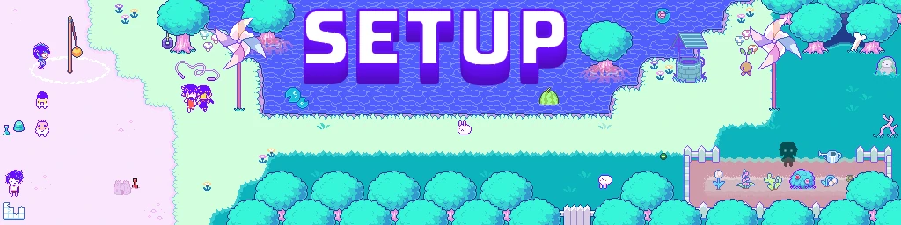

*(所有横幅均由 TomatoRadio 使用 Tiled绘制地形、使用 Photopea制作角色和文字。精灵图:原版游戏;字体:Bungee)*

好了,在开始制作我们梦想中的模组之前,我们得先知道需要什么,以及如何获得所需的东西。正如标题所示,这是让你的模组进入可制作状态的“第 0 步”。我会把模组制作各个不同方面所需的东西都过一遍。

### 基本要求

这些是你制作任何 OMORI 模组都需要的东西。

- [OMORI](https://store.steampowered.com/app/1150690/OMORI/)。这应该不用多说。不过具体来说,你需要一份完全更新至 v1.08 的英文版 Steam 游戏发行版。你还需要知道它安装在哪里,这一点随手谷歌一下 Steam的安装位置就能搞定。
    - 你也可以通过 Steam 定位游戏文件:在媒体库中 OMORI 的 Steam 页面上找到齿轮形状的“管理(Manage)”图标,在下拉菜单中把鼠标悬停在“管理(Manage)”上,然后点击“浏览本地文件(Browse Local Files)”。
- [OneLoader](https://mods.one/mod/oneloader)。那个页面上有关于如何安装它的详细说明。
- [BundleTool](https://mods.one/mod/bt)。严格来说它并不是必需品,但它是一个用来编译打包模组的工具,比手动操作省事得多。另外,不要把它放进“`mods`”文件夹。它要到很后面才用得上——也就是你准备好把做好的模组导出、给别人玩的时候。

现在你只需要启动 OMORI,进入模组菜单中的 `Decrypt` 部分。然后把解密设置设为“<var>basegame</var>”(如果你想把已加载的模组一并嵌入你的模组,也可以填“<var>Everything</var>”),并在是否生成 RPG Maker MV 工程上选择“是”。然后开始解密。完成后,你就拥有了一个供模组使用的反编译工程文件,通常被称为 `Playtest Folder`(测试文件夹)。

### 特殊要求

“好吧。所以我拿到文件夹了。然后呢?这是干嘛的?我八成还需要别的东西,对吧?” 说得好,胸怀大志的模组制作者!不过,你究竟需要什么,取决于你要做的模组。下面这份清单能让你对自己需要什么有个大致的概念。

- `Asset Replacement`(资源替换):只需要你自己的才华。图像、文本、音频的编辑/制作都有大把免费程序可用。
    - 我(FruitDragon)画图用 [Procreate](https://procreate.com/procreate) 和 [Aseprite](https://www.aseprite.org)(一次性买断),文字/对话用 [Notepad++](https://notepad-plus-plus.org/) 和 [Visual Studio Code](https://code.visualstudio.com)(视用途而定),音频用 [GarageBand](https://www.apple.com/mac/garageband/)/[MuseScore](https://musescore.org/en/download) [4](https://musescore.org/en/download)/[Audacity](https://www.audacityteam.org/)。别问我为什么用这么多……
    - 我(TomatoRadio)画图用 [Photopea](http://photopea.com)、[Piskel](https://www.piskelapp.com/) 和 [Aseprite](https://www.aseprite.org),文字用 [Visual Studio Code](https://code.visualstudio.com),音频用 [Audacity](https://www.audacityteam.org/)。另外,我的 RPG Maker MV 开的是深色模式,所以我的截图和用浅色模式的 FruitDragon 长得不一样。真是个怪人……
    - 哈哈,这波打脸了吧,我现在也用深色模式了 - fd
    - 不过,**你**该用什么,答案是:喜欢啥用啥。浅色模式和深色模式同理(笑)。
- `Editing Skills`(编辑技能)、`States`(状态)、`Events`(事件)、`etc.`(等等):你需要 [RPG Maker MV](https://store.steampowered.com/app/363890/RPG_Maker_MV/)。它通常售价 \$79.99,但在任何季节性 Steam Sale 期间都经常打折到大约 \$7.99-\$12.99。(说出来你可能不信,我写这句的时候它正在打折。)
- `Mapping`(地图制作):你需要 RPG Maker MV 和 [Tiled](https://github.com/mapeditor/tiled/releases/tag/v1.0.3),而且必须是 v1.0.3 版(不打补丁的话,其他任何版本都用不了)。更多内容会在讲地图制作的那一章里细说。
    - 其实有一个插件能让你使用更新版本的 Tiled;凭借更好的用户功能和稳定性,它值得推荐;不过,它的安装流程可比直接下载 v1.0.3 深入繁琐得多。
- `Plugins`(插件):你得会 JavaScript,或者至少能看懂它。就算你不了解 JavaScript这门语言,有其他编程语言的基础也会很有帮助。编写插件时用什么 IDE 都行,不过很多模组作者的个人偏好是 [Visual Studio Code](https://code.visualstudio.com)。其他选择还有 [Notepad++](https://notepad-plus-plus.org/)、[Xcode](https://developer.apple.com/xcode/)(用于

Apple Mac 设备)、[Sublime Text](https://www.sublimetext.com/) 等等。

    - 如果你想学 JavaScript,网上有一大堆免费教程。其他

*资源包括[官方文档](https://developer.mozilla.org/en-US/docs/Web/JavaScript)、[W3Schools](https://developer.mozilla.org/en-US/docs/Web/JavaScript)和 [GeeksforGeeks](https://developer.mozilla.org/en-US/docs/Web/JavaScript),尤其是当你只想查某个具体问题怎么做的时候(比如语法或某个方法)。在写代码这件事上,互联网就是你最好的朋友!*

### 我怎么和朋友们协作?

很遗憾,RPG Maker MV 没有内置的协作功能。我们只能使用外部的源代码管理软件(比如 [GitHub](https://github.com/))来和其他人一起工作。

就算你不和别人合作,也推荐这么做。

GitHub(或其他源代码管理软件)可以让你备份工作、回退更改、在多台设备上工作等等。它就像一个自带“撤销”按钮的第二个保存键!不过,本教程并不讲如何设置 GitHub以及使用它的种种好处。但如果你确实想了解这些,请告诉我(FruitDragon)!我已经为别的事情写过一些 GitHub相关内容,稍微改编一下就能用在这里。

更新:现在已经有人要求这部分内容了,所以我正在着手写。

## GitHub

好。GitHub。它到底是个啥?

GitHub 是一款源代码管理软件兼开发平台,人们出于各种各样的原因使用它。它有许多让程序员的开发工作更轻松的工具;它让软件开发者可以在没有内置协作功能的工具(比如 RPG Maker MV)上协同工作;它还会保存你的编辑历史——几乎像一张张快照——让你能够把 bug 追溯到源头。

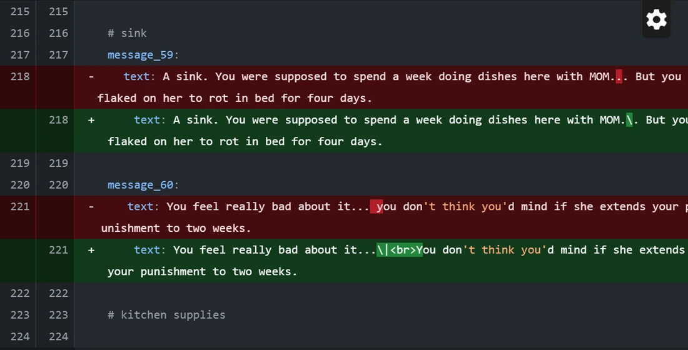

另外,GitHub 能让你在做模组时对每一处实际改动都看得一清二楚。当你向仓库提交时,可以确切地看到自己到底改了什么。这就叫差异对比(diff)。

下面是一个例子:

*(来源:《parallels》的差异对比,FruitDragon 提供)*

红色是旧的更改,绿色是新的更改。

我知道我一下子抛出了好多新词,所以这里准备了一份 GitHub 术语小词典。

**- 仓库(Repository):**简称“repo”,它本质上是一个充当项目文件夹的文件夹,可以类比为 Google 云端硬盘里的文件夹。

**- 本地仓库(Local Repository):**位于你自己电脑上的仓库。**- 源代码管理(Source Control):**也称版本控制,是一种用来随时间追踪文件(例如代码文件)更改的系统或软件。

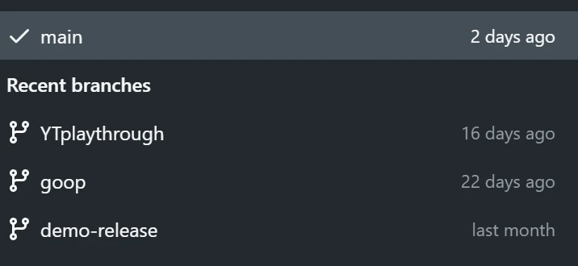

**- 差异对比(Diff):**“difference(差异)”的简称,基本上是对一个文件所发生更改的总结或概览。

**- 远程源(Origin):**由 GitHub 托管的仓库在线副本。

**- 提交(Commit):**把你的更改保存到仓库,本质上是在提交的那一刻为这些更改拍下一张快照。

**- 推送(Push):**把你的提交上传到远程源,好让其他协作者或设备下载(拉取)它们。

**- 拉取(Pull):**从远程源下载新的提交,让你的本地仓库更新到最新版本。

**- 主分支(Main):**你仓库的主分支。

**- 分支(Branch):**一个受控环境,用于在把某些更改提交到主分支(大部分代码所在之处)前先进行测试。它也可以用来保存旧版本,尤其是当你有想保留的旧发行版的时候。(比如试玩版。)

这是《parallels》仓库中分支的一个例子。

这里还有一个实用的[幻灯片](https://docs.google.com/presentation/d/19Bi-uSRFUoT2zRqaMCeWgNKQf5VjvmUBXRWGg6CesrI/edit#slide=id.g2dc6bc93425_4_1783)链接,进一步讲解我刚才定义的这些术语。

(注:GitHub 并不是世上唯一的源代码管理软件。如果你更愿意用别的,那随你。OMORI 本身就是拿 DropBox 当源代码管理软件做出来的(鬼知道怎么做到的……?),这足以说明你大概用什么都能行。不过,GitHub 绝对是源代码管理和协作领域最通用、最强大的工具之一,而且很多 OMORI 模组作者都在用它。一旦你弄明白该怎么操作,它用起来也很简单。所以本教程将只专门讲 GitHub。)

现在我们进入正题:如何在制作 OMORI 模组时使用 GitHub。

### 创建

首先,我们需要一个 GitHub 账号。

去 [GitHub 官网](https://github.com/)注册一个。它是免费的,而且只需要几分钟。你并不是必须开启双重验证,但给账号加上也无妨——它能确保你的仓库得到最大程度的保护,不给黑客可乘之机。

有了账号之后,你还需要下载 [GitHub Desktop](https://desktop.github.com/download/)。安装它,然后打开。

你会看到一个大致长这样的界面。

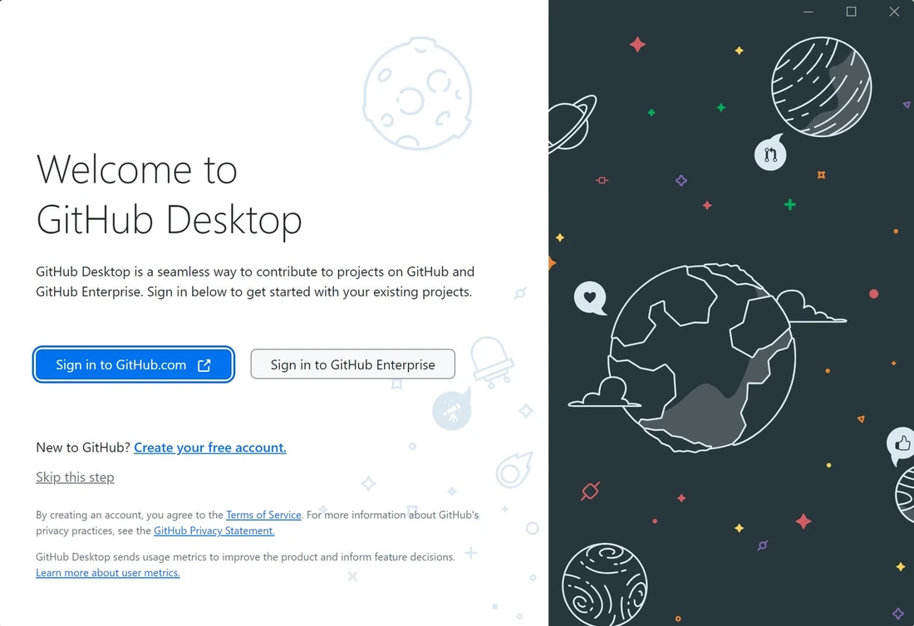

*(来源:zoewillowz)*

点击“使用 GitHub.com 登录(Sign in with GitHub.com)”并登录你的账号。务必点击“授权 Desktop(Authorize Desktop)”。然后返回 GitHub Desktop。

接着你会看到一个大致长这样的界面。

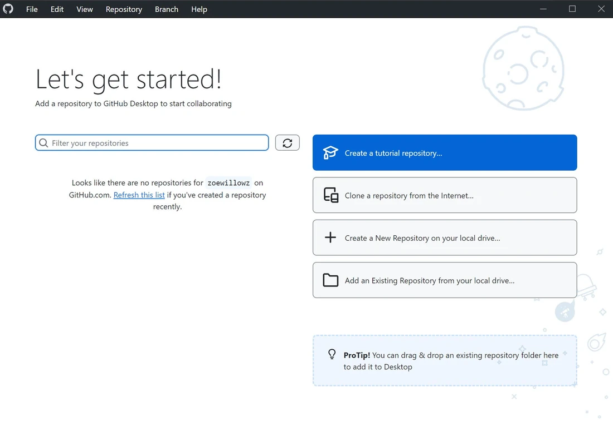

*(来源:zoewillowz)*

在这里,我们要么创建仓库,要么从互联网上克隆一个仓库。

#### 新建仓库

如果你还没有为项目文件夹建过仓库,创建一个也相当简单。

首先,在硬盘里找到你的测试文件夹(Playtest Folder)。我给自己那个起名叫“repo practice”。

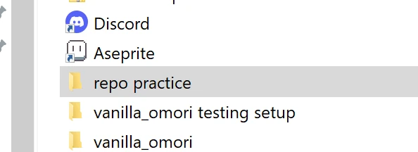

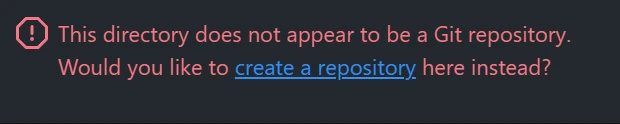

接下来,打开 GitHub Desktop,选择“从本地驱动器添加现有仓库(Add an Existing Repository from your local drive…)”。

*(来源:zoewillowz)*

选择你的仓库。

你会收到如下提示:

点击“创建仓库(create a repository)”。

你会看到如下窗口。(你的文件路径会是灰色的。)把内容填好。你不需要初始化 README、选择许可证,也不需要添加 Git ignore。

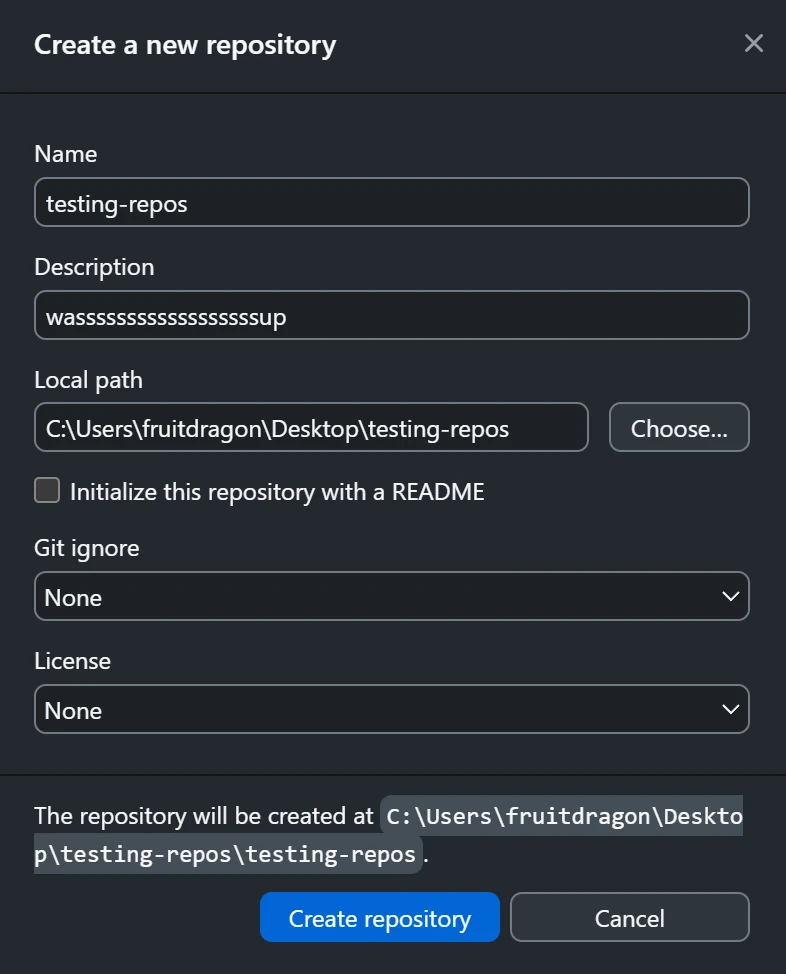

然后点击“创建仓库(Create repository)”!加载一小会儿之后,你会看到如下窗口。

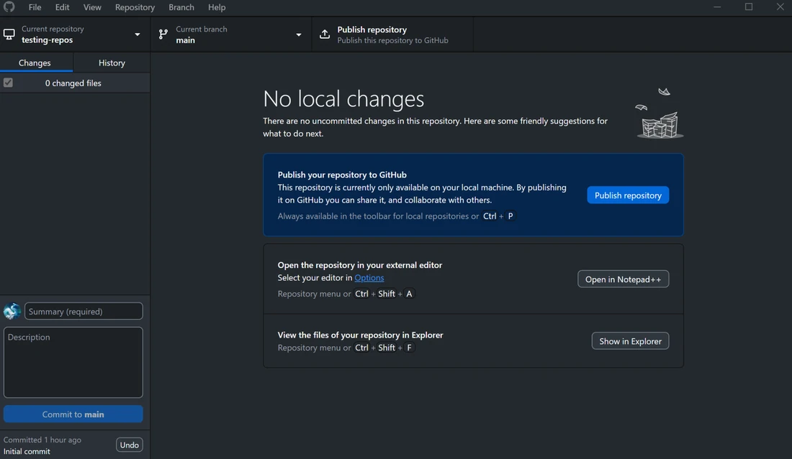

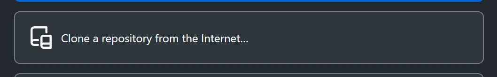

现在你只需要把这个仓库发布到 GitHub,这样就能把它分享给其他人并进行备份。要做到这一点,只需点击顶部的那个按钮!

#### 克隆仓库

如果不是创建你自己的仓库,而是要被添加到别人的仓库里,你就需要从互联网上克隆一个仓库。

如果你已经被添加进了那个仓库(具体做法见[协作](/omori/modding-guide/01-setup/)[章节](/omori/modding-guide/01-setup/)),那么添加你的新仓库就是小菜一碟。

在 GitHub Desktop 主页面,点击“从互联网克隆仓库(Clone a repository from the

Internet…)”。

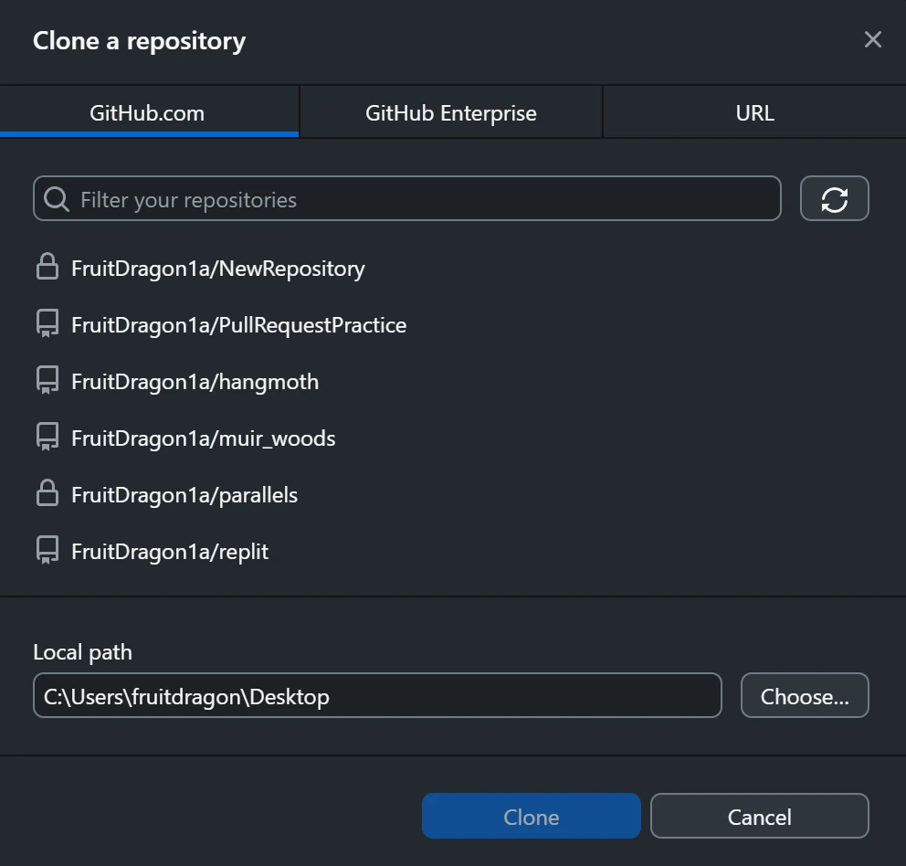

会弹出如下窗口。

从列表中选择你想克隆的仓库(如果你的 GitHub 账号是新的,这份列表应该长不到哪儿去,哈哈),然后把本地路径设置为你想存放文件夹的位置,点击“克隆(Clone)”。

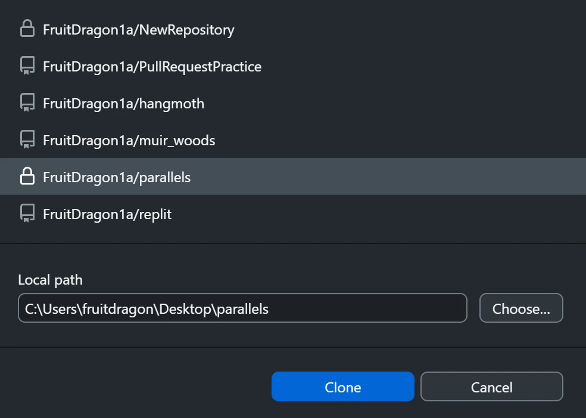

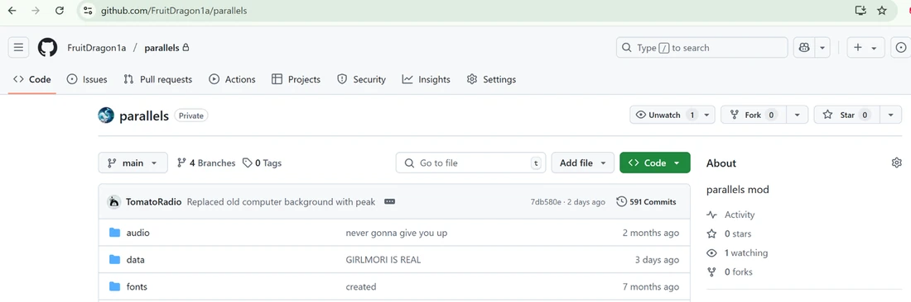

如果出于某种原因,选择窗口里看不到那个仓库,就在浏览器中打开它并复制链接。仓库页面长这样:

从地址栏里复制链接。

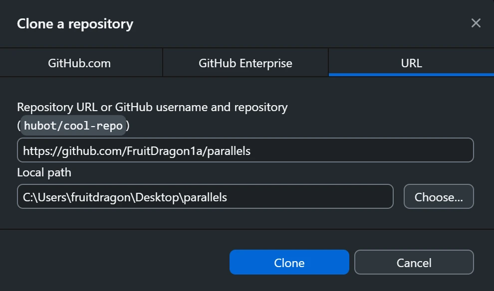

在仓库选择窗口中,点击“URL”标签页。然后粘贴仓库链接并点击“克隆(Clone)”。

*(注:把《parallels》仓库链接放进你的 GitHub 然后试图克隆是行不通的。哪怕通过 URL,GitHub 也会检查你要克隆的仓库是否在你有权访问的范围内。如果你打算通过 URL 克隆,仍然需要别人把仓库共享给你,或让你拥有访问权限。)*

点击“克隆(Clone)”后,它会带你进入如下窗口。

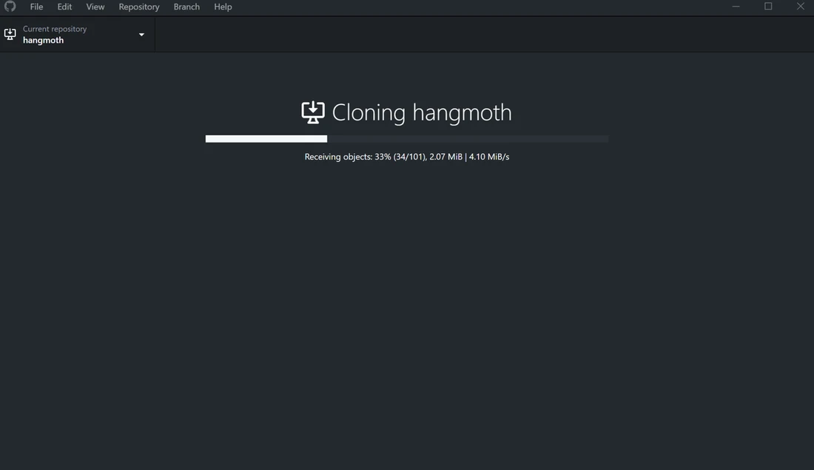

(我没有克隆 parallels仓库,因为我已经把它下载到电脑上了。)

请确保你的网络连接稳定,因为这一步本质上就是在从网上下载整个项目——项目由 GitHub托管。

等待整个仓库下载完毕。一旦完成,它会带你进入如下窗口:

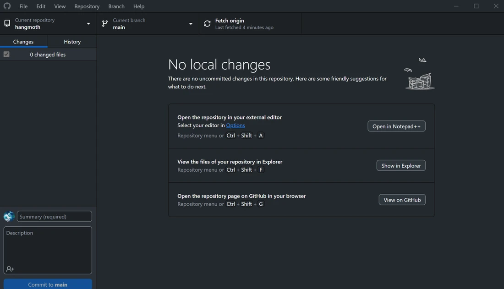

搞定!这就是 GitHub Desktop 的主界面,你可以在这里访问你的仓库、提交、推送、拉取等等。

可现在该做什么呢?该怎么使用 GitHub?

### 源代码管理

首先,我们来练习一下往仓库里推送。我要做一件简单的事:往 `img/characters` 文件夹里添加一张新图片文件。我们来看看这在 GitHub Desktop 里是什么样子。

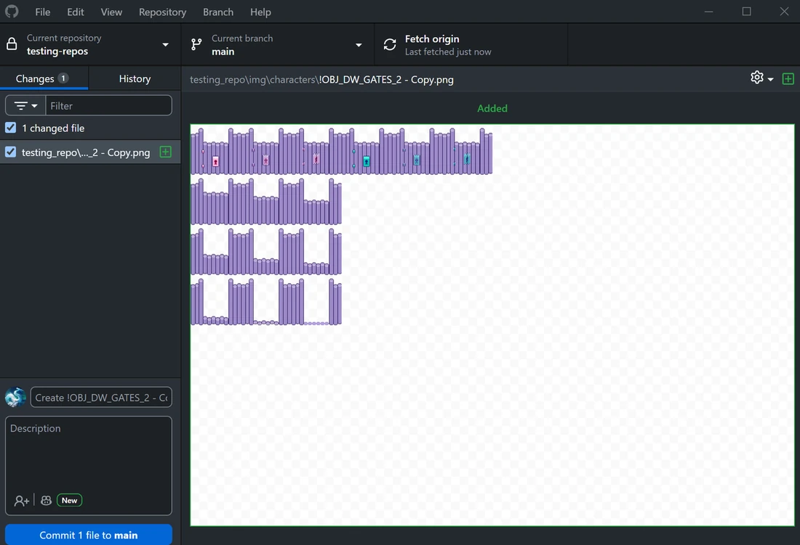

它把我添加的内容显示成了预览!当我想确认自己加了什么、又懒得翻文件夹的时候,这功能超级好用。

GitHub 对大多数文件类型都会这么做(基本上涵盖了你在 OMORI 基础模组制作中会用到的所有文件类型)。在侧边栏里,它会显示你添加了哪些文件及其文件路径,选中之后还会显示你添加到仓库里内容的预览。

文件名旁边的图标表示该文件是新建、编辑还是删除的。绿色加号表示新增文件,黄色圆点表示有改动,红色减号表示文件被删除。

当文件是文本类文件时,比如 .js 插件文件或 .yaml 对话文件,具体的逐行更改会显示在窗口中。绿色高亮的文本或行表示新增的更改,红色高亮的文本或行表示删除的更改。

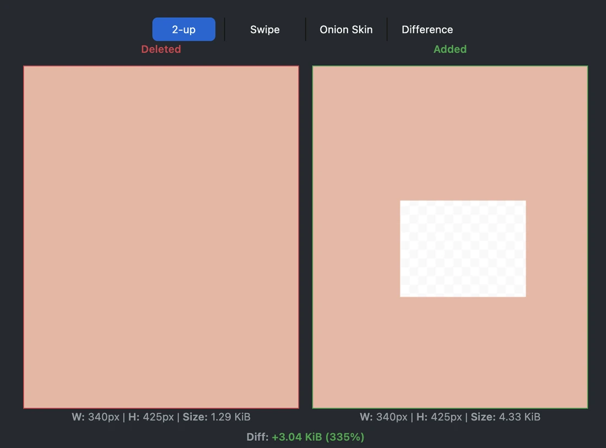

当文件是图片类文件时,比如 .png,你会得到几种查看更改方式的选项。

2-up(双图并排)会把旧版本和当前版本并排显示。

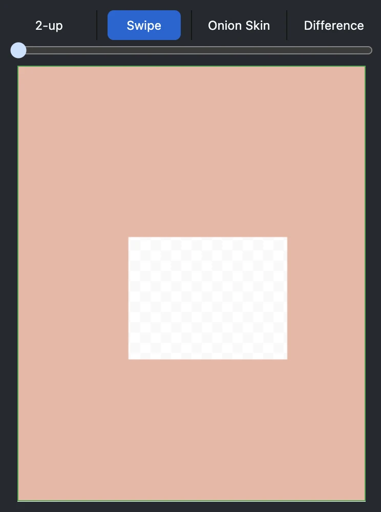

Swipe(滑动)会以滑动方式扫过更改,就像你在旧版本上拖动一层窗帘一样。

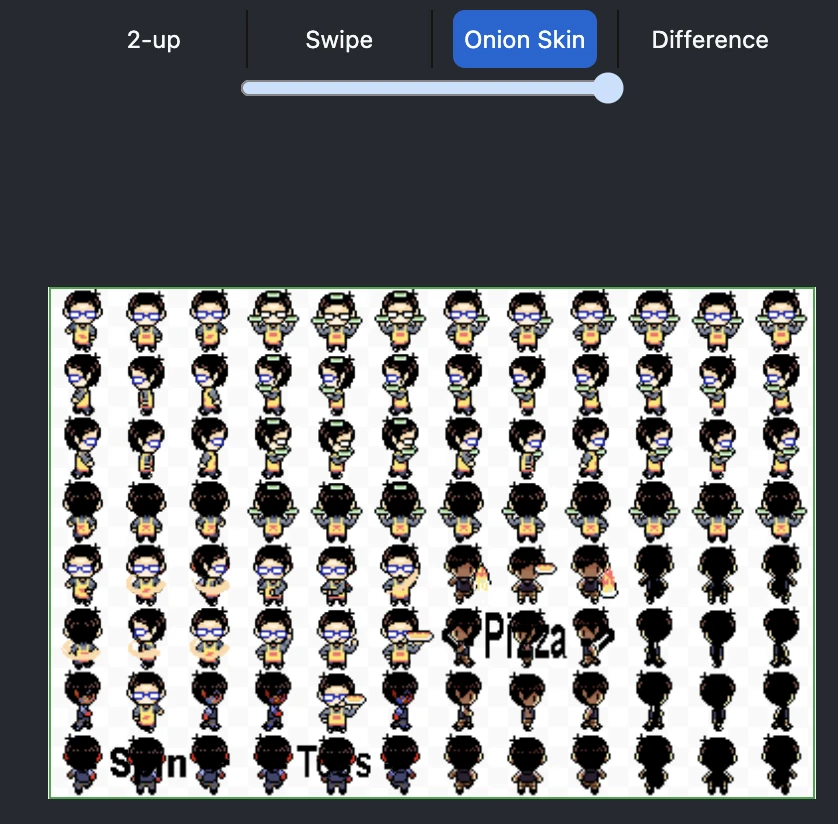

Onion Skin(洋葱皮)会给你一个滑杆,把更改前后的版本叠加显示。当改动很小时这招格外好用,来回拖动滑杆就能看到变化。

最后是我的最爱——Difference(差值)标签页。

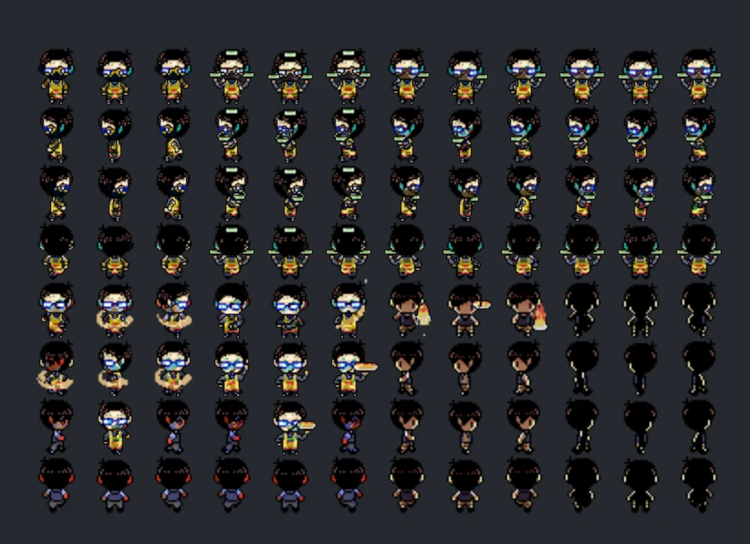

这个标签页会把一个版本叠放到另一个版本之上,并把混合模式设为“差值(Difference)”,显示出每个像素确切的颜色变化。它有时候能整出特别欢乐的效果!

### 协作 OMORI模组作者使用 GitHub的头号原因大概就是协作了。在需要多人参与的模组项目里,你需要一种与团队其他成员协作的方式。

### 亲身故事

最后,我来分享一些 OMORI模组作者使用 GitHub 的亲身故事,让你看看这个工具有多好用。(也就是说,如果这一节前面的内容还没把你说动,希望这部分可以。)
