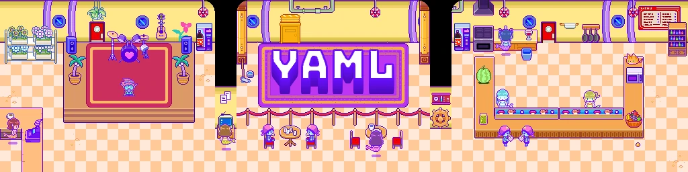

入门的好办法,就是去看看原版游戏里现成的 `.yaml` 文件。这些文件位于 `Playtest Folder`(测试文件夹)中——它由 <span class="og-g">OneLoader</span> 提供,路径如下:

### 位置

```text
playtest_folder/languages/en 
```

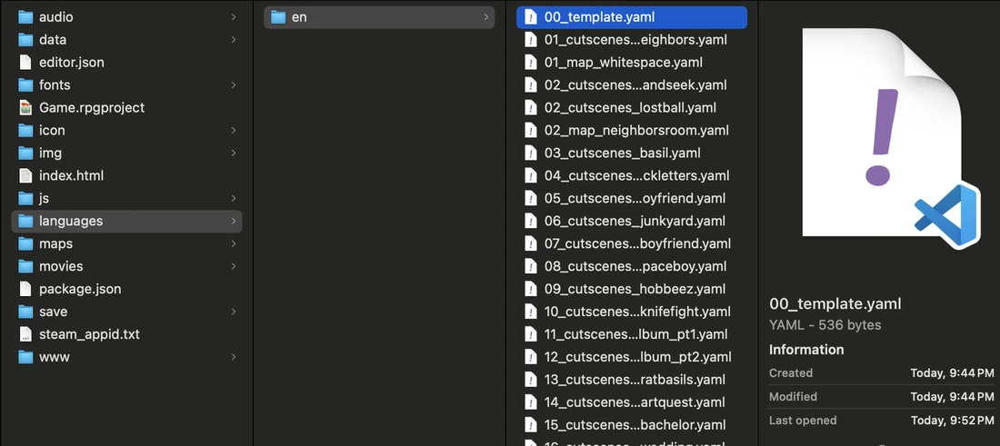

*(来源:FruitDragon)*

游戏里大部分的文本内容都存放在这个文件夹中。基本上,只要不是战斗文本(对话除外),就多半存放在这些 yaml 之一里。你自己新建的任何`.yaml`文件,也都要放到这个文件夹里。

### 语法

当我们打开 `00_template.yaml` 时,会看到下面的代码:

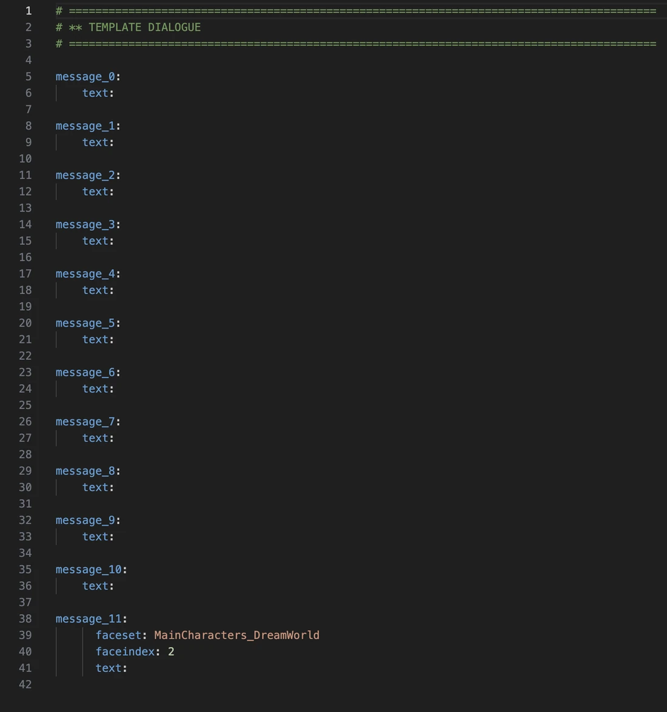

*(来源:00\_template.yaml,原版游戏)*

这段代码的含义相当基础。每条不带脸图的消息(也就是所有不涉及 OMORI/桑尼(Sunny)、奥布里、凯尔、希罗、玛丽,或

贝西尔/陌生人(Stranger)的对话),都定义为以“`message_`<var>XX</var>”开头的一行文本(其中 <var>XX</var> 是某个数字);而带脸图的消息则必须额外定义两个值——`faceset`,即你想要的那个脸图所在的文件,以及 `faceindex`,即该文件中的第几张脸。详情后面再讲。

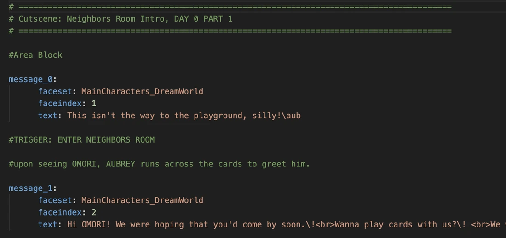

*注:`message_`<var>XX</var> 只是惯例,不是硬性要求。这个位置其实用任何字符串都可以。而且在很多情况下,如果你给它起一个不同于惯例的名字,反而更容易记住某些对话选项。有一个利用了这一特性的模组就是 [Reverie](https://mods.one/mod/reverie)。*

#### 示例

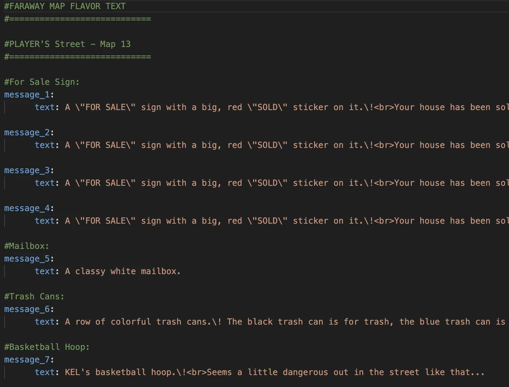

*(来源:01\_cutscenes\_neighbors.yaml,原版游戏)*

*(来源:fa\_map\_flavor.yaml,原版游戏)*

如你所见,情景文本(也就是你与物体互动时弹出的文字)的定义方式,与第一个示例中展示的过场剧情对话基本一致。

### 注释

还有,注释!那些行首以 `#` 符号标记的绿色文本行会被文件忽略,它们能让你的`.yaml` 文件读起来轻松许多,通常用来标注一些仅凭消息本身看不出来的信息,比如角色移动或对话选项。

要是没有这些注释,你最后看到的就是这样的东西:

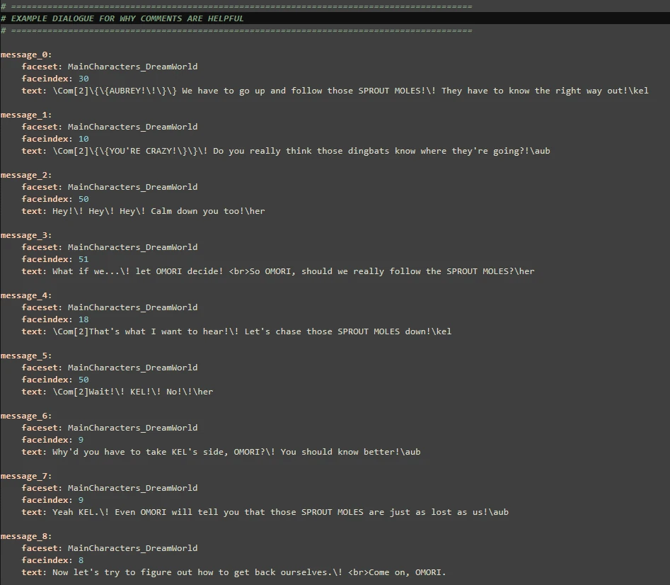

*(来源:精选示例,由 TomatoRadio 提供)*

当你翻看文件、想弄清每一行的用途时,就很难看出任何东西是干什么的了。凯尔做了什么?选“不”会怎么样?你能选“不”吗?根本看不出来。

现在再看看同一个`.yaml` 文件加上注释之后的样子:

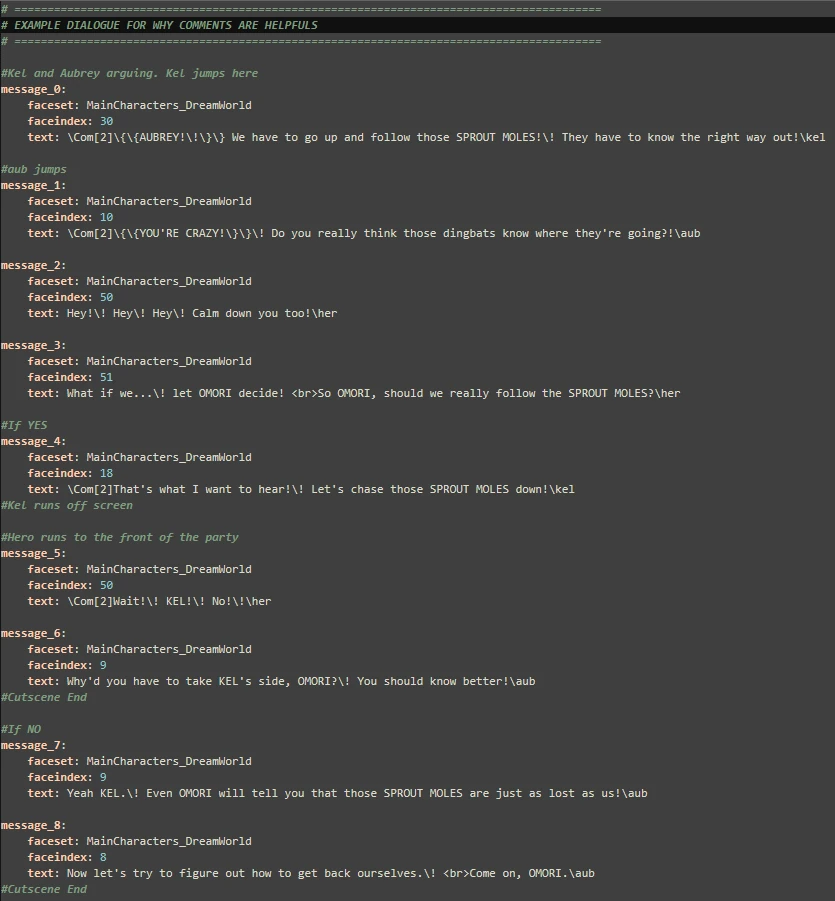

*(来源:精选示例,由 TomatoRadio 提供)*

这下我们学到了一堆有用的信息。我们知道了怎么让凯尔和奥布里打斗的动画跑起来,知道了对话选项有哪些,还知道了凯尔在“是”分支里做了什么。

*回头重读你的 `yamls` 来补注释,还可能让你抓出一两个错误——这里甚至就能看到一个。你能找出哪里改了吗?*

### 游戏内文本格式

“可是,FruitDragon,”你也许会说,“文字中间这些乱七八糟的反斜杠、点和竖线到底是干什么用的?还有,甜心(Sweetheart)那标志性笑声里的超波浪文字效果是怎么弄出来的?”

“哎呀,亲爱的准模组制作人,”我回应道,“文字中间那些乱七八糟的反斜杠、点和竖线,正是实现那些格式效果的关键所在。”

*也不尽然。严格来说,波浪文字是由 `\sinv[]` 函数造成的。不过我扯远了。*

这里是一份超基础格式的快速指南。想要更全面的指南,我强烈推荐访问[这个](https://github.com/Gilbert142/gomori/wiki/Text-Formatting)链接。

所有格式命令都以反斜杠(`\`)开头,只有一个例外——那就是 `<br>`,它和 <span class="og-g">HTML</span> 里的版本一样,起到换行的作用。

- `<br>` = 换行
- `\.` = 暂停 15 帧,约 1/4 秒\*
- `\|` = 暂停 60 帧,约 1 秒\*
- `\!` = 等待用户输入后才会继续,也就是说你必须按 z 才能继续
- `\^`= 文字一写完就自动关闭文本窗口,比如你想让某人的话被打断时就能用上
- `\sinv[`<var>2</var>`]` = 波浪文字(想要波浪没那么剧烈,就用 `\sinv[`<var>1</var>`]`)
- `\quake[`<var>2</var>`]` = 抖动文字(想要抖动没那么剧烈,就用 `\quake[`<var>1</var>`]`)
- `\v[`<var>#</var>`]` = 传入所给编号变量的值(例如:`\v[`<var>143</var>`]` 会传入存档的 WTF 值)
- `\c[`<var>#</var>`]` = 改变文字颜色!这些颜色对应 `img/system/Window.png` 里的棋盘格。<var>0</var> 是左上角的白色方格,然后从那里开始、从左到右依次排下去。你可以通过修改这张图片来添加自己的颜色。下表展示的是 OMORI 的颜色惯例:

```text
#FFFFFF 0
Default
#6095ff 1
Skills
#5bd863 3
Snacks
#fed966 4
Important Items
#ff9233 5
Toys
#64f7ed 11 Locations
#c263e1 13 Equipment
```

*RPG Maker 的音频是独立于游戏帧率运行的,如果你按稳定的 60fps 来估算,就可能出现音画不同步的问题。*

再强调一次,想实现某种特定格式的效果,去翻翻现成的`.yaml` 文件是个好主意,比如你想还原甜心那标志性的笑声。没有比照着实例学更好的办法了!

……

好吧,这下把我自己的好奇心也勾起来了。

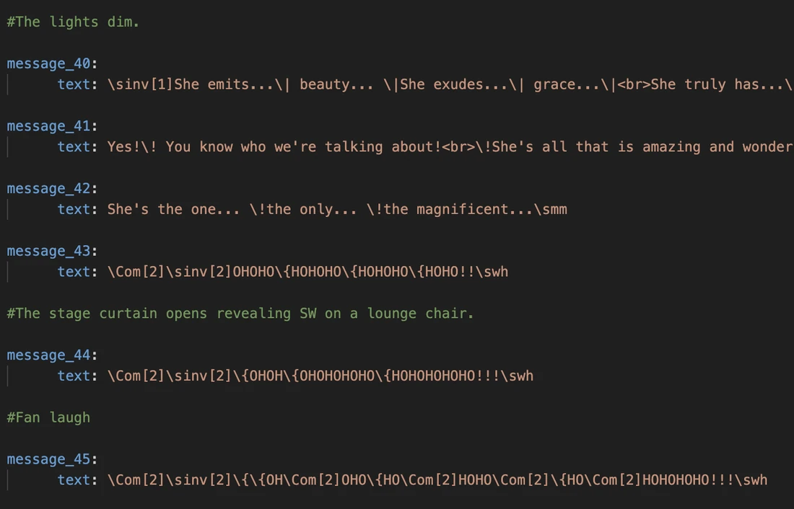

*(来源:15\_cutscenes\_herothebachelor.yaml,原版游戏)*

这里我们看到的是甜心标志性的登场,配上甜心标志性的笑声。总共重复了整整三次,每次用的格式都不一样。

这段对话里到底都发生了些什么?

就格式而言,我看到的是这些:

```text
 \Com[2] 
 \sinv[1] 
 \sinv[2] 
 \{ 
 \! 
 \| 
 <br> 
 \smm 
 \swh 
```

这里面大部分我们都已经认识了。正如前面所说,`\sinv[`<var>1</var>`]` 和 `\sinv[`<var>2</var>`]` 就是让甜心的对话波浪起伏起来的元凶。`\|`是暂停 60 帧,`\!` 是等待用户输入后再继续。而 `<br>` 当然是换行。那么 `\{`、`\Com[`<var>2</var>`]`、`\smm` 和 `\swh` 又是什么呢?

`\{` 的作用是放大文字。类似地,`\}` 的作用是缩小文字。

`\Com[`<var>x</var>`]` 会调用游戏中对应编号的 `Common Event`(公共事件),编号就是你在命令里 <var>x</var> 位置传入的数字。在本例中, `Common Event`<var>#2</var> 就是 `Shake Screen`(屏幕震动),也就是说,每次运行 `\Com[`<var>2</var>`]` 时,屏幕都会震一下。(哇,甜心最后那阵笑声里震了好多下屏幕。)

那 `\smm` 和 `\swh` 又是什么呢?

其实很简单。不过这要牵扯到一个我们还没真正聊过的话题。

是时候来谈谈:

### 名字

没错,就是名字。就是那个出现在文本框上方、告诉你此刻是谁在说话的小框。

这么一想……我们其实还没见过名字是怎么定义的,目前只见过对话本身。那游戏是怎么知道谁在说话的?

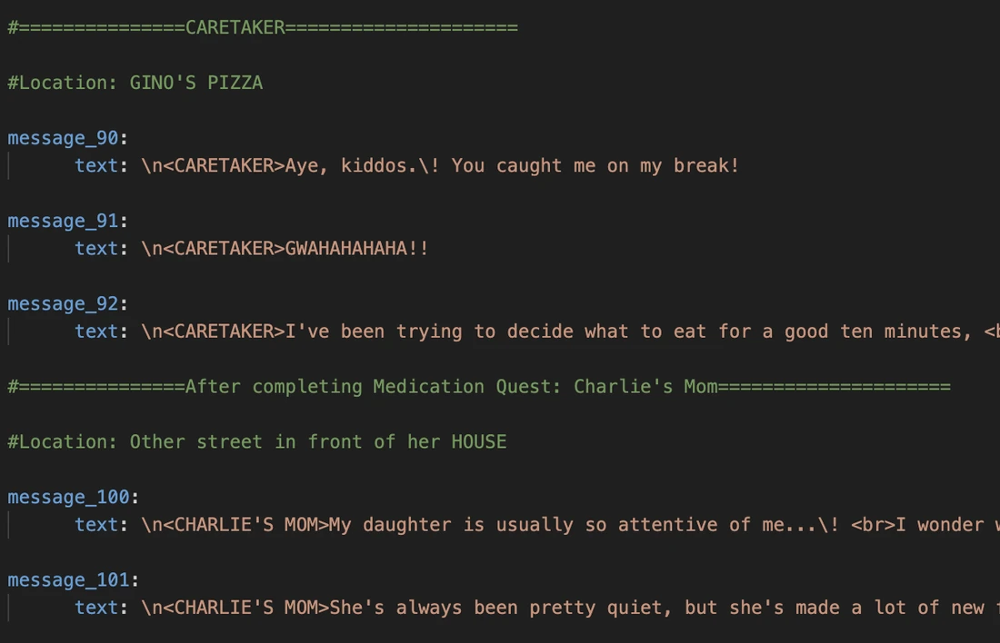

*(来源:farawaytown\_extras\_dailydialogue.yaml,原版游戏)*

其实,只要把下面这一行贴到文本的开头或结尾就可以了:

```text
\n<NAME OF PERSON HERE> 
```

可是,到目前为止我们见过的其他对话里,这一行又在哪儿呢?

事情是这样的。一遍又一遍又一遍地写 `\n<`<var>NAME</var>`>` 实在累人,尤其是名字还特别长的时候。所以 <span class="og-g">OMORI</span> 自带了一套 `Macro Plugins`(宏插件)。说白了,它们就是文本字符串的简写形式,其中可以包含文本代码。你可以往这些 `Macros`(宏)里塞任何东西,也可以通过修改 `Plugin Manager`(插件管理器)里的参数来添加自己的宏,不过在 <span class="og-g">OMORI</span> 里,它们主要用来表示名字。

下面是常见名字的简表:

- `\aub` = 奥布里
- `\her` = 希罗
- `\bas` = 贝西尔
- `\kel` = 凯尔
- `\mar` = 玛丽
- `\omo` = OMORI
- `\who` = ???
- `\swh` = 甜心
- `\smm` = 豆芽鼹鼠麦克(Sprout Mole Mike)
- `\sbf` = 太空男友
- `\cap` = 太空男孩队长
- `\spxh` = 太空前夫

有认出来的吗?

没错。`\smm` 和 `\swh` 就是用来标明说话的是豆芽鼹鼠麦克和甜心!这下就完全说得通了。

当然,宏远不止这些。想要完整的宏列表,请访问[这个](https://github.com/Gilbert142/gomori/wiki/Text-Macros)链接。

*注:对于像桑尼这样可以改名的角色(前面那些例子除外;[parallels](https://mods.one/mod/parallels) 里没有可改名的桑尼),你必须用 `\n[`<var>8</var>`]` 来显示角色名。<var>8</var> 就是桑尼的角色 ID。如果想以这种方式获取其他角色的名字,只要用 `\n[`<var>ACTOR ID</var>`]` 即可。所以最终写出来就是 `\n<\n[`<var>ACTOR ID</var>`]>`*

现在,是时候讲讲我之前说好要讲的东西了:`Faceset`(脸图集)和 `faceindex`(脸图索引)。

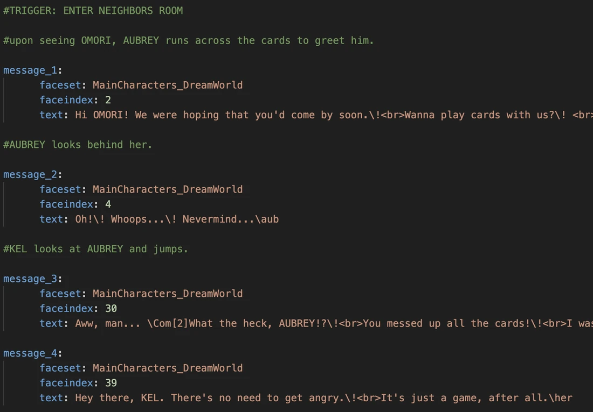

### 脸图集(Faceset)

*(来源:01\_cutscenes\_neighbors.yaml,原版游戏)*

什么是 `faceset`?`faceset` 里这些莫名其妙的字符串又是什么?

它们是文件名。确切地说,是 `img/faces` 文件夹里的文件的名称,如下所示:

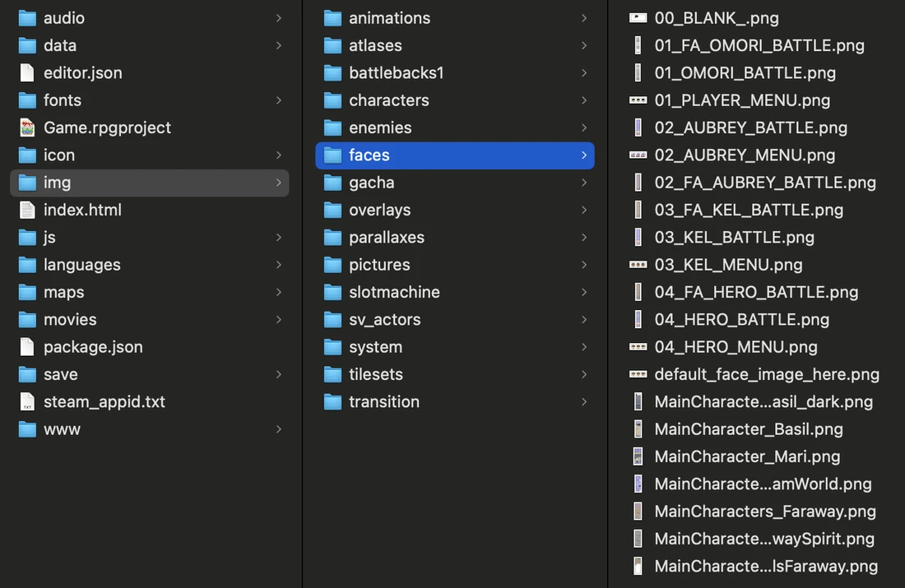

*(来源:FruitDragon)*

具体来说,我们在 `yaml`文件里会用到的,是图片底部那些以 <var>MainCharacter_</var> 或

```text
MainCharacters_prefix.
```

以下是原版游戏自带的选项:

- <var>MainCharacter_Basil_dark</var>—— 满足你对夜间遥远镇(Faraway Town)角色的一切需求!
- <var>MainCharacter_Basil</var>—— 白天贝西尔(遥远镇贝西尔和梦境世界贝西尔)的全部脸图!还附赠陌生人、夜间奥布里,以及一点点夜间希罗!
- <var>MainCharacter_Mari</var>—— 梦境世界的玛丽,以及未被使用的灵体玛丽(Spirit Mari)!另外还有几张属于黑色空

间(Black Space)里那些无脸人体模特的脸,以及遥远镇十二岁孩子们的脸。

- <var>MainCharacters_Dreamworld</var>—— 梦境世界的希罗、奥布里和凯尔。外加赫克托。
- <var>MainCharacters_Faraway</var>—— 遥远镇的希罗、奥布里和凯尔。

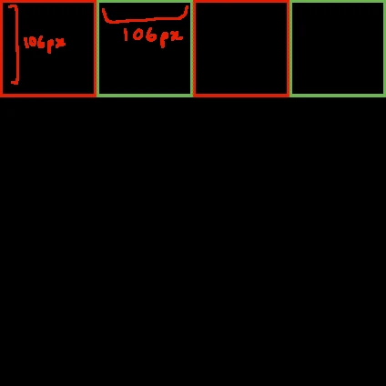

这类 `facesets` 的文件格式相当讲究:每张脸 106×106 像素,每行 4 张脸。需要多少行都可以。

*(来源:FruitDragon)*

不过,游戏是怎么知道每个 `faceset` 该用哪张脸的呢?

这就轮到下一个话题登场了。

### 脸图索引(Faceindex)

这个数字会告诉游戏,要从给定的 `faceset` 里取用哪一张脸。

下面来看一个示例,用的是调成暗色的单色版

```text
MainCharacters_Faraway:
```

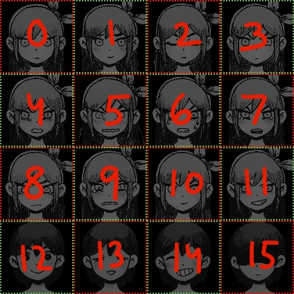

*(来源:FruitDragon(基于 MainCharacters\_Faraway 的修改,第 15 张脸为自制))*

如你所见,编号从 <var>0</var> 开始(毕竟计算机就是这么数的),每次加一,数满一行就折到下一行。所以,调用 <var>MainCharacters_Faraway</var>并把 `faceindex` 的值设为 <var>2</var>,那么这条对话显示时,就会出现值为 <var>2</var> 的那张脸,也就是闭着眼睛的奥布里。

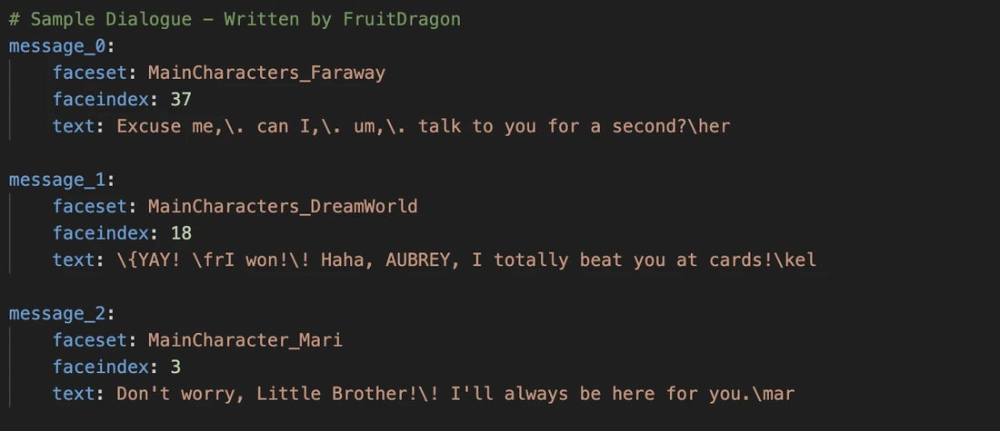

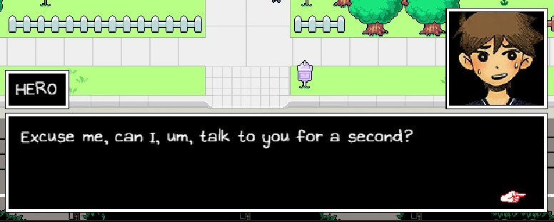

### 对话示例:

来看看它们各自最终的效果吧!

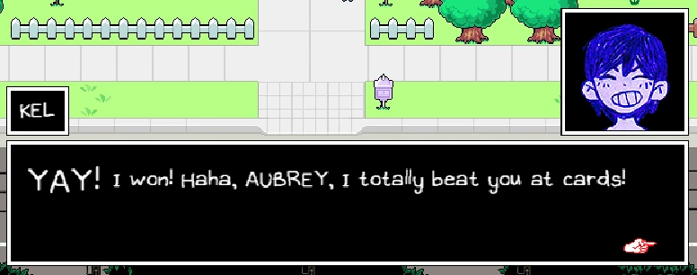

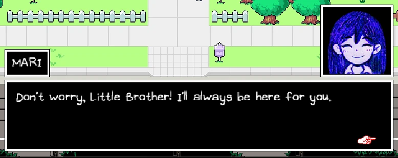

*(来源:Biggie Cheese)*

我用的是非常基础的格式,因为像 `\sinv` 那些让文字动起来的效果,没法很好地呈现在截图里。`\!`、`\.`、`\|`,以及其他任何等待/玩家输入类的命令,同样没法体现在截图里。

这里有个新面孔:`\fr`,它会重置所有字体改动。之所以要用它,是因为凯尔那段对话的开头把字号调大了,而我们并不想让这一行从头到尾都保持大字号。

现在你可能在想:要怎么把这些对话加进游戏里呢?

别急,下一节我就会讲到:
