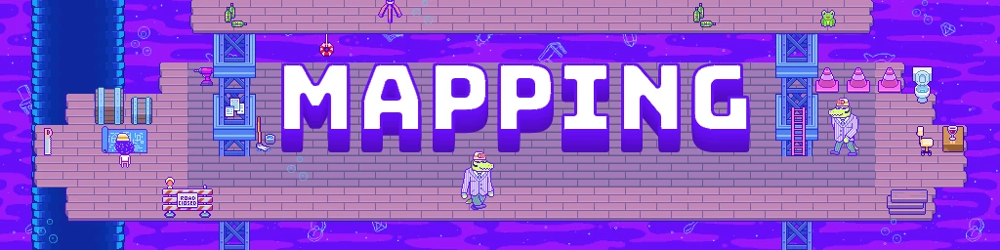

你现在正看着一张呢!瞧瞧那条横幅,它就是一张地图!先不算上面的文字和 NPC……

地图(Map)就是队伍可以四处走动的土地,也是事件所在之处。

地图位于 <span class="og-g">RPG Maker MV</span> 编辑器的左下角:

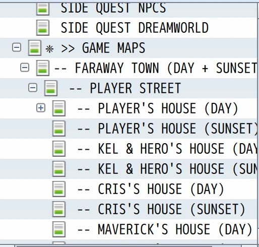


*(来源:FruitDragon)*

### 关于地图的基本信息

这些信息都可以在编辑器右下角找到!!

*(来源:parallels,由 FruitDragon 提供)*

坐标系(The Coordinate System)

地图使用 `(`<var>x</var>`,`<var>y</var>`)` 坐标系,和大多数网格类似;不过,原点,也就是 `(`<var>0</var>`,`<var>0</var>`)`,位于左上角,所以越往右 <var>X</var> 值越大,越往下 <var>Y</var> 值越大。

坐标决定了各个事件该放在哪里(以 `tilemap` 图块地图为准),它也是弄清如何在地图上挪动事件的省事办法。传送脚本同样要靠坐标系来精确决定把玩家放到哪里。

地图 ID(Map ID)

这是分配给每张地图的 ID 编号。在上面的例子中,它是 <var>520</var>。之后我们讨论如何给地图分配 `tilemaps`(图块地图)时它会非常相关;而且你正是靠它在 `Events`(事件)中从一张地图引用另一张地图。

尺寸(Dimensions)

括号里的那些数字。简单说,它告诉你地图有多大。制作 `tilemaps`(图块地图)时这一点也非常重要。

“FruitDragon,”你可能会说,“你一直在提图块地图,可图块地图究竟是个啥?”

`Tilemaps`(图块地图)就是你在游戏里加载一张地图时看到的东西。我们来更详细地讲讲它们。

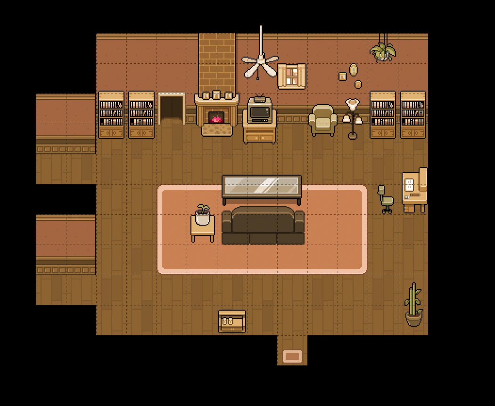

### 图块地图(Tilemap)

*(来源:map28,Kim 与 Vance 的家,原版游戏)*

这就是 `Tilemap`(图块地图)。它们由图块组成,使用 [Tiled 1.0.3](https://github.com/mapeditor/tiled/releases/v1.0.3) 软件制作。**没有** **其他任何版本能在不借助外部插件的情况下正常工作。**

*(注:你也可以把 [最新版 Tiled](https://www.mapeditor.org/) 与 [tiledfxer i](/omori/modding-guide/10-plugins/)*

*[插件](/omori/modding-guide/10-plugins/)一起使用。它能带来更好的稳定性、支持度和更趁手的工具。不过要注意:一旦下载,它就会覆盖你的 Tiled 1.0.3 软件,所以最好在每一个你打算用来编辑地图的 playtest 里都安装它。)*

游戏中的所有 `Tilemaps`(图块地图)都位于 playtest 文件夹中的 `maps` 文件夹里。

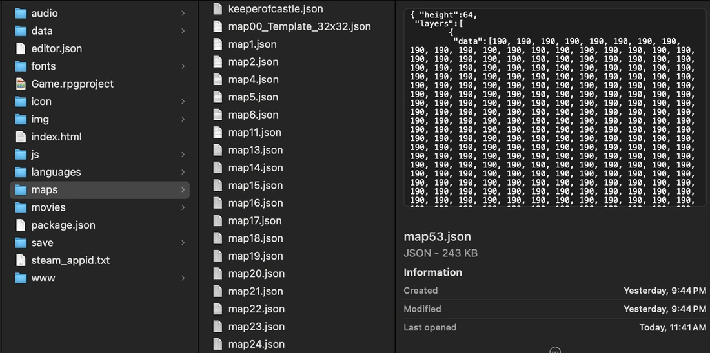

*(来源:FruitDragon)*

这些地图文件本身,用代码编辑器打开时看上去只是一堆数字,绝对不是你想象中游戏里的样子。

不过,当你用 <span class="og-g">Tiled</span>编辑器打开同一个文件时,看到的就是这个了。

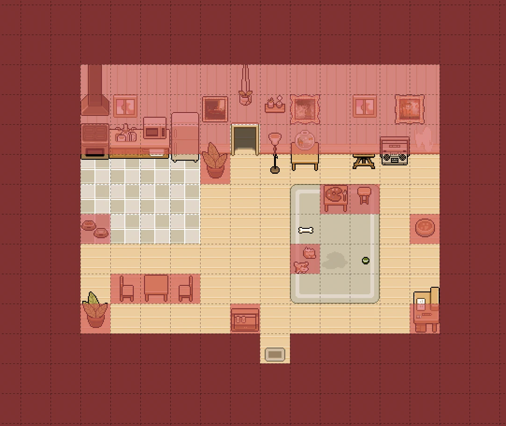

*(来源:map53,Artist 与 Angel 的家,原版游戏)*

一张 `Tilemap`(图块地图)由多个 `Layers`(图层)组成:位于角色下方的 `Layers`(图层)、与角色同层的 `Layers`(图层)、位于角色上方的 `Layers`(图层),以及 `Collision Layer`(碰撞层)。正是这个 `Collision Layer`(碰撞层)让玩家无法穿过物体,或者无法穿过你放置碰撞图块的任何地方。它不会在游戏中显示出来。

在上面的截图中,那层半透明的红色就是 `Collision Layer`(碰撞层)的可视化呈现。在 Vance 和 Kim 家的那张图里,同一图层被设成了不可见,主要是为了更容易看清各个东西都是什么。

那么,`Tilemaps`(图块地图)里使用的图块都是从哪来的呢?

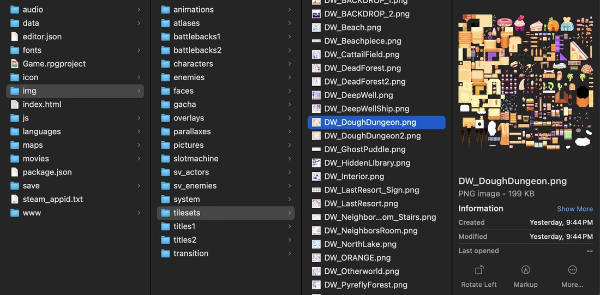

### 图块集(Tileset)

`Tilesets`(图块集)随原版游戏自带。它们基本上就是 `Tilemaps`(图块地图)所用的全部 32×32 像素 `Tiles`(图块)的集合。

它们和地图文件本身位于同一个文件夹(`playtest_folder/maps`),同样可以用 <span class="og-g">Tiled</span> 地图编辑器打开。要在 `Tilemap`(图块地图)中使用某个 `Tileset`(图块集),你需要先把图块集加载进来,这样 `Tilemap` 才能访问到它。

与 `tilesets`(图块集)相关联的图片(和图块集本身是分开的)

位于 `img/tilesets` 文件夹里,像这样:

*(来源:FruitDragon)*

如图所示,图块集通常都塞得密密麻麻。这是为了在同时加载尽可能少的图块集的前提下,给你尽可能多的图块选择。不过,这也确实让在图块集里找特定图块成了一件苦差事……多看看已有的地图,弄清你想要的图块出自哪个图块集,绝对大有帮助。

可是,我们要怎么用这些东西来创建一张地图呢?

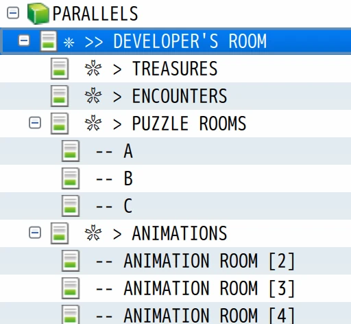

### 创建地图

这里有一份教你创建地图的[非常棒的视频教程](https://youtu.be/pstj8qSbM0g)。我强烈推荐你去看!不过,我在这里也会讲得更加详细。而且老规矩,自己动手摸索 <span class="og-g">Tiled</span>编辑器,或者多看几个相关教程,也很有帮助!

首先,我们要在 <span class="og-g">RPG Maker MV</span> 中新建一张地图。需要注意的是,地图在列表中的从属位置取决于你创建地图时在编辑器里选中了哪张地图。举个例子:

*(来源:FruitDragon)*

现在,我选中的是 `Developer's Room`(开发者房间)。此时新建地图,它就会出现在这里,`Developers' Room` 分类的最底部。

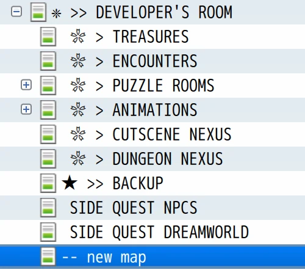

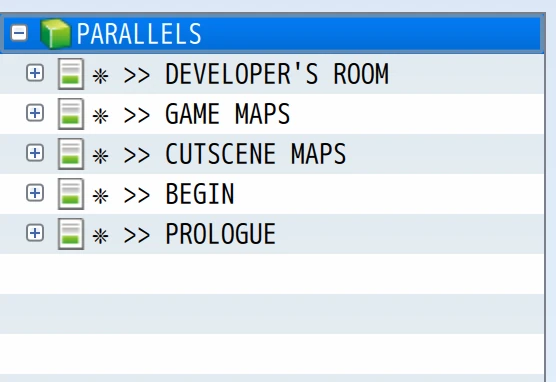

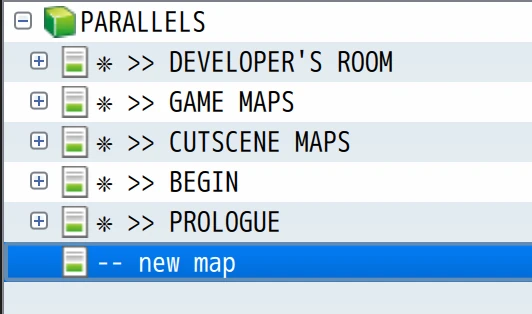

*(来源:FruitDragon)*

*(来源:FruitDragon)*

然而,当我选中主游戏时……

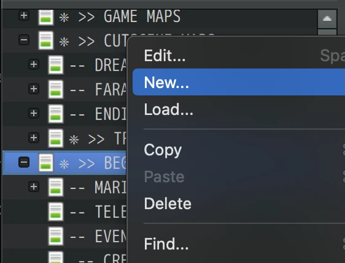

*(来源:FruitDragon)*

地图就出现在这里了。

不过别担心!如果你把地图建错了地方,直接拖拽就能把它移到想要的位置。只要把它放到你想让它嵌套其下的那张地图上就行。

好,这件事解决之后……咱们开始做地图吧。

右键点击你希望地图归入的地图分类,然后点击 New(新建)。

*(来源:FruitDragon)*

接着会弹出下面这个窗口:

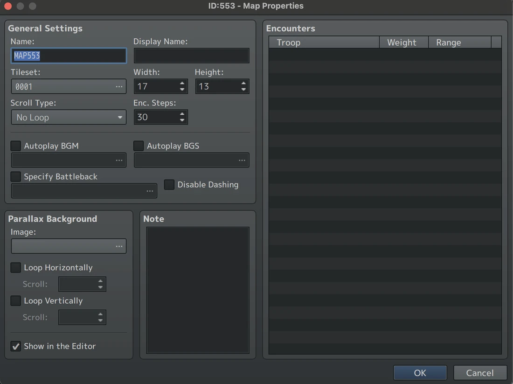

*(来源:FruitDragon)*

在这里,你可以为地图命名、修改宽度和高度、按需开启滚动(这会让它变成一张无限地图,不再受尺寸限制,可以联想 `Deeper Well`(深井)中的 `Endless Highway`(无尽公路),或 `Black Space`(黑色空间)里的许多房间),还可以指定玩家进入地图时播放的音乐。

*注:显示名称(Display Name)通常就是在存档点处显示的名字。*

有一点很重要:背景音如果不直接更改,就会在不同地图之间延续。不过,只要把选项勾上但留空,就能切断已在播放的音频。举例来说,假设你有一段背景音,比如风吹过树叶的沙沙声,你想在走进屋子时把它切断,那么像下面这样开启设置但不选择任何声音,音乐就会停止,而且不会有任何音频顶替播放。

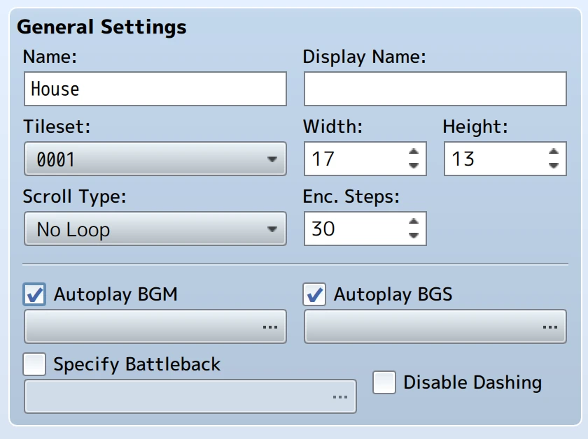

`Battlebacks`(战斗背景)也是同理——这个术语指的就是战斗背景。

*(来源:FruitDragon)*

你还可以添加 `parallax`(视差背景)图片。`Parallaxes`视差背景位于 `img/parallaxes` 文件夹。

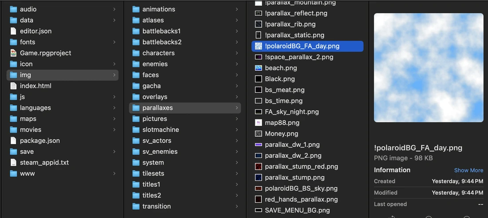

*(来源:FruitDragon)*

它们基本上就是地图的背景图片,当玩家走到地图边缘,或穿过地图上的空隙时就会露出来,比如 `Black Space`(黑色空间)的 `Town Area`(城镇区域)。通常它们被视为地图的天空,但在某些情况下——主要是在 `Black Space`(黑色空间)里——它们会是别的东西。

你可以用循环(Loop)选项让视差背景在屏幕上移动。放手去调那些数值,摸索出最合适的做法吧!

那么,这张地图我的设置如下:

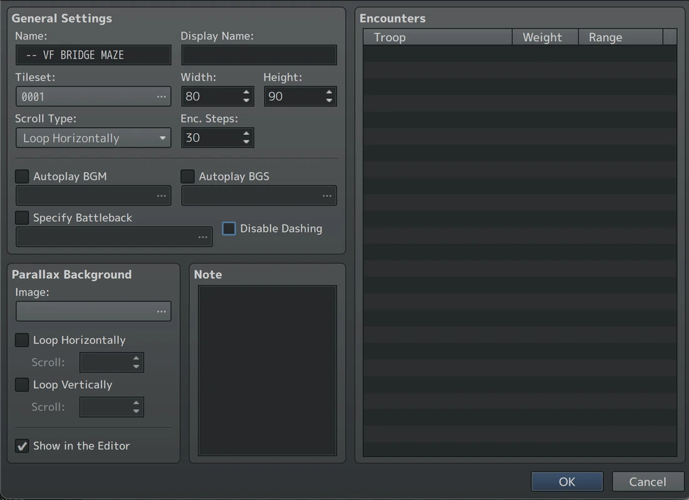

*(来源:FruitDragon)*

注意屏幕顶部的 `ID`(<var>530</var>,这是我的)很重要。制作 `tilemap`(图块地图)时我们会用到它。

我还决定让这张地图横向循环、纵向不循环,与无尽公路类似。也就是说,玩家无法越过地图的顶部或底部,但可以无限地向左或向右走。

所有设置都定好后,一定要点击底部的“`OK`”。你的新地图应该就会出现在 <span class="og-g">RPG Maker MV</span> 编辑器角落的地图列表里了!

在 <span class="og-g">RPG Maker MV</span> 里要做的就是这些。现在,该切换到 <span class="og-g">Tiled</span> 了。

不过在那之前,我们还需要一个能拿来编辑的 `tilemap`(图块地图)。在 `maps`文件夹里找到下面这个文件:

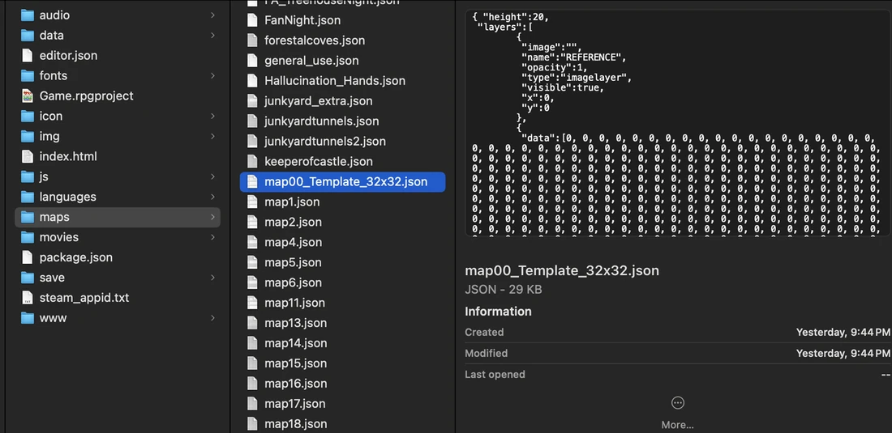

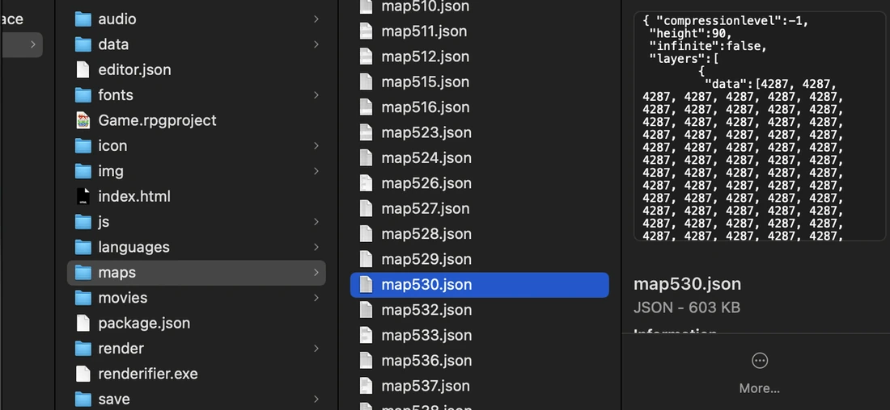

```text
maps/map00_Template_32x32.json
```

*(来源:FruitDragon)*

复制一份,并把它重命名为 `map`<var>XX</var>(<var>XX</var> 就是我们先前记下的 `ID number`,即地图 ID)。<span class="og-g">RPG Maker MV</span> 正是靠它知道我们要制作的图块地图属于我们在 <span class="og-g">RPG Maker MV</span> 里建的那张地图。

这是我的:

*(来源:FruitDragon)*

现在,用 <span class="og-g">Tiled</span> 打开它。

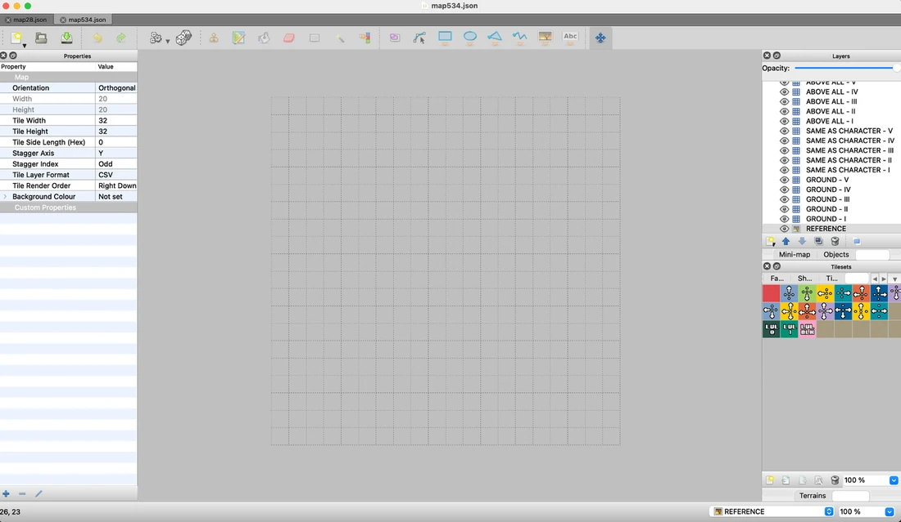

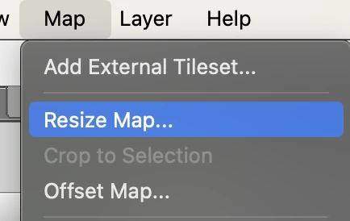

*(来源:FruitDragon)*

打开后的编辑窗口就是这个样子。首先,在做任何其他事情之前,我们要调整 `tilemap`(图块地图)的尺寸,使其与我们在 <span class="og-g">RPG Maker MV</span> 里的地图尺寸一致。点击屏幕顶部工具栏中的 `Map > Resize Map` 即可。

*(来源:FruitDragon)*

完成后,就到了制作我们地图的时候了。

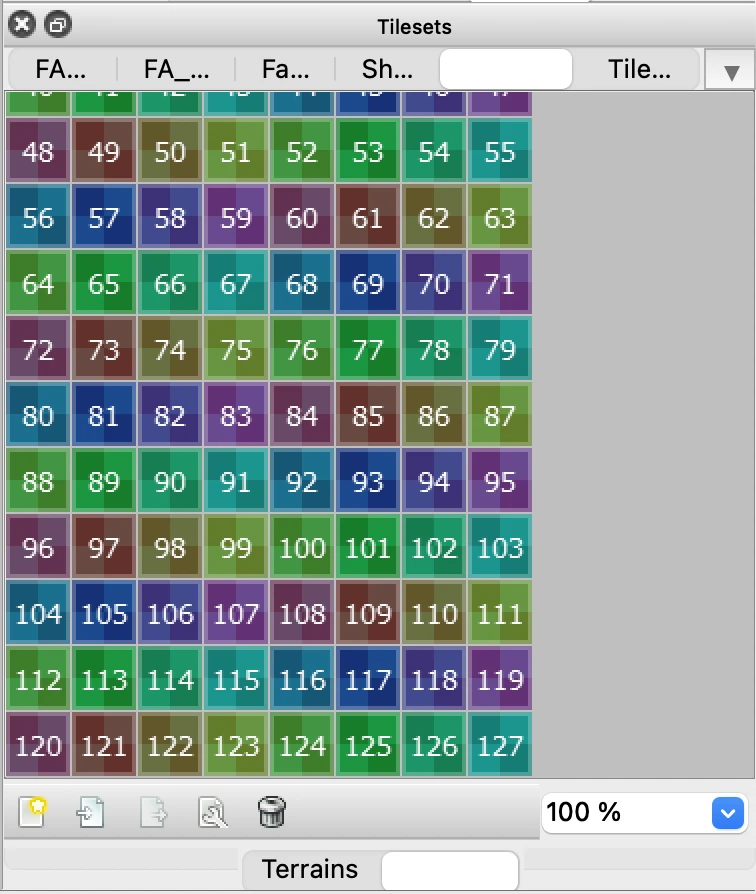

“可是,为什么有这么多图层?它们都是什么意思?我要怎么拿到想要的图块集?”

在正式开始画图之前,我们先来了解几件关于 <span class="og-g">Tiled</span>地图编辑器的事情。

#### 加载图块集

加载 `tileset`(图块集)非常简单。

*(来源:FruitDragon)*

角落里的这个窗口就是 `tilesets`(图块集)显示的地方。不过,如果我想要一个不在里面的 `tileset`(图块集),只需这样做:

1. 在我的文件管理器里找到该图块集(通常,文件名就是该区域的内部名称)

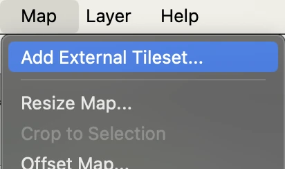

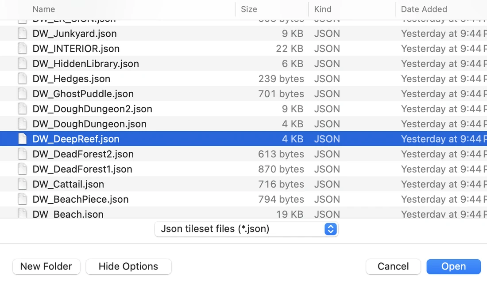

点击顶部工具栏的 Map(地图)> Add External Tileset(添加外部图块集)。

*(来源:FruitDragon)*

3. 选中我想要的 `tileset`(图块集)(确保把文件类型设置为

```text
.json)
```

就这样,大功告成!我想要的 `tileset`(图块集)现在已经添加到我刚做的地图里,我可以随意在 `tilemap`(图块地图)中使用其中的任何图块了。

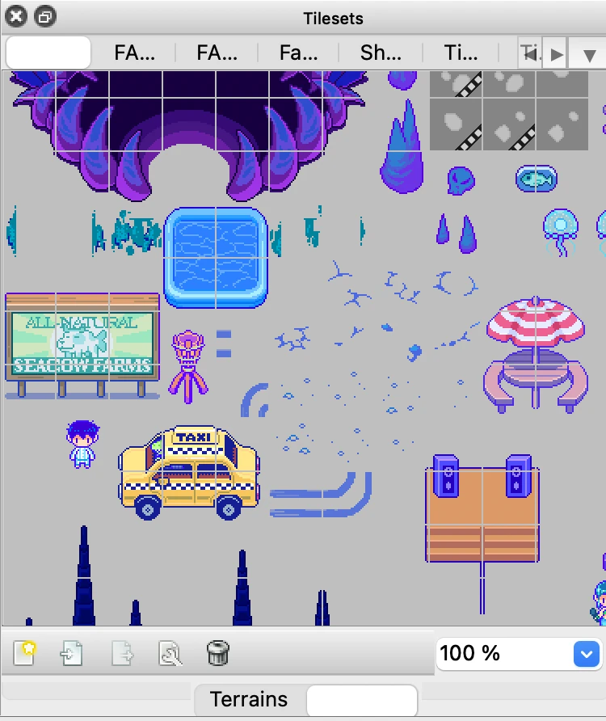

*(来源:FruitDragon)*

注:千万不要一次性加载所有图块集。这是我用惨痛教训换来的经验,哈哈。文件夹里有一些 `tilesets`(图块集)因为引用了不存在的图片而无法使用,它们基本上会让你新建的 `tilemap`(图块地图)报废——更别提图块集数量一旦超过某个数(大约 16 个),<span class="og-g">Tiled</span> 就无法正确识别图块了。我把 maps 文件夹里的每一个文件都翻了个遍,所有可用的 `tileset`(图块集)清单都整理在[这份表格](https://docs.google.com/spreadsheets/d/157gbdncgn1_1sT9ZbLotL1KiRml7Y1oFKG7rZEccOA0/edit?usp=sharing)里供你参考,还附带了 TomatoRadio 做的一些排版和补充信息。一般来说,如果某个 `tileset`在`img/tilesets` 里没有对应的图片,那它就是废的。

“这些图层都有什么区别?那我该用哪个图层?图层又到底是什么?”

好吧,我觉得是时候讲讲在

```text
Tiled:
```

#### 图层 `Layers`(图层)就是为地图增添纵深的东西。不然,我们要怎么让一些图块显示在玩家上方、另一些图块位于玩家脚下、还有一些与玩家处于同一水平呢?

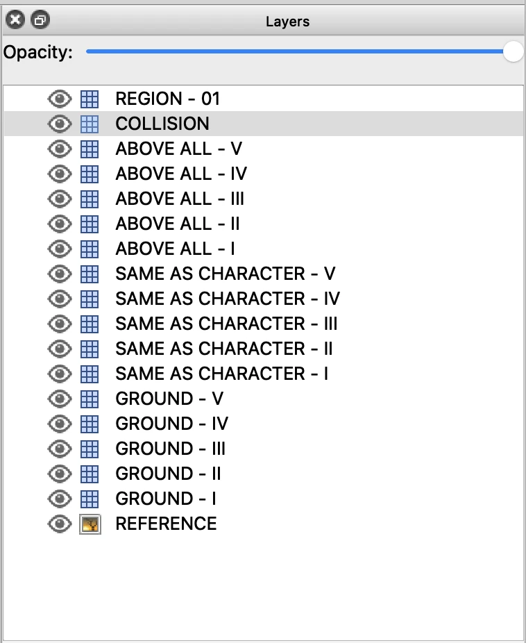

答案很简单:`Layering`(分层)。

如果你听说过数码绘画和图片编辑中使用的 `Layers`(图层),

那么 <span class="og-g">Tiled</span>的 `Layer`(图层)系统运作方式也大同小异。图层从下往上依次排列,最顶部的通常是 `Region`(区域)层和 `Collision`(碰撞)层。这样你更容易看清地图上哪些部分已经设为某个 `region`(区域)或已被阻挡,因为它们不会被上方 `layers`(图层)的任何图块挡住。

*(来源:FruitDragon)*

<span class="og-g">OMORI</span>的 `tilemap`(图块地图)的 `layer`(图层)菜单大致长这样。

图块 `layers`(图层)的命名惯例如下:<var>GROUND</var>(地面层),用于垫在角色脚下的图块;<var>SAME AS CHARACTER</var>(与角色同层),用于角色能与之互动的物体;<var>ABOVE ALL</var>(最上层),用于树冠、悬垂物之类玩家必须从下方走过的东西(`Otherworld`(异世界)里那条秘密小径就是个例子)。然后是 <var>COLLISIONS</var>(碰撞层),负责碰撞;以及 <var>REGIONS</var>(区域层),负责区域图块——这两个我们稍后会讲到。

不过,游戏并不会按 <span class="og-g">Tiled</span>里的图层名来读取图层——如果你把地图原封不动地放进 <span class="og-g">RPG Maker MV</span>,就会看到角色在一张平平的纸面上走来走去。(更糟的是,`collision layer`(碰撞层)和 `region` `layer`(区域层)还会显示出来。)因此,我们必须设置一些 `custom properties`(自定义属性)。可我们要怎么添加这些 `custom properties` 呢?

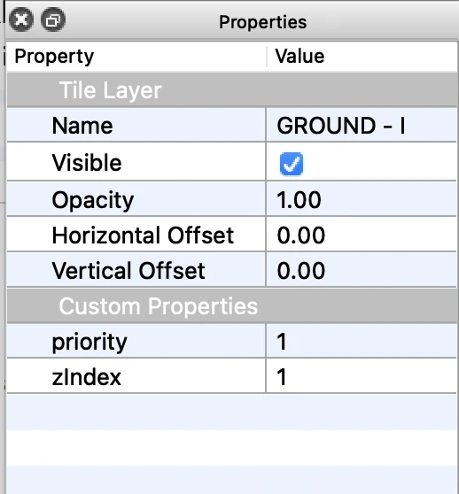

#### 添加自定义属性

*(来源:FruitDragon)*

这是你的 `properties`(属性)窗口。默认情况下,如果你用的是模板,里面已经加载了两个自定义属性:`priority`和 `zIndex`。不过,`custom properties`(自定义属性)的类型可不止这两种。要添加一个新的:

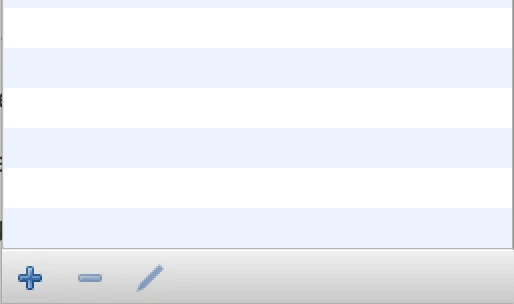

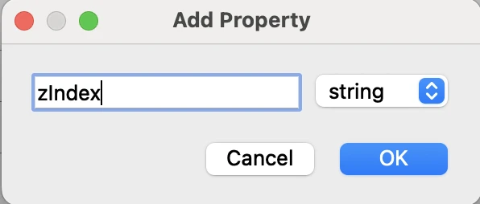

*(来源:FruitDragon)*

点击底部的加号。

*(来源:FruitDragon)*

在对应的输入框里填上属性名。你**不应该**把该属性的数据类型从“<var>string</var>”改掉。

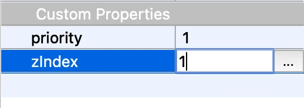

*(来源:FruitDragon)*

你会跳转到 `Custom Properties`(自定义属性)栏,你的新属性会出现在那里。接着就可以为该图层填入值了。

#### 自定义属性指南

我们要添加的最重要属性——也就是必须添加到每一个图层上的那些(**(不包括**`Region`**和**`Collision`

`layers`**)** 的话,那就是 `zIndex` 和 `priority`。

##### zIndex

`zIndex`告诉 <span class="og-g">OMORI</span>各图层相对于玩家的位置关系。<span class="og-g">OMORI</span>通常使用三种不同的 `zIndex`值:

<var>1</var>:`Ground`(地面层,位于角色下方)

<var>3</var>:`Same as character`(与角色同层,和玩家处于同一层)

<var>5</var>:`Above all`(最上层,角色从其下方走过)

*注:游戏同一时间最多只能显示 256 个“与角色同层”图块,所以请只在需要时使用。*

除这些之外还有更多可用值,但 <span class="og-g">OMORI</span>并没有用到,所以你也不必用。尽管如此,这里还是附上一份简明指南。

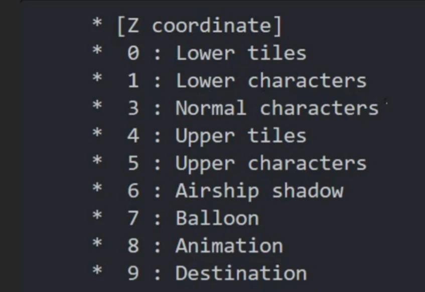

*(来源:[这份谷歌文档](https://docs.google.com/document/d/1LyoDxBbtw4MUb7HirIZEaigpbJOcbwTelby7vttIAlg/edit#heading=h.dckld2q0kapk))*

##### Priority

`priority`决定的是图层的加载顺序(指载入内存,而不是 `layering` 分层)。`Priority`数值会随每次 `zIndex`的变化而重置。`zIndex`值最低且 `priority`数值最低的图层最先加载,随后 `priority`高一级的图层叠在其上,再下一层依此类推;直到 `zIndex`升高,`priority`再回到 <var>1</var>。

用表格来直观呈现是个好办法。表中的每个值都按(`zIndex`, `priority`)的顺序排列,从左到右、从上到下依次读取。

1, 1 1, 2 1, 3 1, 4 1, 5 3, 1 3, 2 3, 3 3, 4 3, 5 5, 1 5, 2 5, 3 5, 4 5, 5

##### RegionId

`regionId`是一种给地图局部区域应用效果的方式。有几种不同的 `RegionIds`会对队伍产生特定效果。把“`regionId`”自定义属性设为对应的 id 即可完成设置。

这些效果分别是:

<var>1</var>:用于让 `Headspace`(头脑空间)里的镜子映出玩家。

<var>10</var>**:**让玩家打滑。`Snowglobe Mountain`(雪球山)的冰面用的就是它。

<var>20</var>**:**充当碰撞图块,但只对事件生效,对玩家无效。`Last Resort`(最终度假村)的地毯用的就是它。

<var>28</var>**:**让脚印显现。沙地和雪地用了它,`Truth Sequence`(真相段落)的血脚印也是如此。不过,想让血脚印显示出来,你还得打开 `Switch`<var>84</var>“used in recital”。

<var>90</var>**:**让队伍使用攀爬行走图。所有梯子用的都是它。

<var>92</var>**:**让屏幕闪红,并对队伍造成 10 点爱心伤害。不会致死。黑色空间 2 的碎镜子用的就是它。

`tileset`(图块集)“`Tile_Region_32x32`”里带有对应 `regions`<var>1</var>`-`<var>127</var> 的图块。它们对 `regions`(区域)没有任何固有效果,但拿来作标记很方便。

你可以利用 `Regions`(区域),通过 `$gamePlayer.regionId()` 在 <span class="og-g">JavaScript</span>中检测玩家所在的位置。例如,如果你要检查玩家是否位于 `Region`<var>3</var>,只需使用 `$gamePlayer.regionId() ===`<var>3</var>。此外,你还可以借助插件,在玩家站到某个区域上时运行一个公共事件。不过,有一个很大的限制务必牢记:一个图块只能被分配**一个**`region`(区域)。所以,举个例子,你不能让一片雪地既用 `Region 28` 留下脚印——那些图块无法同时再用 `Region 20` 来阻挡事件移动。

##### Collision

`collision`正是让一个 `Layer`(图层)成为 `Collision Layer`(碰撞层)的属性。所有 `collision` `layers`(碰撞层)在游戏内加载时都会自动设为不可见,它们需要配合一个特殊的图块集使用,即位于 `maps`文件夹中的 `TileCollision_32x32.json`(不过它会随模板地图自动加载进来。)

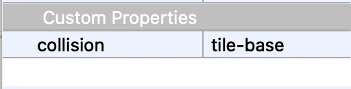

创建 `collision layer`(碰撞层)时,你只需要把 <var>collision</var> `property`(属性)设为 <var>tile-base</var>,就像这样:

*(来源:FruitDragon)*

*注:模板地图中的碰撞层已经预先设置正确了*

##### 层级(Levels)

此外,你还可以在地图上制作多个 `Levels`(层级),从而实现这样的布局:比如走某条路径时从桥下穿过,走另一条路径时则从桥面上走过。

`Levels`(层级)无疑是这些属性中最复杂的,所以我把它拆成两部分来讲。

##### 层级切换图块(To Level Tiles)

我们要做的第一件事是创建两个新图层,分别命名为 <var>TO</var> <var>LEVEL 0</var>和<var>TO LEVEL 1</var>。它们的作用是:当我们经过该图层上的某个图块时,把玩家向上或向下移动到对应的 `Level`(层级)。这个过渡通常放在连接上下层的“路径”(梯子、楼梯等)上,其中 <var>TO LEVEL 0</var> 在底部,<var>TO</var>

<var>LEVEL 1</var> 在顶部,大致就像这张画得潦草的示意图。

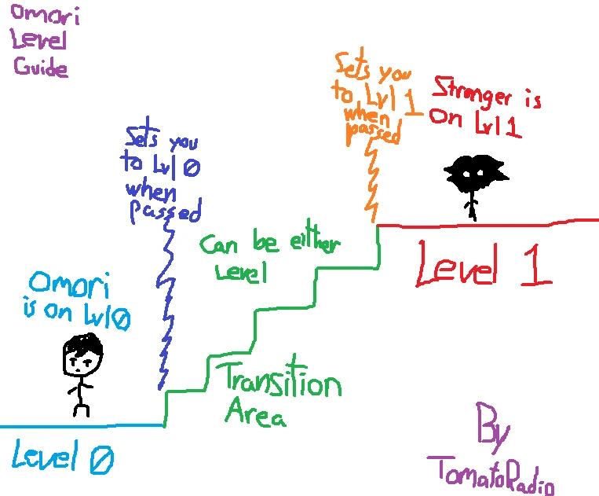

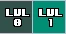

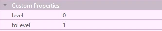

*(来源:TomatoRadio)*

方便的是,`Collision Tileset`(碰撞图块集)里就带有用来在地图上标记这些图块的图块,省心好用。

不过,还需要 `Custom Properties`(自定义属性),这些图层才能真正起作用。

*(来源:TomatoRadio)*

首先,<var>level</var>属性标记该图层位于哪个 `Level`(层级)。默认情况下,所有图层都在 `Level`<var>0</var> 上。

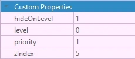

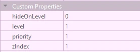

接着,<var>toLevel</var>属性表示:当玩家踩到该图层的图块时,就会被移动到指定的 `Level`(层级),这里是 <var>1</var>。

再做一个反向版本来返回 `Level`<var>0</var>,你的过渡图层就完成了!

##### 层级图层(Level Layers)

现在我们有了在层级之间移动的手段,接下来需要创建会随层级切换而变化的图层。

我们又需要两种`Custom Properties`(自定义属性)了。

*(来源:TomatoRadio)*

这里分别是一个 `Above All`(最上层)图层和一个 `Ground`(地面)图层。这样 `Above All` 图层只在玩家处于 `Level`<var>0</var> 时显示,而 `Ground` 图层只在玩家处于 `Level`<var>1</var> 时显示。

这要靠下面这两个属性来实现:

<var>Level</var>和之前一样,就是标记图层所在的 `Level`(层级)。

<var>HideOnLevel</var>顾名思义——如果玩家处于指定层级,该图层就会隐藏。

像这样成对使用,我们就能做出桥这类物体:在 `Level`<var>0</var> 时表现为 `Above All`(最上层),在 `Level`<var>1</var> 时表现为 `Ground`(地面层)。

最后,在带层级的地图中,碰撞层和区域层需要为**两个**层级分别制作,所用属性与上面相同。

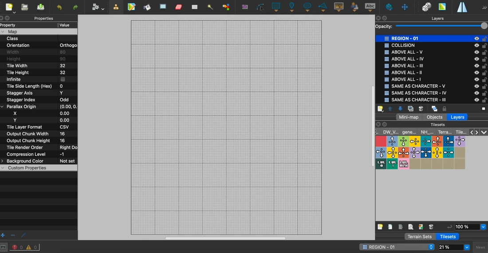

还是没懂?往下翻到“制作我们的地图”标题下的[层级章节](/omori/modding-guide/04-maps/),那里有更一步一步的讲解。

### 制作我们的地图

现在,就用我们学到的知识来做我们自己的地图吧!

*(来源:FruitDragon)*

这是我的编辑器全貌。我的计划是做一张由桥连接各岛屿的地图,玩家可以在上面活动;再放一些通入水中的梯子,让玩家能从桥下和岛屿之间游过去。来看看怎么实现吧!

为此我们需要两个 `levels`(层级):一个给带岛屿的地面层,一个给水。它们还需要各自不同的 `collision layers`(碰撞层)。

我打算先搭岛屿 `layer`(图层)。我会从 `terrain tiles`(地形图块)开始,先搭出我想要的地形的大致样子。

“等等——`terrain tiles`(地形图块)?”

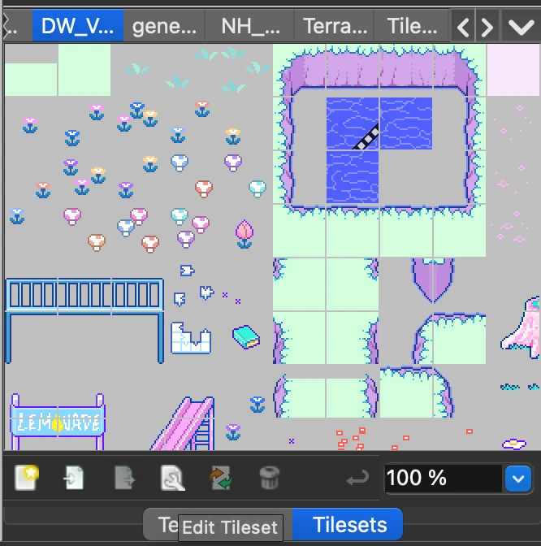

#### 地形图块(Terrain Tiles)

`Terrain tiles`(地形图块)是一种省力得多的图块地图制作方式,尤其是对陆地这类图块而言。你不必手动摆放每一块、还可能越摆越乱,<span class="og-g">Tiled</span>能借助 `Terrain Tiles`(地形图块)自动完成这件事。

要创建 `Terrain Tiles`(地形图块),只需在 <span class="og-g">Tiled</span>编辑器中点击“<var>Edit Tileset</var>”(编辑图块集)打开图块集,然后进行设置。就是那个小扳手图标。

*(来源:FruitDragon)*

打开图块集后,点击那个看起来像迷你图块地图的图标,打开 `Terrain Sets`(地形集)编辑器。

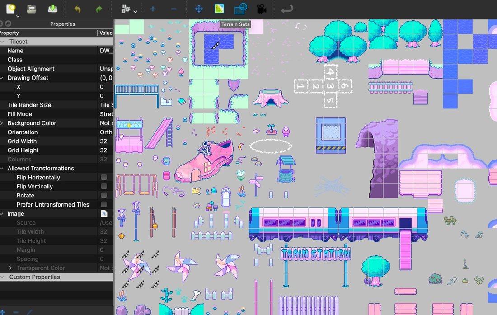

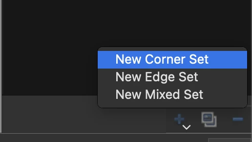

*(来源:FruitDragon)*

点击加号,添加一个新的角集(Corner Set)。

*注:如果你用的是 v1.0.3,它不会询问你要哪种类型的 `Terrain Set`(地形集),因为 v1.0.3 只有 `Corner Sets`(角集)。*

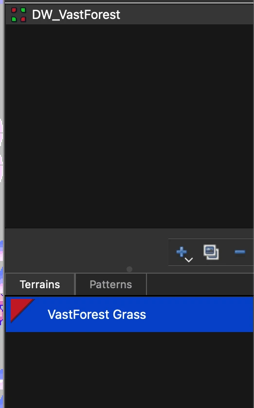

*(来源:FruitDragon)*

地形集的名字想怎么取就怎么取!我就直接用了所用图块集的名字:<var>DW_VastForest</var>。

*(来源:FruitDragon)*

接下来,你只需像下面这样设置 `terrain set`(地形集)。做法很简单:在你想标为地形的地方拖动鼠标就行。这一步其实就是在定义这些图块各自是什么类型——顶边图块、外角图块、内凹角图块等等。记得保存!

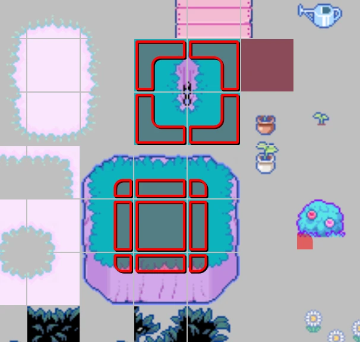

*(来源:FruitDragon)*

然后,到编辑器底部的“<var>Terrains</var>”处选择你的地形集。

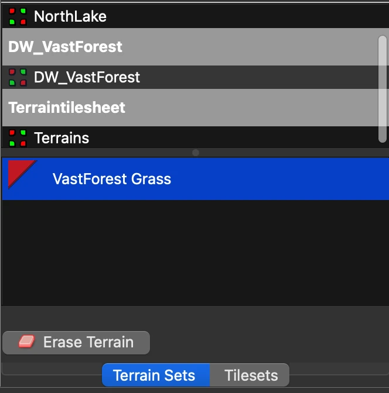

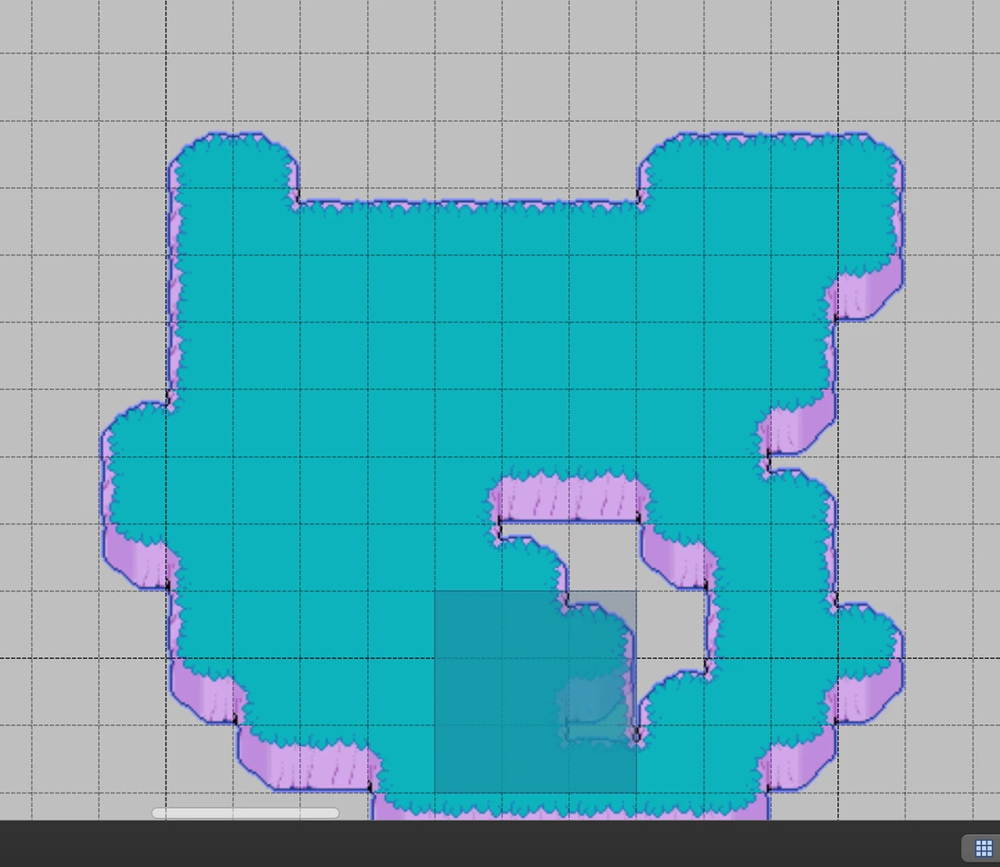

*(来源:FruitDragon)*

现在只需拖动光标,你的陆地就会完美成型,就这么简单!

*(来源:FruitDragon)*

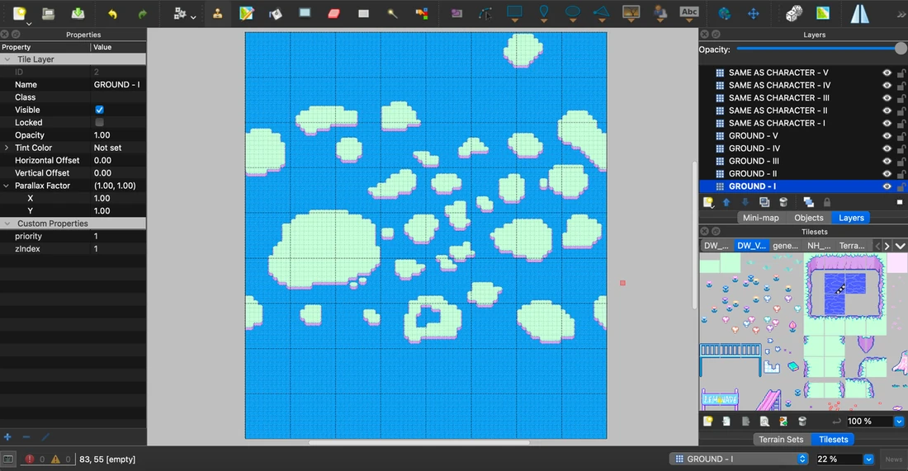

注:<span class="og-g">OMORI</span> 其实自带了一套现成的 `Terrain Sets`(地形集),就在 <var>TerrainTiles.json</var> 里。如果你把那个图块集加载到地图中,它就会自动加载对应的 `Terrain Sets`(地形集)供你使用。

现在,让我们回到做地图上来。

#### 制作地图

看,我已经用广阔森林(Vast Forest)的浅绿草皮(`DW_VastForest.json`,更确切地说是 `TerrainTiles.json` 中的广阔森林草地)和北湖(North Lake)的中蓝水色(`DW_NorthLake.json`)搭好了一片群岛。我用的是最底下两层——`GROUND - I` 放水,`GROUND - II` 放岛屿。目前看起来相当不错!

*(来源:FruitDragon,为 The Dreamer 制作的地图)*

现在我想做桥的系统。我通过修改 `DW_NorthLake.json` 里的桥,做了一些自定义桥图块,接下来就用它们。

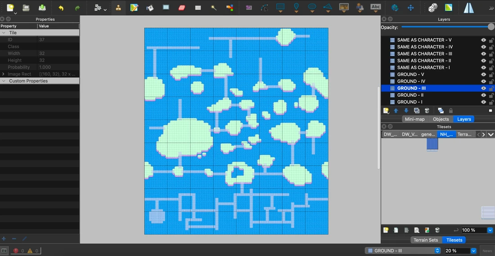

*(来源:FruitDragon,为 The Dreamer 制作的地图)*

看着真不赖!我决定这样设计:要想抵达其中一些岛屿,玩家必须从水里游过去,而不能只靠桥移动。我也挺喜欢它带点迷宫的感觉。这里我最终用了两层,`GROUND - III` 和 `GROUND - IV`,因为一些图块相互重叠,需要再加一层。

说到从水里走,玩家总得有办法进入水里才行。来放几把梯子吧。

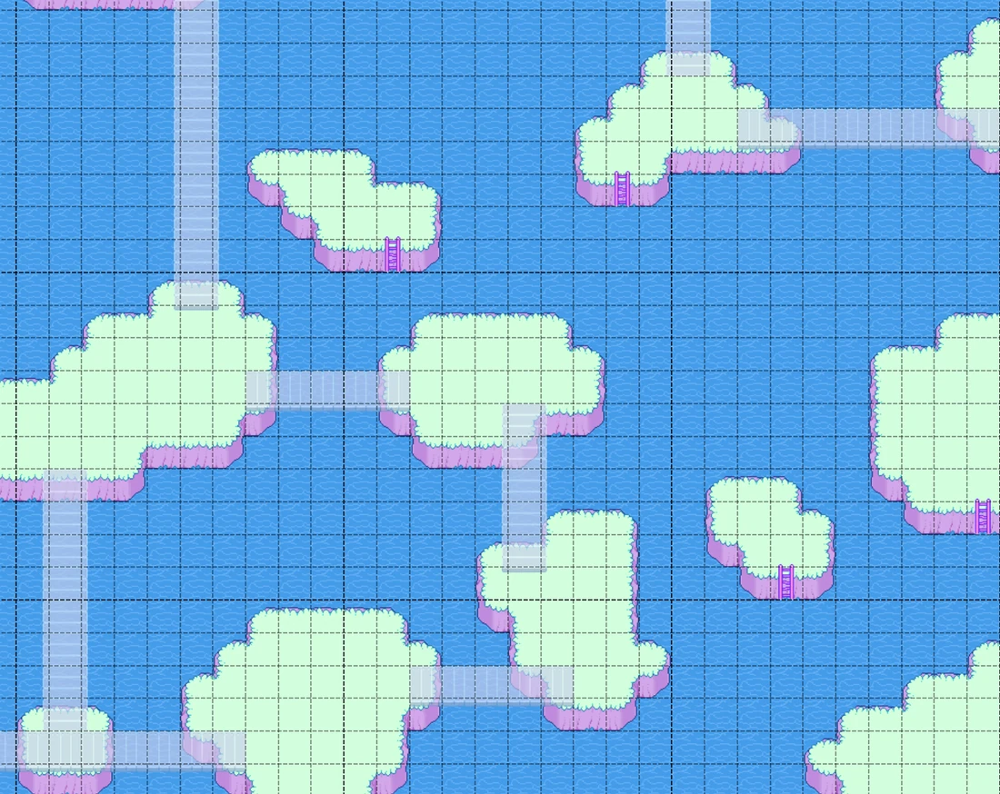

*(来源:FruitDragon,为 The Dreamer 制作的地图)*

我用的是 `general_use.json` 里的一些梯子图块。那个图块集里的梯子种类还真不少!我把它们放在 `GROUND - V`。

等等,`GROUND` 图层已经用完了!

没关系。要新建图层,我只需右键点击图层窗口,然后点击 <var>New > Tile Layer</var>(新建 > 图块图层)。

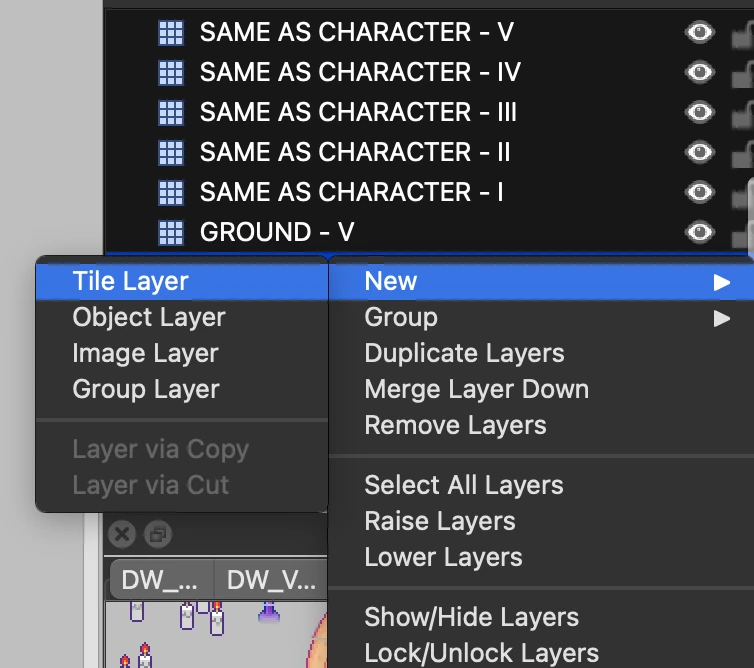

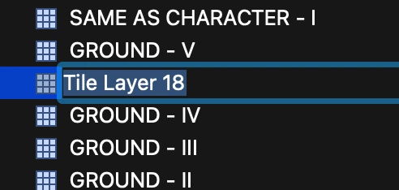

*(来源:FruitDragon,为 The Dreamer 制作的地图)*

之后想给它起什么名都行。`custom properties`(自定义属性)我打算等地图做完后再补,以防还需要更多图层。

*(来源:FruitDragon,为 The Dreamer 制作的地图)*

现在,差不多该加些细节了,比如草丛图块、花和树。做细节时,我喜欢一片一片地推进——这里就是一座岛一座岛地来——这样就不会记不清哪里做了细节、哪里还没做。我会先加草和花,然后再用单独一层加树。

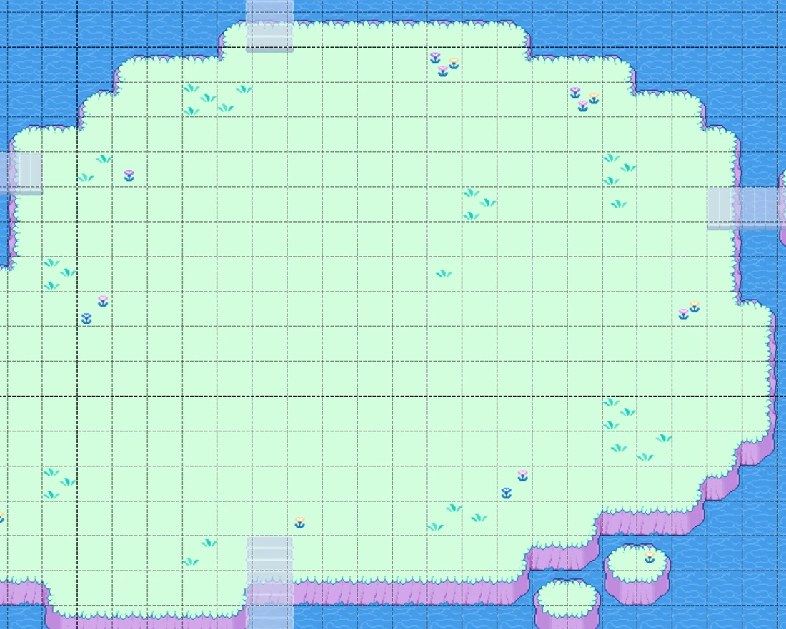

*注:如果要为单格装饰物添加多种变体,比如草簇或花朵,你可以按住 Ctrl 选中所有想要的图块,然后开启随机工具(图标是一对骰子)。这样你放置的每个图块都会从选中的图块中随机取一个。填充工具和矩形工具也同样适用。*

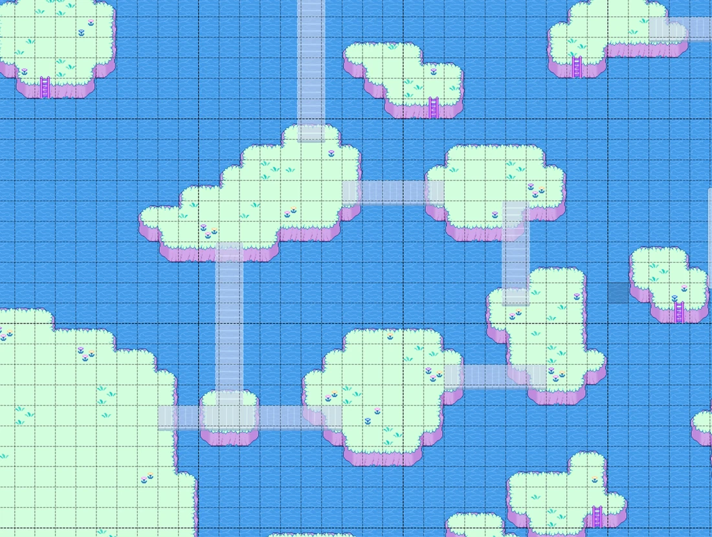

*(来源:FruitDragon,为 The Dreamer 制作的地图)*

*(来源:FruitDragon,为 The Dreamer 制作的地图)*

这些草和花的图块全都在 `DW_VastForest.json` 图块集里。接下来是树。我打算把树的下半部分放在 `GROUND` 图层,把树的上半部分放在 `ABOVE ALL` 图层。这样,我们就能出现在树桩上方、却被树叶挡在后面(下方)。

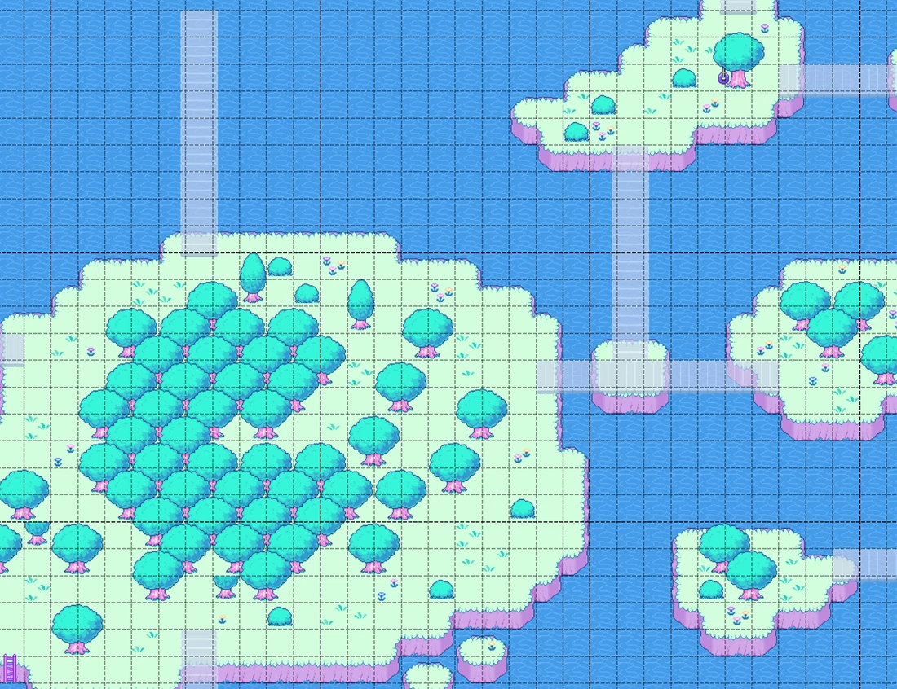

*注 1:正好借此提醒你:你可以选中多个图块(不使用随机工具),然后用矩形工具批量放置。这在圈定树的落点时尤其有用。*

*注 2:如果树的数量不多,也可以把它们放在 `SAME AS CHARACTER`(与角色同层)图层;不过,这类图块同一时间对玩家可见的数量是有上限的,超限就会显示为不可见。*

*(来源:FruitDragon,为 The Dreamer 制作的地图)*

我决定在树所在的同一层加一些灌木。它们同样来自 `DW_VastForest.json` 图块集。

另外,我在 `DW_VastForest.json` 里看到一个半没入水中的树图块,放进水里应该挺酷。我打算加几个。为了省事,我把它们加在和陆地图块相同的图层上(`GROUND - II`)。

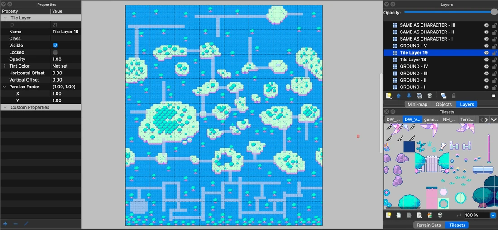

*(来源:FruitDragon,为 The Dreamer 制作的地图)*

这样一来,我的图块地图就做完了!

……或者说,如果不需要 `collision`(碰撞)的话就做完了。还有 `region`(区域)层。哦,当然还有 `levels`(层级)。

说到这个,咱们来把陆地和水的 `level`(层级)系统搭起来。如果你不打算做 `level`(层级)系统,可以直接跳到[区域与碰撞](/omori/modding-guide/04-maps/)章节。

#### 层级(Levels)

因为我希望玩家从陆地开始,所以我把陆地设为 `Level` `0`。<span class="og-g">RPG Maker MV</span> 会在玩家进入地图时自动将其设为 `Level 0`,所以这是最省事的选择。这样一来,水层就是 `Level1`,因为那是玩家需要切换进入的层级。

当玩家在 `Level 1` 上时,我希望桥显示在玩家上方。为此,我要把我的两个桥图层各复制一份,并把它们设为 <var>Above All</var>(最上层)。

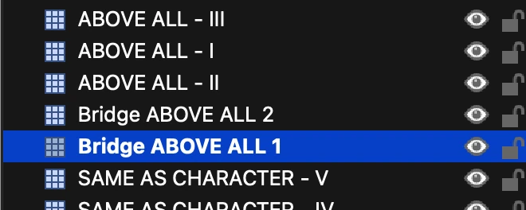

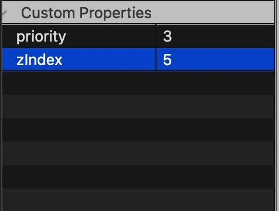

*(来源:FruitDragon,为 The Dreamer 制作的地图)*

当然,我可得记得把 `zIndex`设为 <var>5</var>!

*(来源:FruitDragon,为 The Dreamer 制作的地图)*

##### level 与 hideOnLevel

现在该添加 `level`和 `hideOnLevel`属性了。玩家在水里(`Level 1`)时,地面桥需要隐藏;玩家在陆地上(`Level 0`)时,最上层桥需要隐藏。来看看具体是什么样子。

我的 `GROUND` 桥:

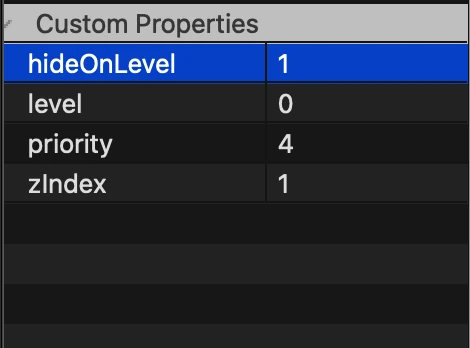

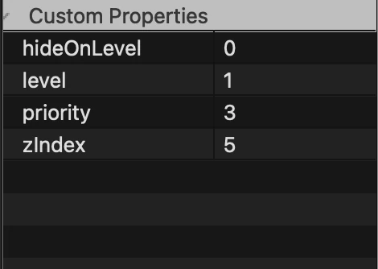

*(来源:FruitDragon,为 The Dreamer 制作的地图)*

我的 `ABOVE ALL` 桥:

*(来源:FruitDragon,为 The Dreamer 制作的地图)*

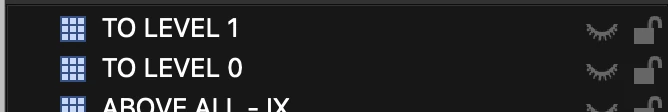

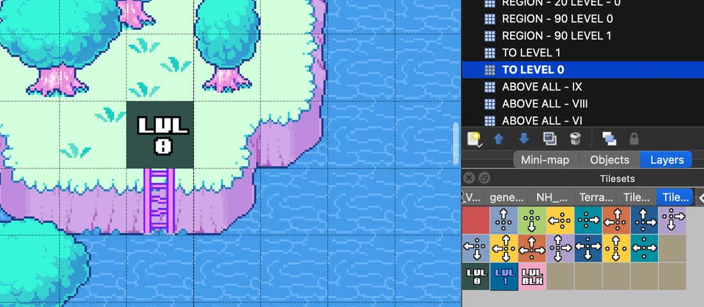

现在来设置让玩家在这些 `levels`(层级)之间往返的方式。由于从水到陆地、再从陆地回水的唯一途径就是梯子,所以我只需在每个梯子旁边设置过渡即可。

你需要像这样创建两个 `layers`(图层),为了条理清晰,最好把它们放在 `layers` 列表的最顶部。

*(来源:FruitDragon,为 The Dreamer 制作的地图)*

`TO LEVEL 1` 位于梯子底部,而 `TO LEVEL 0` 位于梯子顶端。来看看是什么样子。

##### TO LEVEL 0(前往层级 0):

*(来源:FruitDragon,为 The Dreamer 制作的地图)*

图中所示的“`LVL 0`”图块来自 `Tile_Collisions_32x32.json` 图块集。`Custom Properties`(自定义属性)是这样的:

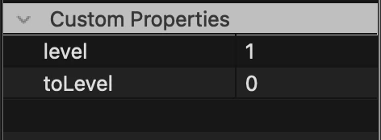

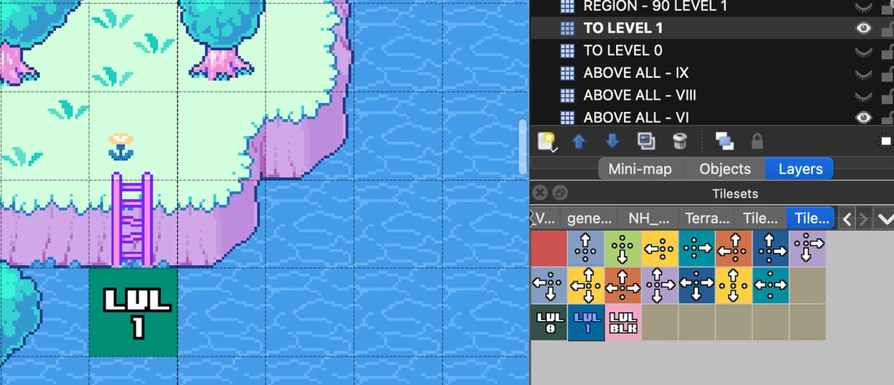

*(来源:FruitDragon,为 The Dreamer 制作的地图)*

##### TO LEVEL 1(前往层级 1):

*(来源:FruitDragon,为 The Dreamer 制作的地图)*

图中所示的“`LVL 1`”图块来自 `Tile_Collisions_32x32.json` 图块集。`Custom Properties`(自定义属性)是这样的:

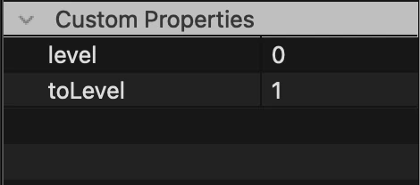

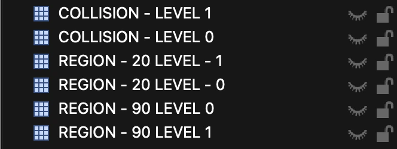

*(来源:FruitDragon,为 The Dreamer 制作的地图)*

##### 最后说明

差不多就是这些了!记得给其他所有会随层级变化的图层都设置好 `hideOnLevel`和 `level`属性。至于不随层级变化的图层(比如我这张地图里的水层和陆地层),则不需要添加 `level`或 `hideOnLevel`属性。无论你身处哪个层级,它们都会保持原样。

但是,`REGION`(区域)层和 `COLLISION`(碰撞)层需要为每个层级分别建立。`COLLISION`碰撞层尤其关键——如果每个层级没有各自独立的碰撞层,游戏就会坏掉。

*(来源:FruitDragon,为 The Dreamer 制作的地图)*

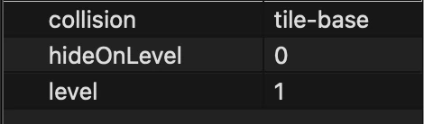

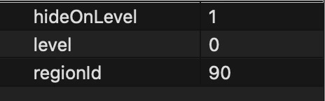

它们的 `custom properties` 大概长这样。

碰撞:

*(来源:FruitDragon,为 The Dreamer 制作的地图)*

区域(`Region90`):

*(来源:FruitDragon,为 The Dreamer 制作的地图)*

现在我们来聊聊怎么制作 `region`层和 `collision layers`。

#### 区域与碰撞

##### 碰撞

制作碰撞层很简单。有一个叫 `Tile_Collisions_32x32.json` 的图块集,专门用来做碰撞层。

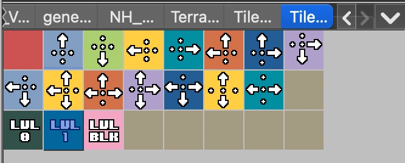

*(来源:FruitDragon)*

红色碰撞图块,人称全碰撞图块,是我们做碰撞时用得最多的图块。它上手最容易,也最难翻车。玩家和其他事件(开了 `Through`的除外)无论如何都踏不上这些图块。

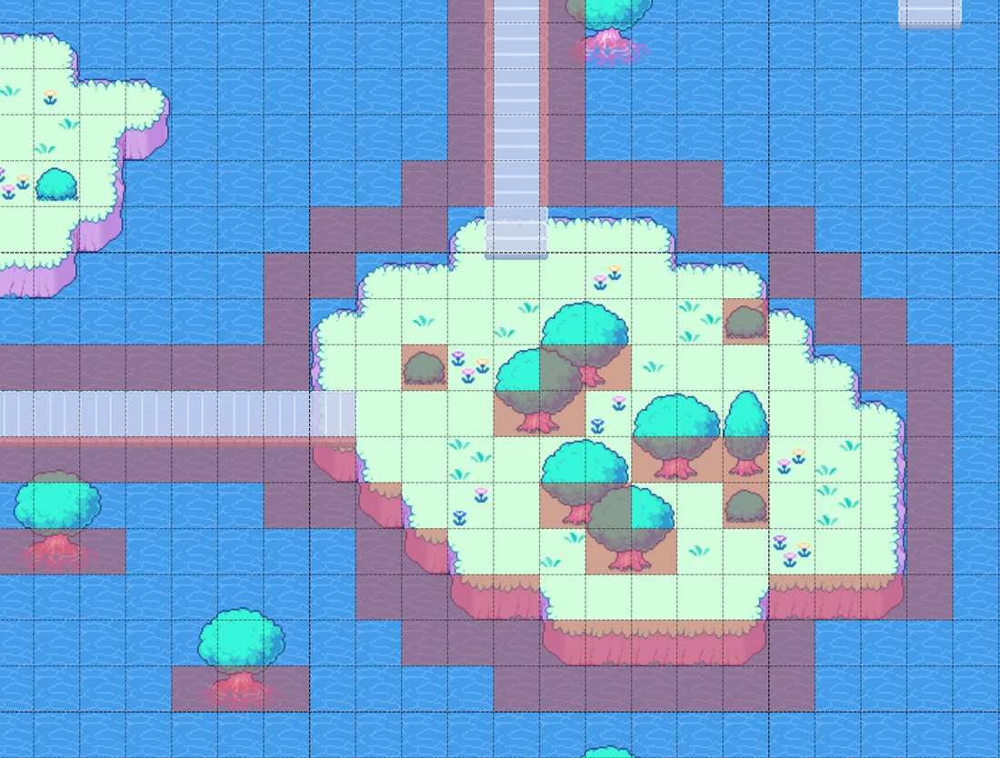

*(来源:FruitDragon,为 The Dreamer 制作的地图)*

其余的碰撞图块(不算 `LVL 0`、`LVL 1` 和 `LVL BLK` 图块),也就是 `partial collision tiles`(部分碰撞图块),则稍有不同。用这些图块时,玩家依然能走上带有 `partial collision tile` 的图块,但只能从箭头标出的方向进入;同样,也只能从箭头标出的方向离开该图块。因此,它们的使用场景要少见得多——即“墙”正好夹在两个图块之间的情况。

在下面这个例子里,我不想让玩家从侧面够到梯子,所以用了一个部分碰撞图块。

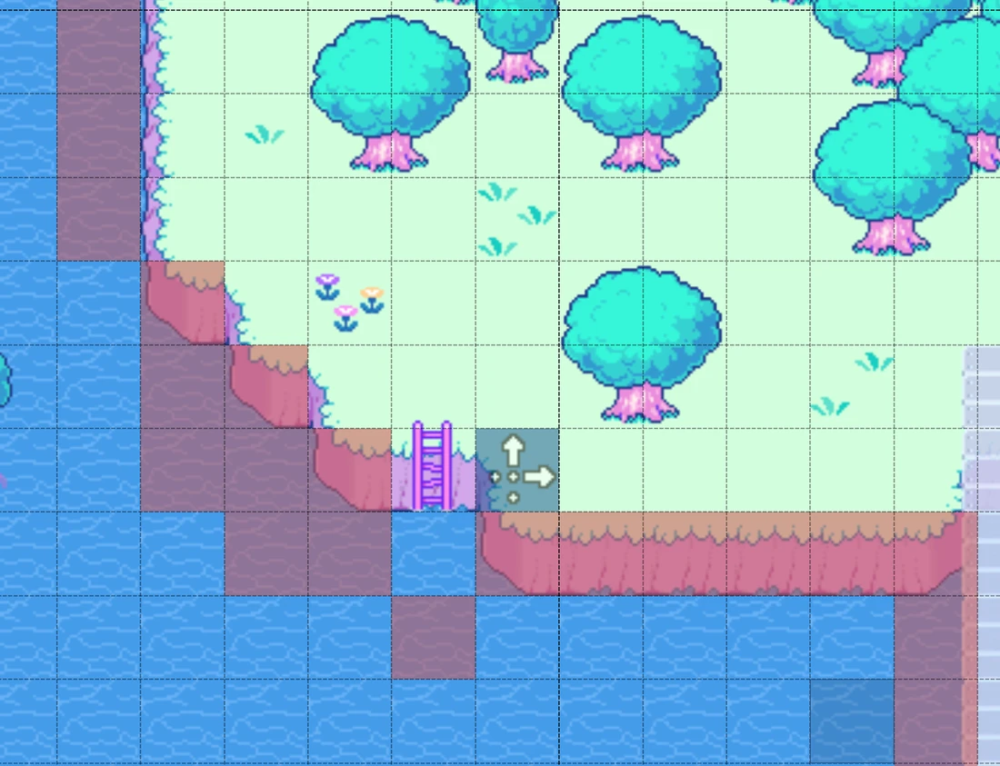

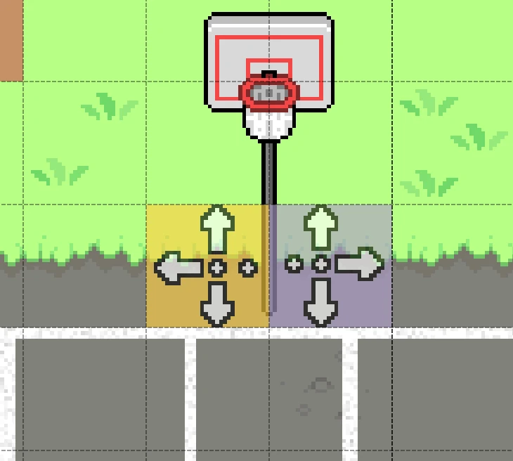

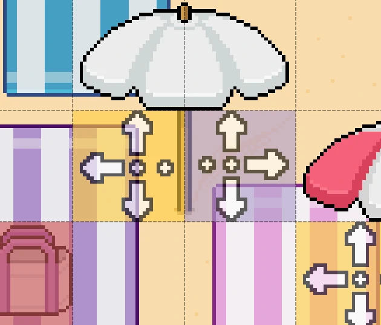

*(来源:FruitDragon,为 The Dreamer 制作的地图)*

原版游戏也会在杆子之类的东西上用到它们。

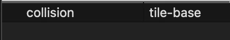

*(来源:map63,远野公园 Faraway Park,原版游戏;以及 map383,海滩回忆 Beach Memory,原版游戏)*

碰撞层做好后,给它添加 collision `Custom Property`(碰撞自定义属性)。

*(来源:FruitDragon,为 The Dreamer 制作的地图)*

碰撞就讲到这!使用 `Levels`(层级)时,每个层级都需要单独的碰撞层,但除此之外,碰撞部分就算完成了。

##### 区域

我需要给地图里的梯子加上 `Region 90`,这样玩家爬梯子时才会有攀爬动画。具体怎么做呢?

区域层跟碰撞层一样简单。和碰撞一样,有个叫 `Tile_Regions_32x32.json` 的图块集,就是我们用来画区域的。

在我的 `Region 90` 层上,我会用标着“`90`”的图块。我要做的就是把“`90`”图块铺到每架梯子上。

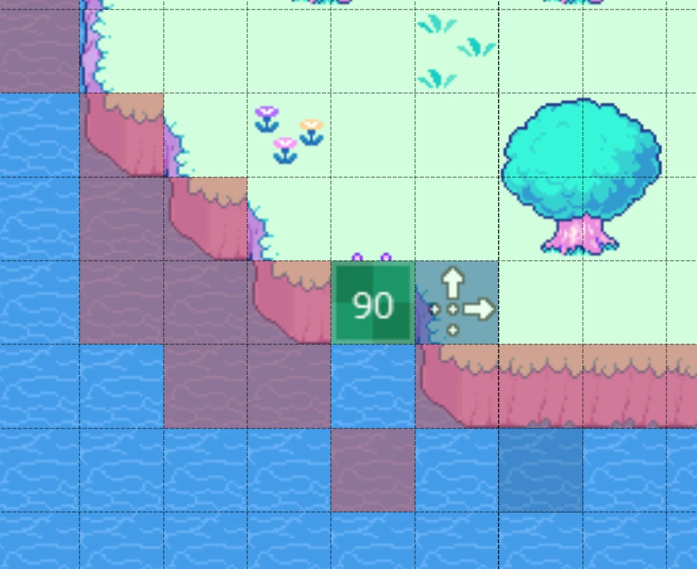

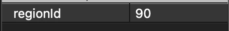

*(来源:FruitDragon,为 The Dreamer 制作的地图)*

最后收个尾,我会确认 `regionId Custom Property` 已设置为 <var>90</var>。

*(来源:FruitDragon,为 The Dreamer 制作的地图)*

不过,处理区域时有一点很重要:如果你在两个不同的区域层里,往同一个图块上放了两种不同的区域图块,它们会互相抵消。千万留神!另外,每个层级都要有单独的区域层。

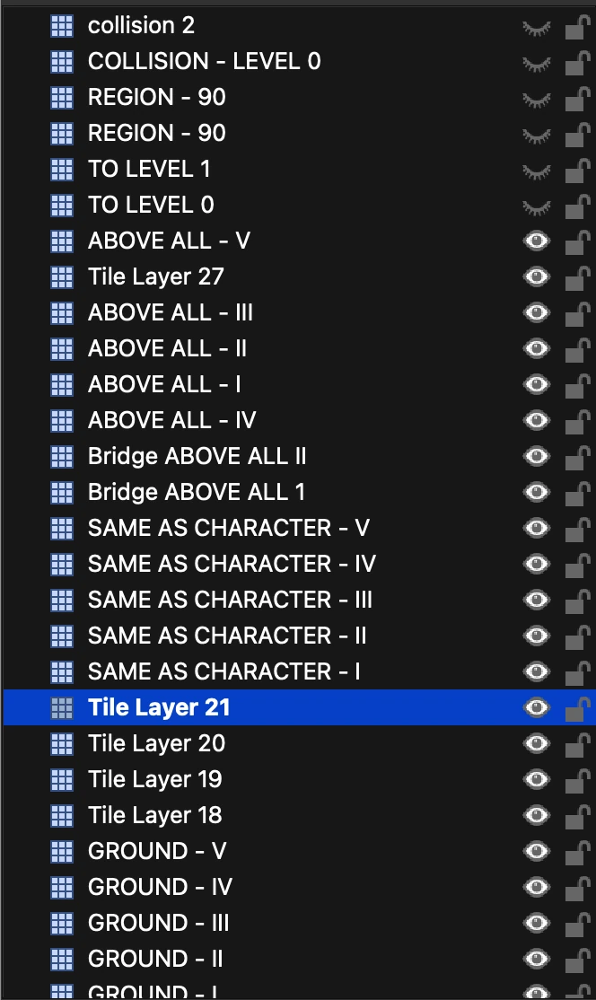

#### 图层整理

说到做地图,图层整理真的、真的非常重要。

因为现在嘛?我的地图完全是一团糟。

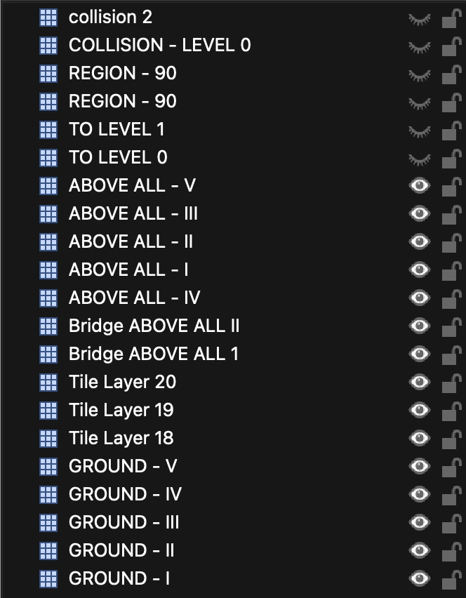

*(来源:FruitDragon,为 The Dreamer 制作的地图)*

更别提我的 `zIndex`和 `priority`自定义属性值都没对齐。可我现在连每个图层是干嘛的都快看不清了,更别提搞明白哪里该填什么 `zIndex`和 `priority`值。

那我该怎么整理呢?

##### 第 1 步:删除用不到的图层

*(来源:FruitDragon,为 The Dreamer 制作的地图)*

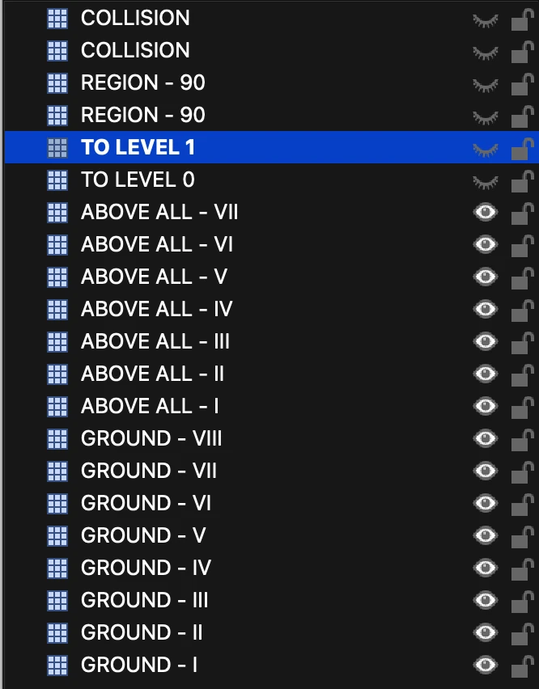

这看上去已经好太多了。不那么让人头大,处理起来也更容易。

##### 第 2 步:重命名所有图层

如果所有图层都用同一套命名规则,事情会轻松得多。不一定非得用原版那套“GROUND - I, SAME AS CHARACTERS - I, ABOVE ALL - I”,不过我用的就是它。你也可以用别的方案,比如“G1, S1, A1”或“Ground 1, Character 1, Above 1”。怎么顺手怎么来!

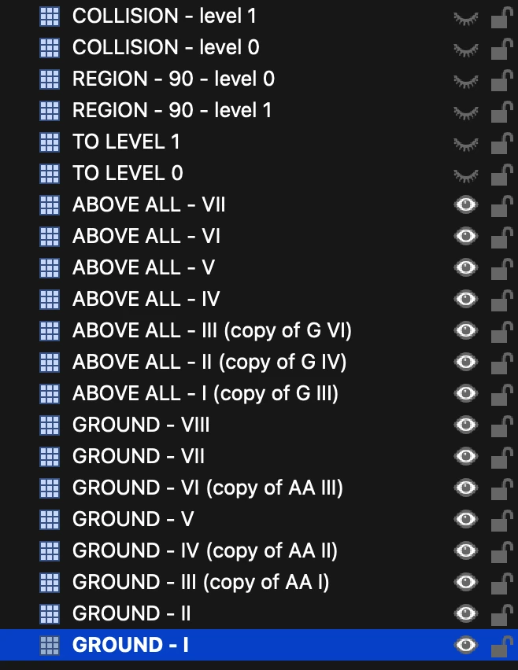

*(来源:FruitDragon,为 The Dreamer 制作的地图)*

##### 第 3 步:层级(Levels)

我个人喜欢加点小料:层级标注(Level Specification)。这对多层级地图很有帮助,尤其是能帮我看清哪些图层是别的图层的副本——这样改了其中一个,我就记得去改另一个。

*(来源:FruitDragon,为 The Dreamer 制作的地图)*

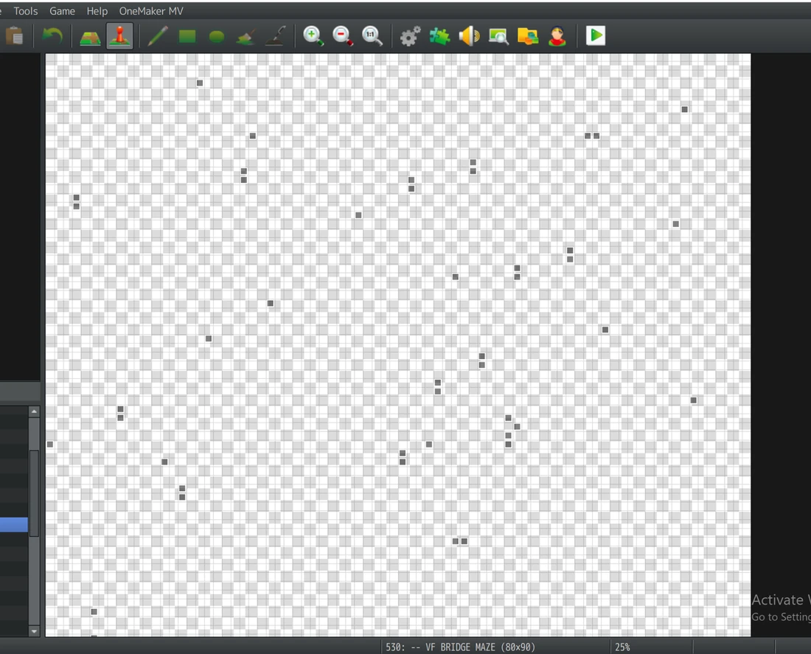

##### 第 4 步:Priority 与 zIndex

终于可以搞定 `custom properties` 了!从底往上逐层来,多亏把地图整理过了,填上正确的 `zIndex`和 `priority`毫不费劲。

大功告成!你有一张完整做好的地图啦!

因为你把地图命名成了 `map`<var>XX</var>(<var>XX</var> 是该地图的 `ID`,也就是它在 <span class="og-g">RPG</span> <span class="og-g">Maker MV</span> 里的编号),进入游戏访问这张地图时,它应该能完美加载。

……对吧?

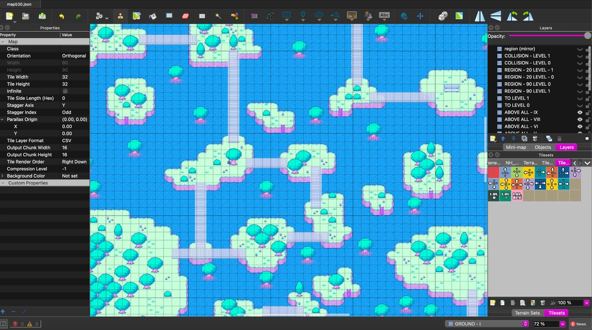

*(来源:FruitDragon,为 The Dreamer 制作的地图)*

呃,它没出现。游戏测试运行时加载得好好的,可它偏偏不显示在编辑器里。怎样才能让它现身,好让我放事件时不用在 <span class="og-g">Tiled</span>和 <span class="og-g">RPG Maker</span>

<span class="og-g">MV</span>之间来回奔波呢?

很简单:加载一个 `parallax`(视差背景)就行。(或者使用 [OneMaker MV](/omori/modding-guide/10-plugins/)。)

#### 在 RPGMaker MV 中加载地图

如果你有 [OneMaker MV](/omori/modding-guide/10-plugins/),可以直接跳到[“在 OneMaker MV 中加载地图”](/omori/modding-guide/04-maps/)

[一节](/omori/modding-guide/04-maps/)。如果你没有它,我建议你弄一个——它有一大堆 <span class="og-g">OMORI</span>Mod 制作者真正用得上的神器。但如果你不想弄,或者弄不到,我也会带你一步步把地图加载进编辑器,用的是

原版 RPG Maker MV。

首先,我们要把想要加载进 <span class="og-g">RPG Maker MV</span> 的那张地图,在 <span class="og-g">Tiled</span>编辑器里打开。

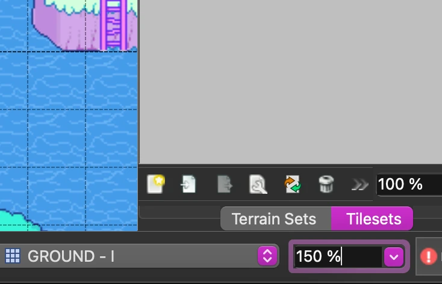

*(来源:FruitDragon,为 The Dreamer 制作的地图)*

把缩放级别设为 <var>150</var>%。**这一步很重要。不这样的话,把地图导入**

**RPGMaker 时会出问题。**

*(来源:FruitDragon,为 The Dreamer 制作的地图)*

*(注:这是因为 <span class="og-g">OMORI</span> 的图块尺寸是 32x32 像素,而 <span class="og-g">RPG Maker</span> <span class="og-g">MV</span> 的图块都是 48x48 像素。把缩放设为 <var>150</var>%,就能把地图从 32x32 放大到 48x48 像素图块,确保一切都对得整整齐齐。)*

接下来,我需要把地图导出为图片。选择 `File`

```text
> Export as Image.
```

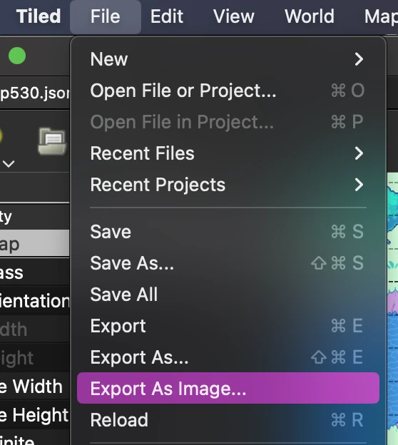

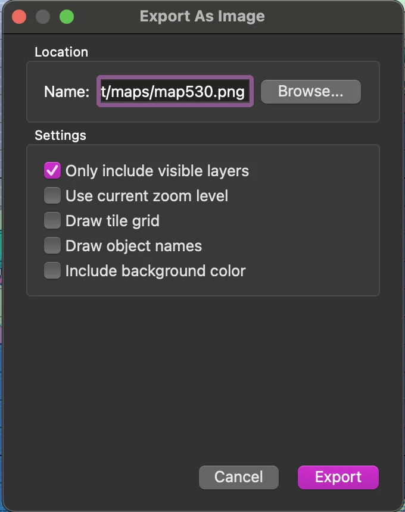

*(来源:FruitDragon,为 The Dreamer 制作的地图)*

它会打开下面这个窗口。

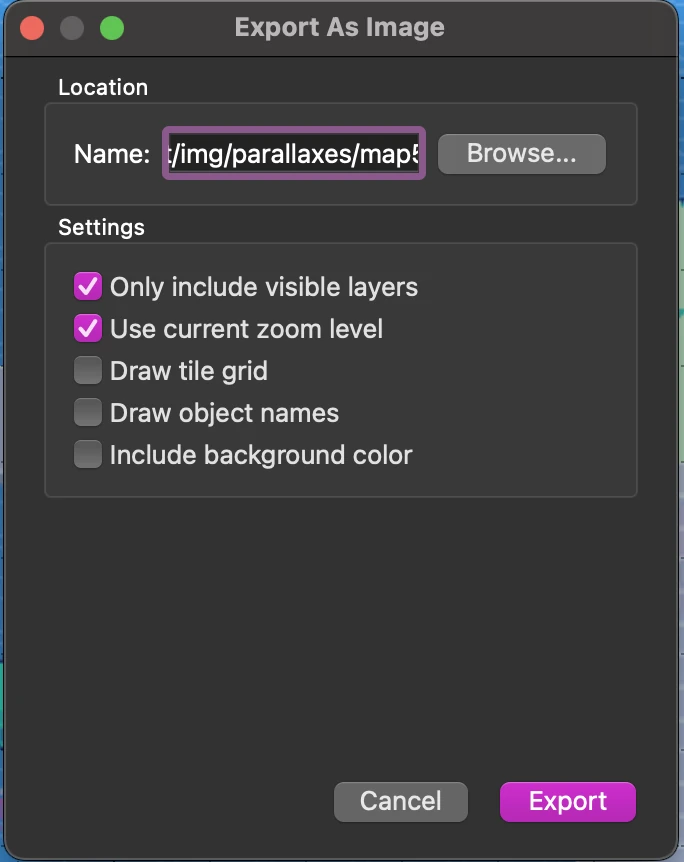

*(来源:FruitDragon,为 The Dreamer 制作的地图)*

你只应该勾选两个选项:“`Only include visible` `layers`”(只包含可见图层)和“`Use current zoom level`”(使用当前缩放级别)。只要你的碰撞层和区域层处于隐藏状态,这就能确保整张地图完整可见,而且尺寸正适合 <span class="og-g">RPG Maker MV</span>。

另外,你还需要更改图片的存放路径。默认情况下,它会导出到下面这个路径:

```text
…/www_playtest/maps/mapname.png 
```

这里要把“`maps`”改成“`img/parallaxes`”。

```text
…/www_playtest/img/parallaxes/mapname.png 
```

地图的名字随你取,不过通常最省事的就是保持 `map`<var>XX</var> 格式。

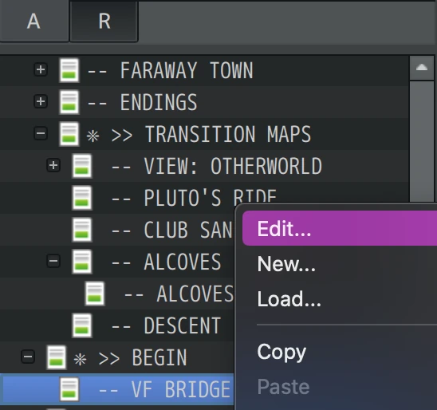

*(来源:FruitDragon,为 The Dreamer 制作的地图)*

这些都弄好后,点击“`Export`”(导出)吧!

该回到 <span class="og-g">RPG Maker MV</span> 了。

在屏幕左侧的地图列表里右键点击地图名,然后点击“`Edit`”(编辑)。

*(来源:FruitDragon,为 The Dreamer 制作的地图)*

它会打开下面这个窗口:

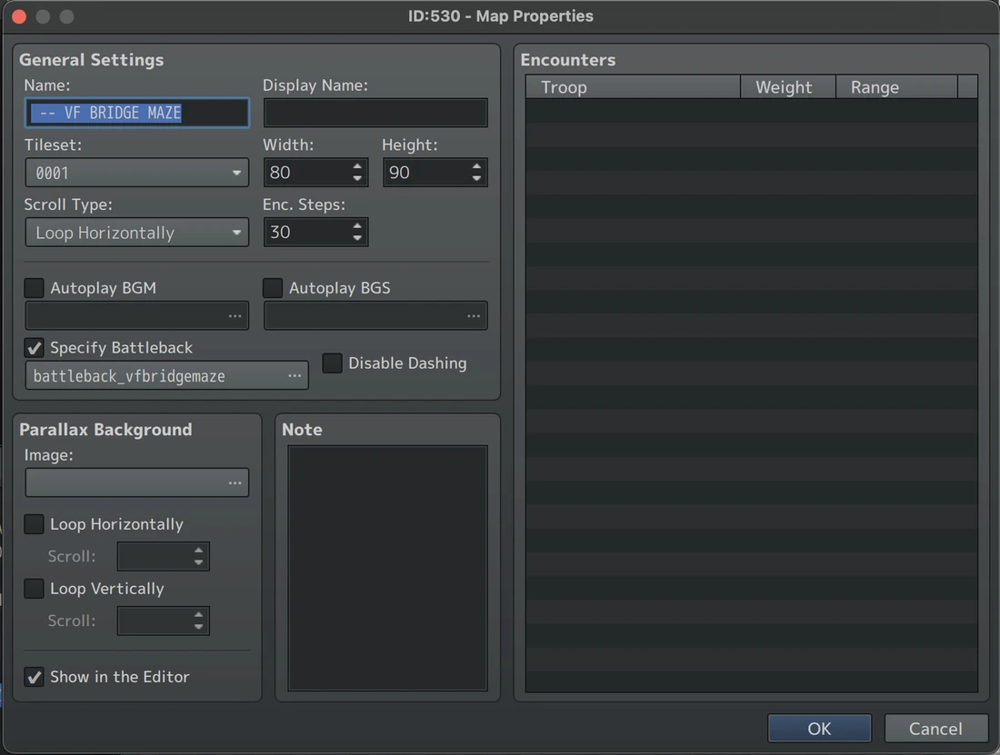

*(来源:FruitDragon,为 The Dreamer 制作的地图)*

我们需要的是 `Parallax Background`(视差背景)部分。打开图片选择窗口,找到你刚导出的那张地图图片。那里只会显示 `img/parallaxes` 文件夹里的图片——这就是为什么我们刚才必须把它放进这里,而不是 `maps`文件夹。

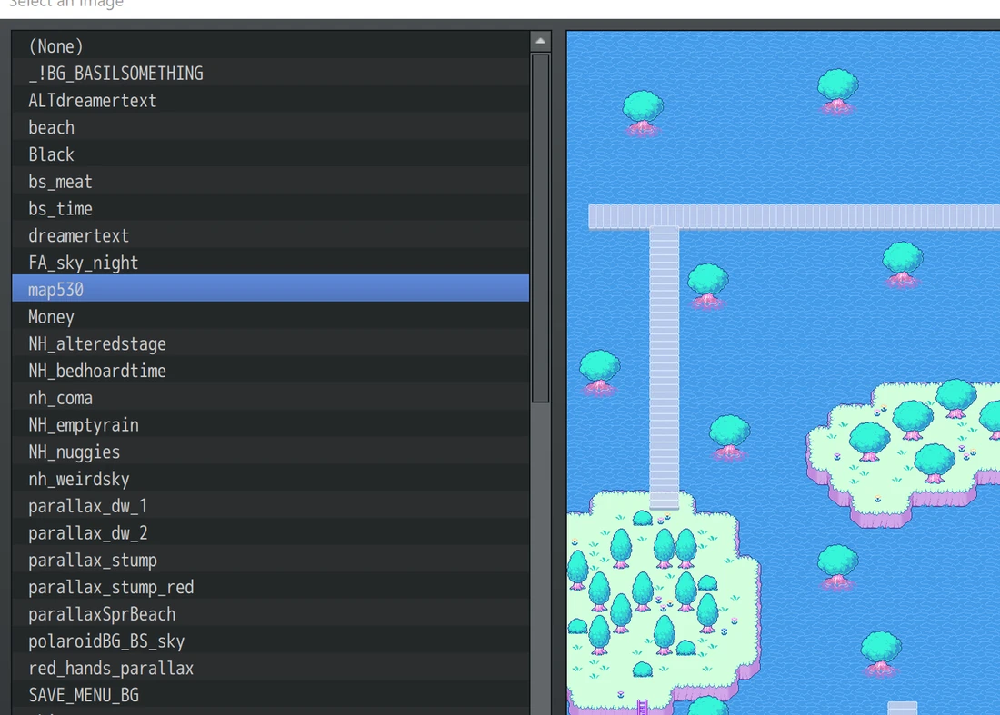

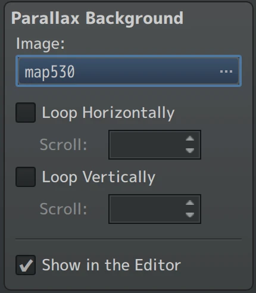

*(来源:FruitDragon,为 The Dreamer 制作的地图)*

点击“OK”,然后确保勾选了“`Show in the Editor`”(在编辑器中显示)。它应该长这样:

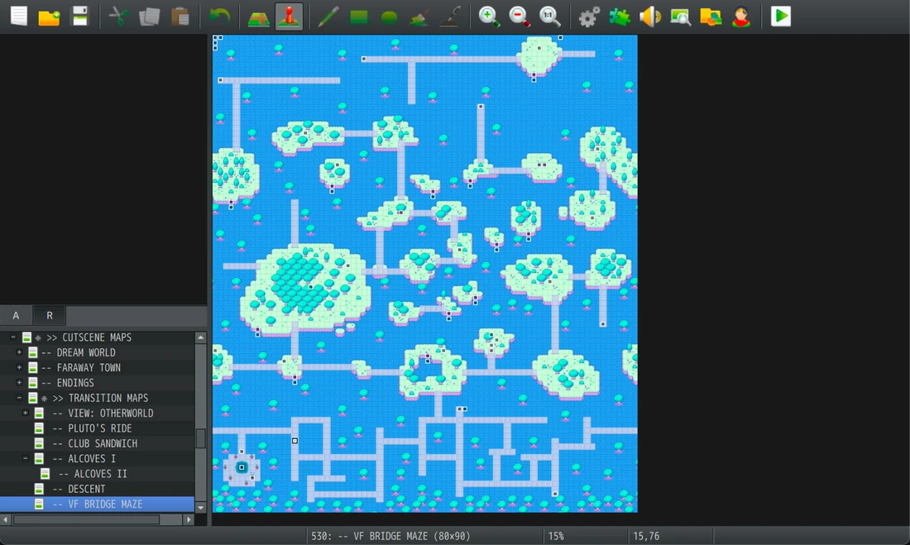

*(来源:FruitDragon,为 The Dreamer 制作的地图)*

“`Loop Horizontally`”(横向循环)和“`Loop Vertically`”(纵向循环)这两个勾选项不会产生任何影响,所以如果你原本有一个滚动的 `parallax`,只是被迫拿这张图顶替,滚动设置原样保留就行。

现在,只要退出地图编辑窗口,你的地图就会自动出现在编辑器里!

*(来源:FruitDragon,为 The Dreamer 制作的地图)*

不过,如果你这是在顶替某个 `parallax`,千万记得:做完之后,或者在编译、导出游戏时,要把 `parallax`换回原来那张。

顺带一提,这个方法在 <span class="og-g">OneMaker MV</span> 里也能用,但你**不必这么做**。有一个轻松得多的办法。

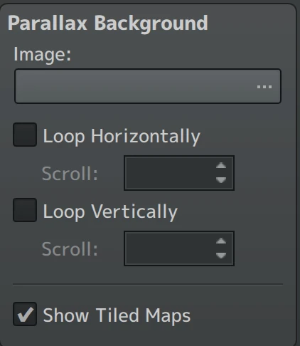

#### 在 OneMaker MV 中加载地图

如果你没有 <span class="og-g">OneMaker MV</span>,也不打算(或没办法)弄到它,可以[跳过本节](/omori/modding-guide/04-maps/)。

在 <span class="og-g">OneMaker MV</span> 里打开地图编辑器,你会发现“`Show in the Editor`”(在编辑器中显示)这个勾选项被换成了“`Show Tiled Maps`”(显示 Tiled 地图)。这是因为默认所有 `parallax`图片都会渲染在地图上,而 <span class="og-g">Tiled</span>地图是单独渲染的。

*(来源:FruitDragon,为 The Dreamer 制作的地图)*

它仍然没法全自动,但保存和导出已经省事太多了。

##### 自动地图渲染工具(OMORI 地图渲染器)

如果你有一大堆地图要导出渲染图,可以用 [OMORI Map Renderer](https://github.com/rphsoftware/omori-map-preview-renderer/actions/runs/20416117980)(OMORI 地图渲染器)来自动导出。只需打开链接,往下滚动,下载适合你操作系统的版本(见下图)。

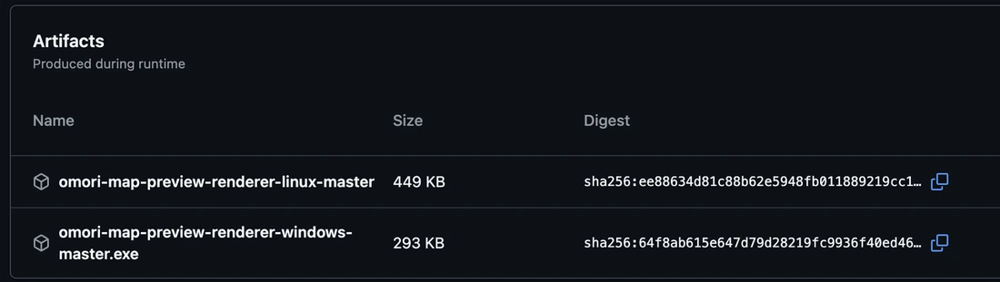

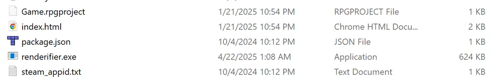

*(来源:FruitDragon,GitHub)*

我会用 <span class="og-g">Windows OS</span> 版本。

接下来,把这个应用程序带进你的 playtest 文件夹,丢进去就行。它应该和你的 `Game.rpgproject`文件位于同一个文件夹。(注:你拿到的文件不一定叫 renderifier.exe。)

*(来源:FruitDragon)*

运行这个程序。你应该会看到一个长这样的终端窗口:

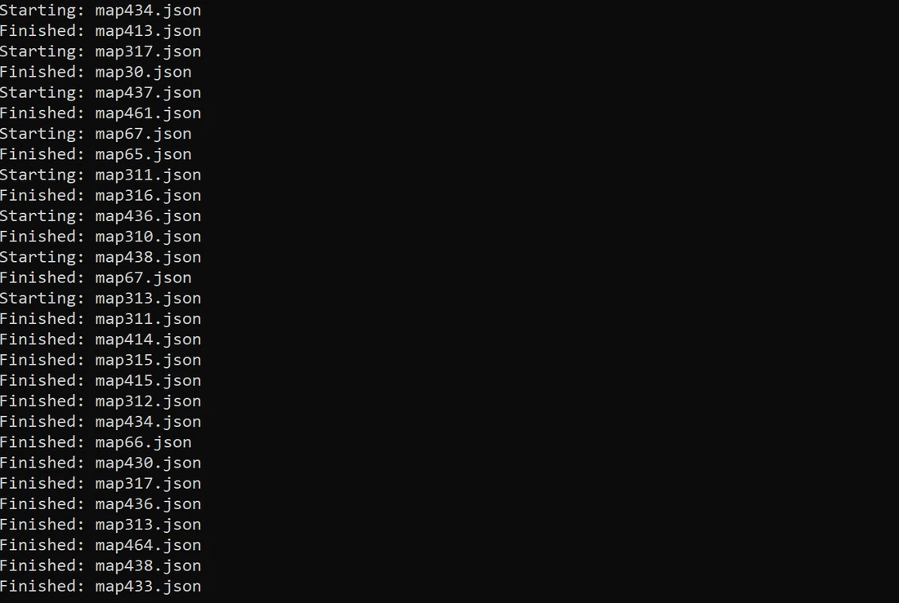

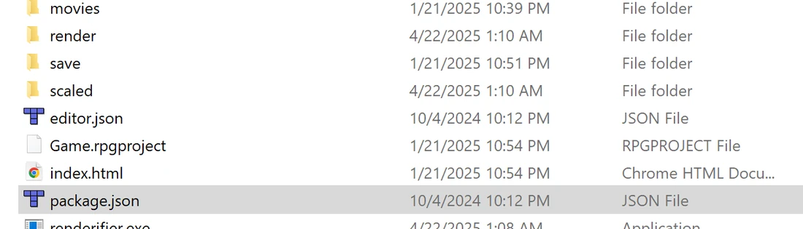

*(来源:FruitDragon)*

*警告:它很卡,还会大量消耗你机器的算力。请有所准备。渲染期间你可能什么都干不了,或者电脑电池掉电更快,等等。*

<span class="og-g">OMORI Map Renderer</span> 会在你的 playtest 里创建两个文件夹:`scaled`和 `render`。`render`文件夹里是你 maps 文件夹中所有地图以 <var>100</var>% 缩放级别导出的渲染图,<span class="og-g">OneMaker MV</span> 用的是它。而 `scaled`文件夹则包含 maps 文件夹中所有地图以 <var>150</var>% 缩放级别导出的版本——这是把地图作为视差背景加进 <span class="og-g">RPG Maker MV</span> 时要用的尺寸。谢天谢地,我们不需要那么干。

在你的 <span class="og-g">File Explorer</span>(文件资源管理器)窗口里,这两个文件夹大概长这样,就位于 Game.rpgproject 文件所在的那个文件夹里:

*(来源:FruitDragon)*

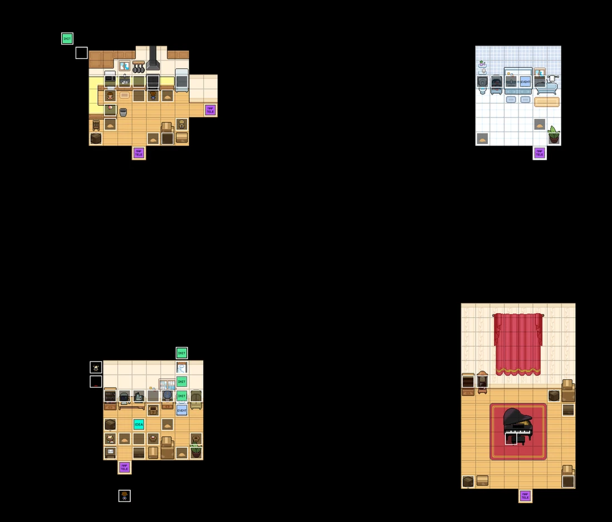

现在,只要打开你的 <span class="og-g">RPG Maker MV</span> 工程,地图就会由 <span class="og-g">OneMaker MV</span> 自动渲染出来。

*(来源:map14,玩家之家(白天),原版游戏,摄于 <span class="og-g">OneMaker MV</span> 编辑器)*

想在某张地图上关闭 <span class="og-g">Tiled</span>地图视图,只需取消勾选该地图的“`Show Tiled` `Maps`”(显示 Tiled 地图)。取而代之的会是棋盘格事件网格。

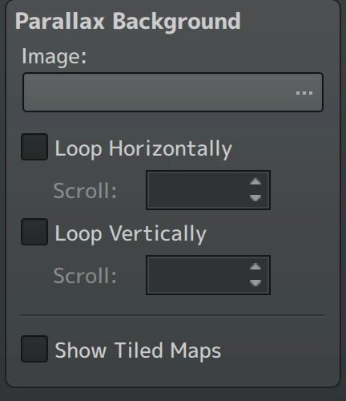

*(来源:FruitDragon)*

别担心,<span class="og-g">Tiled</span>地图不会出现在游戏里!开着它们时,`Parallaxes`(视差背景)照样可见。来看个例子。

不开 <span class="og-g">Tiled</span>地图时:

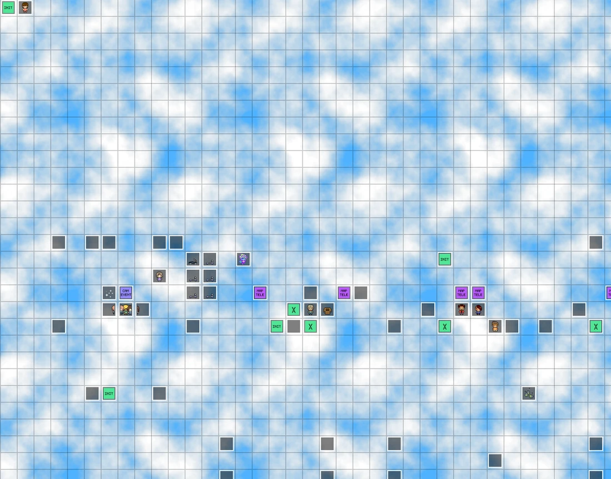

*(来源:map55,购物中心(白天),原版游戏,摄于 <span class="og-g">OneMaker MV</span> 编辑器)*

开着 <span class="og-g">Tiled</span>地图时(为了测试稍微改了改,哈哈):

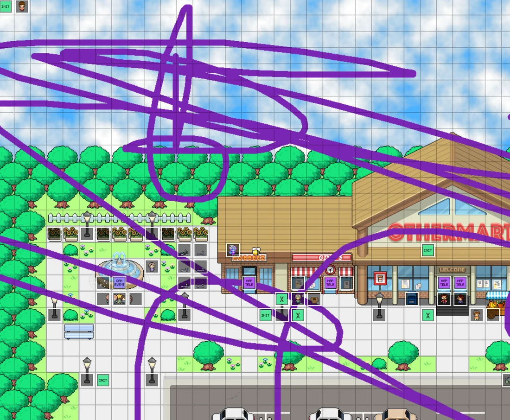

*(来源:map55,购物中心(白天),原版游戏,摄于 <span class="og-g">OneMaker MV</span> 编辑器)*

同一张地图,在 playtest 中加载的效果:

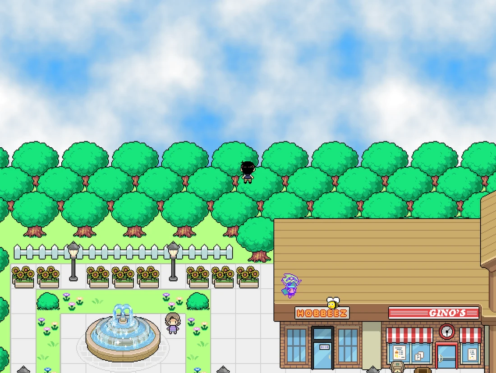

*(来源:map55,购物中心(白天),原版游戏)*

好,这些确实很酷,但接下来才是我知道你们盼了好久的部分。

渲染自定义地图。

##### 自定义地图(Tiled)

很遗憾,`OMORI Map Renderer` 不支持渲染自定义地图(**本节已过时,它现在支持了**)。这意味着我们得自己在 <span class="og-g">Tiled</span> 里渲染地图。

*(注:这个方法对原版地图同样有效。如果你只想渲染原版中的一两张地图,而不是全部,建议改用这个方法。)*

不过,这比没有 <span class="og-g">OneMaker MV</span> 时轻松多了,因为现在我们不用操心缩放级别。


不过,导出地图之前,我们得先确保 render 文件夹存在。如果 `OMORI Map Renderer` 没帮你生成过,就在你的 playtest 文件夹(即包含 `Game.rpgproject` 的那个文件夹)里新建一个文件夹,命名为“`render`”。要做的就这么多。

回到 `Vast Forest Maze`(广阔森林迷宫)这个例子,我们要再次在 <span class="og-g">Tiled</span>中打开这张地图。

*(来源:FruitDragon,为 The Dreamer 制作的地图)*

缩放级别不用管。

现在我要把地图导出为图片。选择 `File`

```text
> Export as Image.
```


*(来源:FruitDragon,为 The Dreamer 制作的地图)*

它会打开下面这个窗口。

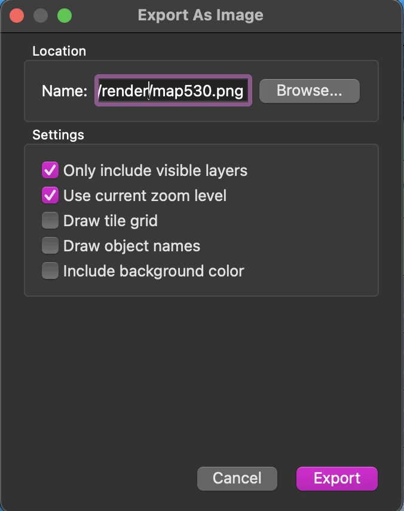

*(来源:FruitDragon,为 The Dreamer 制作的地图)*

“`Only include visible layers`”(只包含可见图层)是唯一需要勾选的选项。不勾“`Use current zoom level`”(使用当前缩放级别),默认就会以 <var>100</var>% 尺寸导出。

把文件路径中的“`maps`”改成“`render’`,像这样。

*(来源:FruitDragon,为 The Dreamer 制作的地图)*

搞定!导出吧!

现在,在 <span class="og-g">OneMaker MV</span> 里打开你的地图,它就会显示在编辑器里。很神奇,对吧?

“可是,FruitDragon,”你说,“现在我学会做自定义地图、也知道怎么把它加载进 <span class="og-g">OneMaker MV</span> 了,可自定义图块集要怎么做?你之前提到过它们,却没讲过!”

哦对,我确实提过!这个真的很简单!我演示给你看。

### 自定义图块集

开始做自定义图块集之前……你得先有一张自定义图块集图片。“Sprites and Art(精灵与美术)”标题下的[图块集章节](/omori/modding-guide/05-sprites-art/)更详细地讲了这些图片的规格,我这里就不重复了。

这是我的图块集:

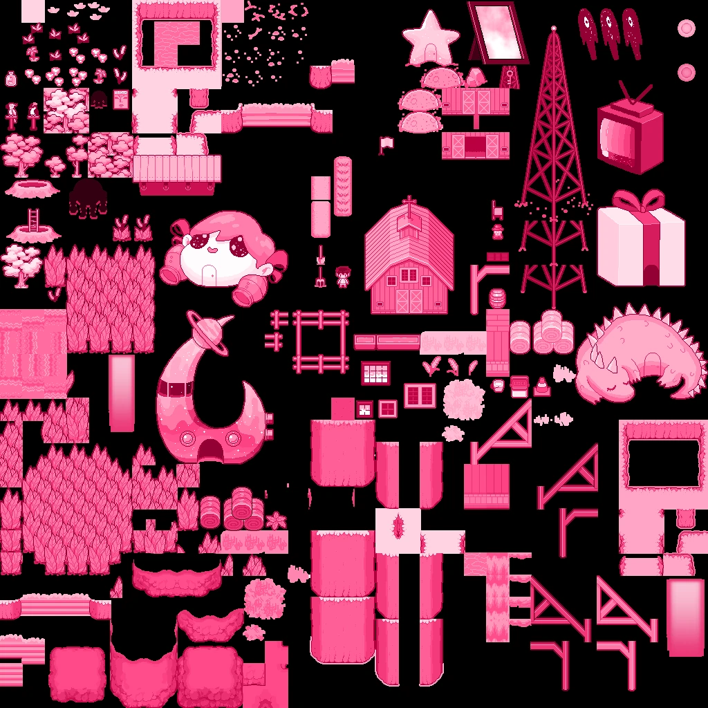

*(来源:FruitDragon,DW\_CattailField.png 的编辑版)*

它就是把 `DW_CattailField.png` 改了改,涂成了粉色。务必把你的图块集图片放进 `img/tilesets` 文件夹!

接下来,我要在 <span class="og-g">Tiled</span> 里新建一个图块集。前往 `File > New > Tileset`。

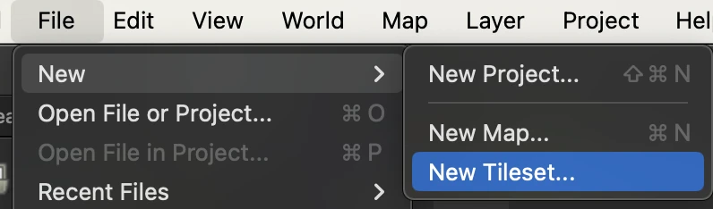

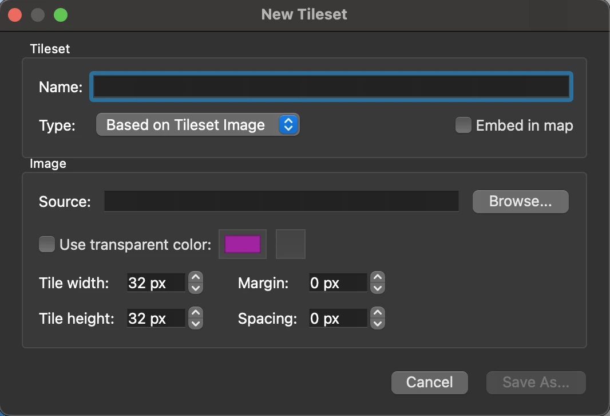

*(来源:FruitDragon)*

它会打开下面这个窗口:

*(来源:FruitDragon)*

你可以给它命名,但没必要。直接点击“`Browse`”(浏览),在 `tilesets` 文件夹里找到你的图块集图片。如果 `Name`框里什么都不填,图块集就会自动采用图块集图片的文件名。

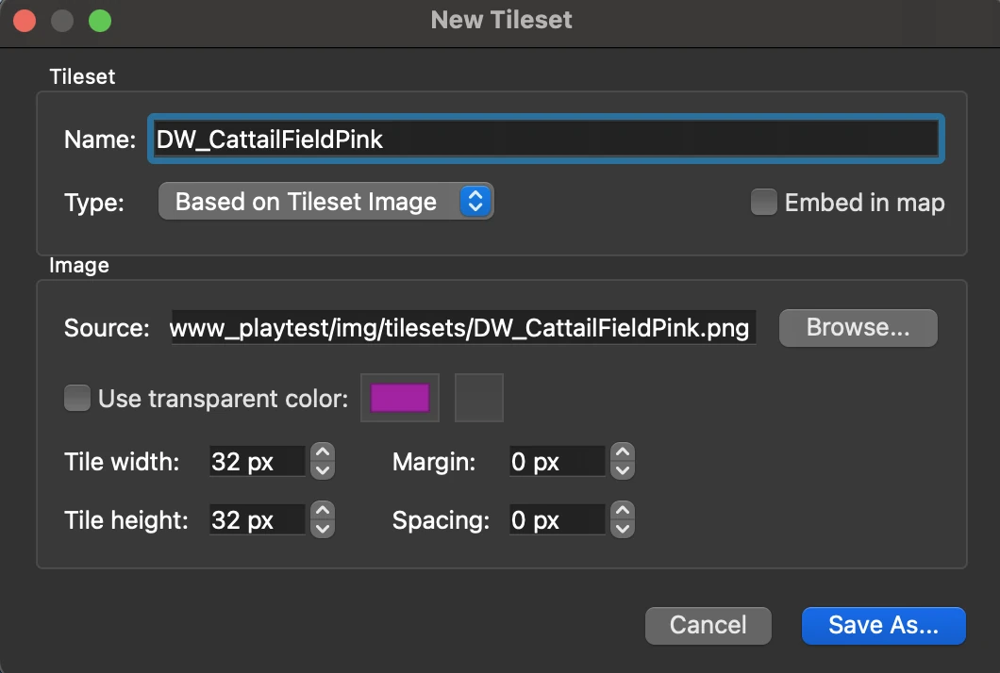

*(来源:FruitDragon)*

其余设置保持默认即可。把图块集保存到 maps 文件夹,名字随你取。[Tiledfxeri](/omori/modding-guide/10-plugins/) 用户请注意:务必把图块集保存为 `.json` 格式。方法是先选择“`JSON tileset files`”(JSON 图块集文件),再手动在文件名末尾敲上 `.json`,然后点击“`Save`”(保存)。

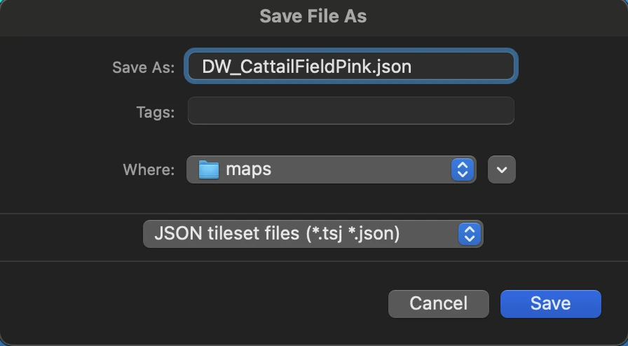

*(来源:FruitDragon)*

这一步一完成,你的新图块集就应该在 <span class="og-g">Tiled</span> 里冒出来了。

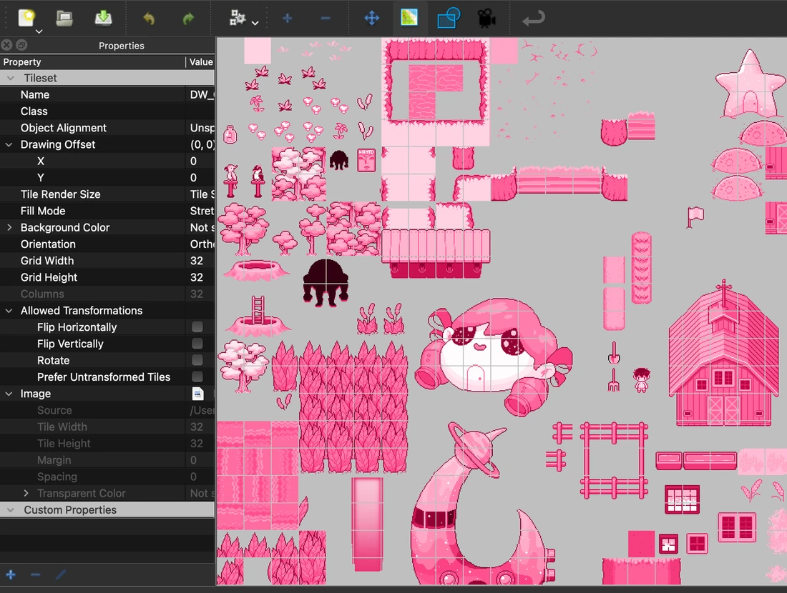

*(来源:FruitDragon)*

之后,你想拿它干什么都行!它会自动出现在你打开的任何地图的图块集列表里,立刻就能上手使用。

“等等!FruitDragon!图块动画怎么做?”

#### 图块集动画

要做图块动画,先点击你想加动画的图块,然后点击顶部那个摄像机模样的图标,打开 `Tile Animation Editor`(图块动画编辑器)。说实话我也不知道那图标叫什么,哈哈。

“那叫胶片摄影机。”——TomatoRadio

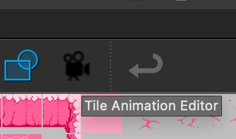

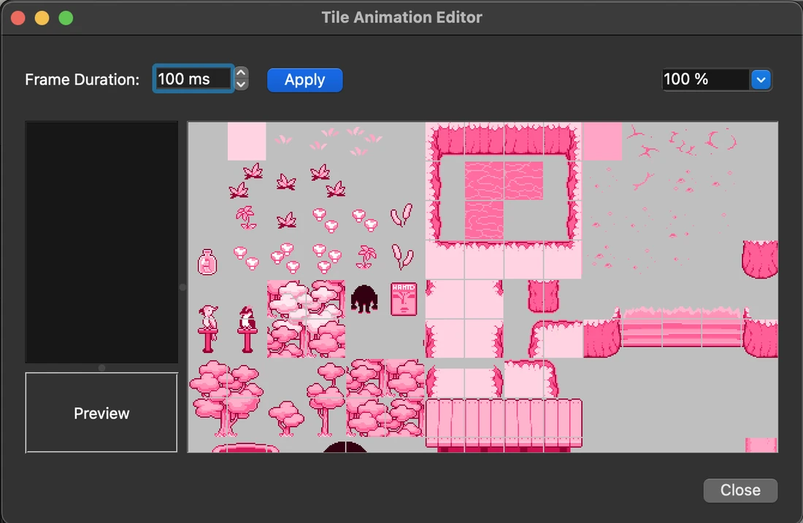

*(来源:FruitDragon)*

它会打开这个窗口。

*(来源:FruitDragon)*

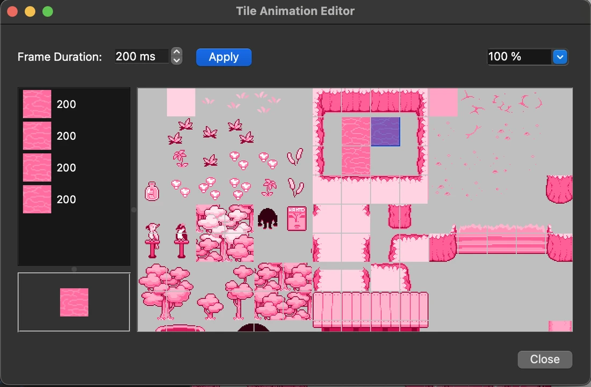

在这里,你可以把图块拖进 `animation editor`(动画编辑器),并设置该图块显示的 `milliseconds`(毫秒数)。在顶部设置帧延迟,就决定了你把图块拖进编辑器时默认套用的时间。

*(来源:FruitDragon)*

这是水面常用的动画。

做完之后,把窗口一关就完事了!

<span class="og-g">Tiled</span>有个有趣的特性:动画只存储在一个图块上,而不是动画包含的所有图块上。

这意味着,如果你想让这个动画图块在不同区域以不同速度播放,可以换一个图块来起始动画,它会被单独存储。

可是,如果你想用某个图块集的编辑版,把整个图块集都替换掉呢?那该怎么办?

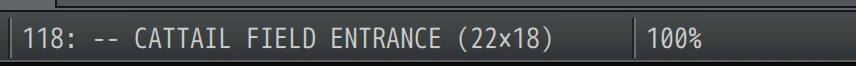

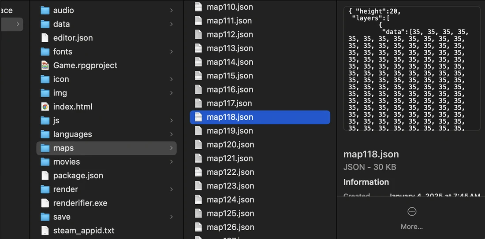

#### 替换图块集

如果你用的是 <span class="og-g">OMORI</span> 专用的 <var>1.0.3</var> 版 <span class="og-g">Tiled</span>,那这个过程相当有深度。用最新版 <span class="og-g">Tiled</span>加 [Tiled Fixer](/omori/modding-guide/10-plugins/) 插件会轻松许多,但没有它也照样能做。那么,假设我想把某张异世界(Otherworld)地图里的 `DW_Cattail.json` 换成我的 `DW_CattailFieldPink.json`。首先,我得找到那是哪张地图。

我挑的是这张地图:

*(来源:FruitDragon)*

现在,我需要在 maps 文件夹里找到它。

*(来源:FruitDragon)*

然后我需要用我顺手的代码编辑器打开它。这里我用 [Visual Studio](https://code.visualstudio.com/) [Code](https://code.visualstudio.com/)。

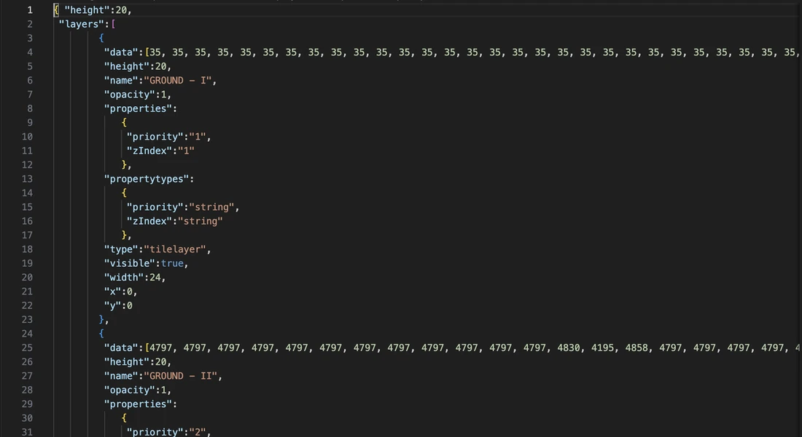

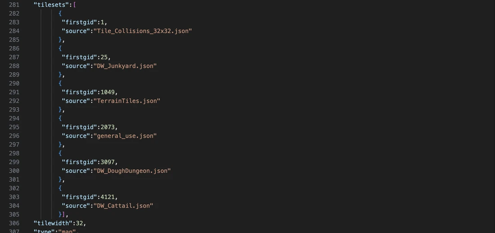

它带我进入一个长这样的窗口:

*(来源:FruitDragon)*

一路滚到最底部,你会看到图块集的名字。

*(来源:FruitDragon)*

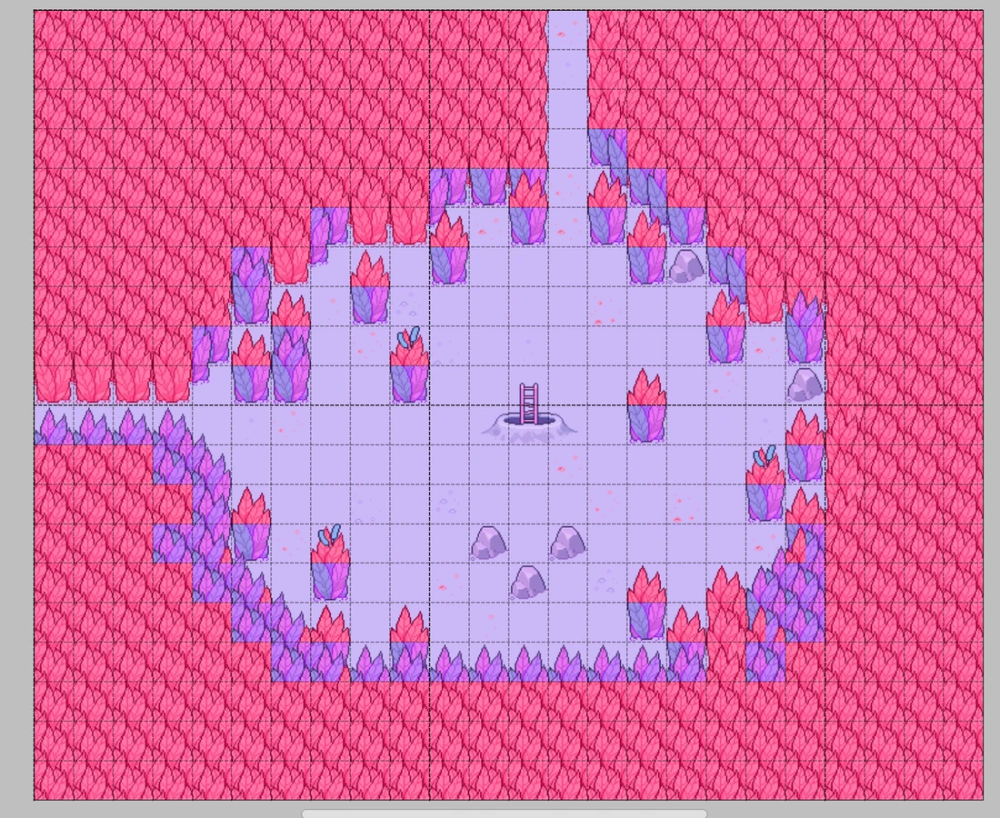

把“`DW_Cattail.json`”直接换成“`DW_CattailFieldPink.json`”,然后打开你的地图,看看它现在长什么样!

*(来源:FruitDragon,编辑过的 map118.json)*

快看哪!粉色的香蒲草原!不过……它只替换了 `DW_Cattail.json`,并没有替换 `DW_Junkyard.json`,所以并不是所有图块都变粉了。想用这种方式替换整张地图,你需要把该地图用到的所有图块集都编辑一遍。

如果你用的是最新版 <span class="og-g">Tiled</span>(装了 [Tiled Fixer](/omori/modding-guide/10-plugins/) 插件)来替换图块集,上面的方法对你依然有效。但你还有一个轻松得多的途径:选中你想替换的图块集,然后点击这里的“`Replace Tileset`”(替换图块集)图标。接着,在弹出的文件资源管理器窗口中找到要用来替换的图块集。就这么简单!
