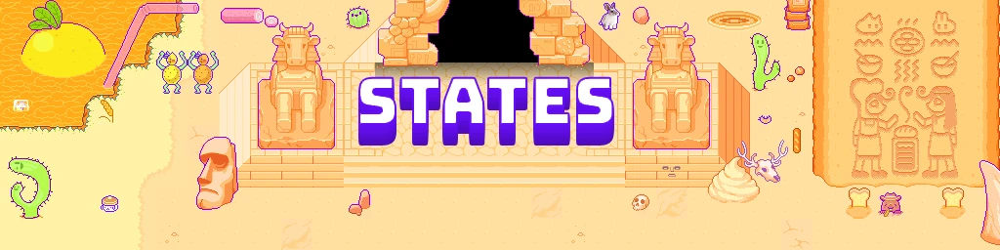
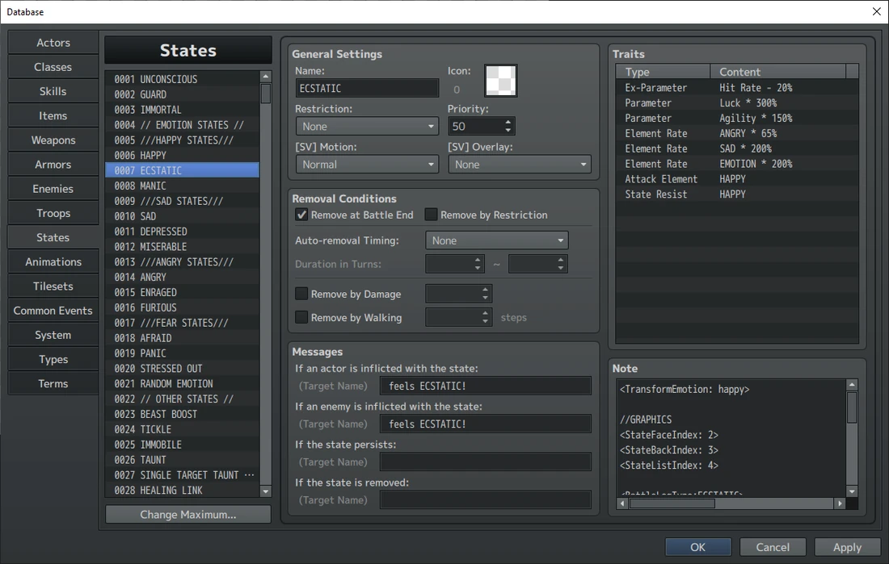
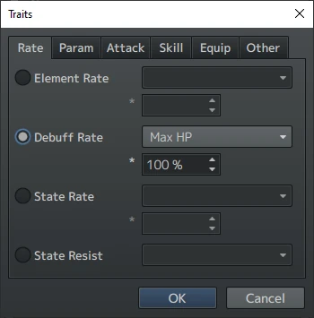
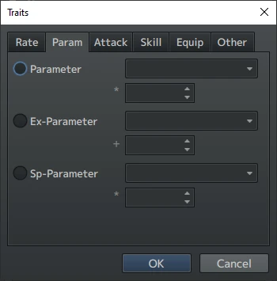
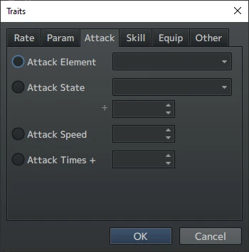
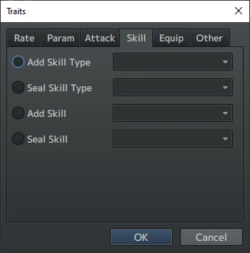
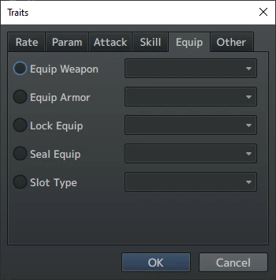
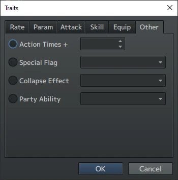

*(来源:parallels,精灵图由 TomatoRadio 创作)*

添加新的 `atlas` 时,最好从 [OMORI Modding Resources GitHub](https://github.com/modsone/omori-modding-resources/blob/main/Data%20Organization%20Plugins/Stahl_AtlasExtended.js) 获取 [Stahl_AtlasExtended](https://github.com/modsone/omori-modding-resources) 插件,新建一个 `atlas`,而不是去改本体的`Atlas.yaml`。这是因为本体 `atlas` 作为参考资料非常有用,而且它的语法又极其容易搞砸,能不改就不改、留作参考最省事。这样一来,万一你的 `atlas` 出了问题,手头还有个文件可以对照。

本体里其他被打进 atlas 的图片还包括:各个相册的几乎全部素材、各种战斗 UI 素材之类、标签照片,以及 OMORI 的素描本。它们都能在`img/atlases` 文件夹里找到。

“哦吼,我要学状态(states)了?战斗里的情绪不就是存在这儿的吗?那我能自己做情绪吗?我要做超多酷炫的情绪给玩家用!”


*(来源:图片由 u/Whisp\_Is\_My\_Waifu 提供)*

“到底出什么 \[WTF 值 13\] 问题了?!为什么就是不生效!”

其实它没那么吓人,尤其是现在有人直接掰开揉碎讲给你听;不过我(TomatoRadio)当年刚入 Mod 坑时,要把这套东西琢磨明白,可真是经历了一场地狱。

好了。正如你那位假想中的未来 Mod 同好所说,没错,你要学的是 `States`,而且这确实包括学 `emotions`。但在开始给我们的朋友和敌人制造新感受之前,我们得先学 `states`的基本运作,因为它们可远不止 `emotions` 而已。



*(来源:TomatoRadio)*

哇哦!这就是 `Database` 里的 `States` 页签。游戏里每一个被动战斗效果都住在这儿。`Buffs`、`debuffs`、`counters`,还有海量的游戏逻辑,全都装在这里面。

### 基础设置

我先简单过一遍中栏的那些东西。哪个我没提到,就别去碰它,它多半在 <span class="og-g">OMORI</span> 里根本不生效。(如果你还没品出来……<span class="og-g">OMORI</span>大多数时候都爱走自己的路,而不是老老实实用 <span class="og-g">RPG Maker MV</span> 的默认工具。)

- `Name`(名称):这是你 `state`的名字(哇,好机智……)。不过在 <span class="og-g">OMORI</span> 里这个名字从不显示。比如,<var>UNCONSCIOUS</var>状态其实就是 <var>TOAST</var>和 <var>BLACKED OUT</var>在内部的叫法。即便如此,最好还是给这些 `states`起个易于分辨的名字,方便你把它们区分开。



- `Remove at Battle End`(战斗结束时移除):顾名思义。基本上所有状态都建议勾上,免得状态跨战斗残留。(在战斗开始时附加状态的护符走的是另一套机制。)
- `Auto-removal Timing`(自动移除时机):决定一个状态持续多久。基本顾名思义。
- `Messages`(消息):顾名思义。

### RPG Maker MV 的特性 `Traits`是附加到中了该 `state` 的战斗单位身上的修正项。一个 `state` 里想加多少个都可以。带 \* 号表示该特性未用于

```text
OMORI.
```

*(所有特性窗口来源:TomatoRadio)*

`Element Rate:`(元素倍率)针对所列 <var>element</var>所受伤害的百分比乘算倍率。主要用于 `Emotions`。

`*Debuff Rate:`(减益倍率)改变技能或道具使所列数值陷入减益的概率。



`*State Rate:`(状态施加率)改变技能或道具施加所列

```text
state.
```

*(注:这些只影响技能和道具里的“`Add State`”效果,而不影响 <span class="og-g">OMORI</span>大部分地方所用的备注标签。)*

`State Resist:`(状态抗性)对所列 `state` 免疫。

`Parameter:`(参数)对所列数值按百分比乘算的倍率。

`Ex-Parameter:`(扩展参数)对所列数值按百分比加算的修正。

`Sp-Parameter:`(特殊参数)对所列数值按百分比乘算的倍率。

这些参数都会在下一节中详细说明。



`Attack Element:`(攻击元素)为使用的所有技能附加所列 <var>element</var>。主要用于

```text
Emotions.
```

`*Attack State:`(攻击附加状态)为攻击附加一个按百分比计算的、施加所列 `state` 的几率。

*(注:这些只影响技能和道具里的“`Add State`”效果,而不影响 <span class="og-g">OMORI</span>大部分地方所用的备注标签。)*

`*Attack Speed:`(攻击速度)为使用的任何技能附加速度加成。

`Attack Times +:`(攻击次数 +)重复所使用的技能。+1 就是让技能执行两次。



`*Add Skill Type:`(添加技能类型)把所列技能类型加入可用技能。这在 <span class="og-g">OMORI</span> 里基本派不上用场。

`Seal Skill Type:`(封印技能类型)封印所列技能类型的使用。实际上只有害怕状态在用它。`*Add Skill:`(添加技能)学会所列技能。学到的技能不会被装备上,只是加入可用技能之中。装备技能是通过 `troop`

```text
events in OMORI.
```

`*Seal Skill:`(封印技能)封印所列技能的使用。功能正常,只是没用于

```text
OMORI.
```



`*Equip Weapon:`(装备武器)解锁所输入的武器类型。这能让角色在战斗外装备彼此的武器。

`*Equip Armor:`(装备防具)解锁所输入的防具类型。<span class="og-g">OMORI's</span>所有护符(charm)中,除了 FA Kel 的 `Pet Rock`,全都是同一个类型。

`Lock Equip:`(锁定装备)锁定所输入的装备类型。这意味着 `state`生效期间你无法更换装备。没有任何 `states` 用到它,但 OMORI 和桑尼的武器用到了。

`*Seal Equip:`(封印装备)封印所输入的装备类型。

`*Slot Type:`(槽位类型)是为双持设计的。在 <span class="og-g">OMORI</span> 里不生效。



`*Action Times +:`(行动次数 +)角色再次执行一次指令的百分比几率。这些可以叠加。

`*Special Flag:`(特殊标记)提供在 <span class="og-g">OMORI</span> 里不生效的效果。

`*Collapse Effect:`(倒下动画)决定死亡动画。在 <span class="og-g">OMORI</span> 里不生效。那是在敌人的备注页签里处理的。

`Party Ability:`(队伍能力)添加一个全队生效的能力。只有 <var>Gold Double</var> 和<var>Item Drop</var>

<var>Double</var>有效,而且实际只用了 <var>Gold Double</var>。

### 参数 `Parameters`在 <span class="og-g">RPG Maker MV</span> 里是个相当古怪的存在,尤其放到 <span class="og-g">OMORI</span> 里更是如此,因为许多 `parameters`(接下来我会把它们与 `stats` 混着叫)效果不大,或者因为 <span class="og-g">OMORI</span> 大量使用插件而效果时灵时不灵。

参数分三类:普通参数(就简称参数)、扩展参数(Ex-Parameter)和特殊参数(Sp-Parameter)。三者的区别在于数值的记法,我这就来逐一拆解。

#### 普通参数(Normal Parameters)

这些是 <span class="og-g">RPG Maker MV</span> 里最普通形态的 `stats`。它们是从 <var>0</var>起递增的整数,`Actor`每获得一个`level`就成长一次,成长速度由其 `Class` 决定。下面逐一列出每一项以及它们的作用:

左边的名字是 `stat`的全称,右边的名字则是引擎用来指代该 `stat` 的三字母代码。

**Max HP(最大生命):mhp**

这是 `battler` 的最大 HP(即 `HEART`)。`battler`的当前 HP 使用代码 `hp`。

**Max MP(最大果汁):mmp**

这是 `battler` 的最大 MP(即 `JUICE`)。`battler`的当前 MP 使用代码 `mp`。

**Attack(攻击):atk**

这个 `stat`在 <span class="og-g">RPG Maker MV</span> 里没有预设的功能。开发者们转而把它用进了 `Skills` 的公式。而在 <span class="og-g">OMORI</span> 中,这个 `stat`显然被用来决定 `battler` 造成的伤害。

**Defense(防御):def**

又是一个自由发挥的 `stat`。在 <span class="og-g">OMORI</span> 中,这个 `stat`用来决定 `battler` 能抵御多少攻击伤害。

**M. Attack(魔法攻击,OMORI 未使用):mat**

再一个自由发挥的 `stat`。这个 `stat` 在 <span class="og-g">OMORI</span> 里没被用到,所以想怎么应用,随你发挥。

**M. Defense(魔法防御,OMORI 未使用):mdf**

最后一个自由发挥的 `stat`。这个 `stat`同样没在 <span class="og-g">OMORI</span> 里用到,想怎么应用,随你发挥。

**Agility(速度):agi**

在 <span class="og-g">OMORI</span>里它叫 `SPEED`,这个确实有战斗功能。行动顺序由 `agility` 决定,因此更快的 `battlers`先行动。

**Luck(幸运):luk**

用于暴击率(也就是正中心脏的那种)。每一点 `luck`都在 0% 的基础暴击率上 +1%。

#### 扩展参数(Ex-Parameter)

这些是额外的 `stats`(懂了吧,所以才叫 `Ex-Params`),是以 <var>0%</var> 起递增的百分比。它们不随 `level` 成长。用 `scripts` 调用时,它们是介于代表 <var>0%</var> 的 <var>0</var> 与代表 <var>100%</var> 的 <var>1</var> 之间的小数。所以 <var>0.5</var> 就是<var>50%</var>。

**Hit Rate(命中率):hit**

完全名副其实。任何使用“<var>Physical Attack</var>”`Hit Type` 的 `skill`都会进行一次 `hit rate`判定,以确认 `skill`是否命中。

**Evasion(闪避率):eva**

与 `hit rate` 相对的另一面。若 `hit rate` 判定通过,还会对防御方的 `evasion` 单独做一次判定,决定是否闪避攻击。这意味着 <var>1000%</var>`hit rate` 的攻击者也可能对着 <var>1%</var> `evasion` 的目标打空。挺蠢的,但事情就是这样。

**Critical Rate(暴击率):** cri

在原版 <span class="og-g">RPG Maker MV</span> 中,这个 `stat`用于决定打出暴击的几率。但 <span class="og-g">OMORI</span>把这个职责交给了 `luck`,于是它就闲置了。

**Critical Evasion(暴击闪避):cev**

和 `critical rate` 同一个待遇。

**Magic Evasion(魔法闪避):mev**

在 <span class="og-g">OMORI</span> 里未被使用的 `stat`。若技能的 `Hit Type` 是“<var>Magical Attack</var>”,闪避攻击时检查的就是这个 `stat` 而非 `evasion`。

**Magic Reflection(魔法反射):mrf**

在 <span class="og-g">OMORI</span> 里未被使用的 `stat`。若技能的 `Hit Type` 是“<var>Magical Attack</var>”,则会检查这个 `stat`,把攻击反弹回攻击者。

**Counter Attack(反击):cnt**

在 <span class="og-g">OMORI</span> 里未被使用的 `stat`。若技能的 `Hit Type` 是“<var>Physical Attack</var>”,则会检查这个 `stat`,向攻击者发起反击。

**HP Regeneration(HP 回复):hrg**

每回合开始时,`battler`会回复其最大 HP 的一定百分比。具体百分比就是你的 `stat`。

**MP Regeneration(MP 回复):mrg**

每回合开始时,`battler`会回复其最大 MP 的一定百分比。具体百分比就是你的 `stat`。

**TP Regeneration(TP 回复):trg**

每回合开始时,`battler`会获得一定百分比的 TP。具体百分比就是你的 `stat`。TP 在 <span class="og-g">OMORI</span> 里没被用到。

#### 特殊参数(Sp-Parameter)

这些是对各种通用倍率按百分比进行修正的特殊数值。用 `scripts` 调用时,它们是以 <var>1</var> 表示 <var>100%</var> 的小数。

**Target Rate(被瞄准率):tgr**

据我目前所知,这个 `stat`在 <span class="og-g">OMORI</span> 里多半没有效果。不过它本应用来决定敌人瞄准某个角色的概率。

**Guard Effect(防御效果):grd**

使用 `Guard` 的效果强度。

**Recovery Effect(回复效果):rec**

按修正后的百分比,增减从任何来源回复的 HP 和/或 MP 的量。

**Pharmacology(药理):pha**

按修正后的百分比,增减道具公式的效力。

**MP Cost Rate(MP 消耗率):mcr**

按修正后的百分比,增减战斗中果汁技能的消耗。

**TP Charge Rate(TP 充能率):tcr**

在 <span class="og-g">OMORI</span> 里未被使用,而且不生效。

**Physical Damage(物理伤害):pdr**

按修正后的百分比,增减来自使用“<var>Physical</var>

<var>Attack</var>”`Hit Type` 的技能的伤害。

**Magical Damage(魔法伤害):mdr**

按修正后的百分比,增减来自使用“<var>Magical</var>

<var>Attack</var>”`Hit Type` 的技能的伤害。

**Floor Damage(地形伤害):fdr**

在 <span class="og-g">OMORI</span> 里未被使用,而且不生效。

**Experience(经验):exr**

按修正后的百分比,增减战斗结束时获得的 `exp`。

*注:状态项“<var>Remove at Battle End</var>(战斗结束时移除)”会在队伍获得经验之前把状态移除,所以照这么配置的话,该效果就派不上用场。你其实可以在 Release*

*Energy 增益上亲眼看到这一点。*

### 备注标签

现在,是时候让你见识 <span class="og-g">RPG Maker MV</span> 中那个会让你慢慢失去理智的板块了:`The Notes Section`(备注区)。

\*德古拉式钢琴音效,外加一道闪电。\*

你在[事件章节](/omori/modding-guide/03-events/)里已经略微见过它们了,现在要正式认识一番。

在标准 <span class="og-g">RPG Maker MV</span> 里,这只是个写普通备注的地方;但 <span class="og-g">OMORI</span>是一款真正拿得出手的 <span class="og-g">RPG Maker MV</span> 游戏,它用了一大堆插件,把 `Notes`区变成了一个伪 <span class="og-g">JavaScript</span> 宿主。`Database`顶部 9 个页签都有 `Notes`(`Troops` 除外),在本套教程的推进过程中,你会学到能用它们做什么。不过作为开头,先看看它们在 `States`页签里的用法。

#### 备注标签组

在状态页签里,大多数 `Notetags`都装在我们姑且称为“`Notetag`

`Groups`(备注标签组)”的容器里,它们是像下面这样搭建起来的 `Heading Notetags`。

```text
<Notetag Group> 
Code 
Code 
</Notetag Group> 
```

如果你觉得这格式眼熟,那是因为 <span class="og-g">HTML</span>就是这么工作的。

对我们的 `states` 而言,有几种不同的 `Notetag Groups` 决定其中的代码何时触发。这里只列常见的几种,还有几个可以在[YEP Buff States Core](http://www.yanfly.moe/wiki/Buffs_%26_States_Core_(YEP)#Lunatic_Mode)插件页面找到。

`<Custom Apply Effect>` 在 `state`首次被施加时运行。

`<Custom Remove Effect>` 在 `state`被移除时运行。

`<Custom Leave Effect>` 在 `state`因持续时间耗尽而被移除时运行。

`<Custom Turn Start/End Effect>` 在战斗单位的回合开始/结束时运行。

`<Custom Action Start/End Effect>` 在战斗单位的行动开始/结束时运行。

`<Custom Battle Effect>` 在战斗开始时运行。对在战斗开始时附加 `states`的防具(护符)很有用。

`<Custom React Effect>` 在战斗单位被选为技能目标时运行。你可以在难过状态的果汁流失上看到它的实际运用。

#### 编写备注标签代码 `States`实际只用得上这些能力的很小一部分,所以我只细讲其中一小撮。它们要放在 `notetag groups` 里面。

注意:在以下所有语境里,<var>X</var>都是代码作用的对象。大多数情况下,你会对带有该 `state` 的战斗单位使用“<var>user</var>”。不过如果你用的是 `<Custom React Effect>`,就应改用 <var>target</var>。你还可以用 `$gameActors.actor(`<var>ID</var>`)` 脚本调用来指定特定角色。

<var>x</var>`.addState(`<var>y</var>`)` 把 `ID`为 <var>y</var>的 `state`添加到 <var>x</var> 身上。

<var>x</var>`.removeState(`<var>y</var>`)` 把 `ID`为<var>y</var>的 `state`从 <var>x</var> 身上移除。

<var>x</var>`.removeStateCategoryAll(“`<var>y</var>`”)` 会移除 <var>x</var> 身上所有类别为“<var>y</var>”的`states`(`category`即状态类别)

```text
from x.
```

<var>x</var>`.gainHp(`<var>y</var>`)` 为 <var>x</var>回复 <var>y</var>点 Heart。

<var>x</var>`.gainMp(`<var>y</var>`)` 为 <var>x</var>回复 <var>y</var>点 Juice。

### OMORI 情绪系统

好了。到这儿了。我们终于讲到 `emotions` 了。多半就是你冲着来的那一部分。

本节将讲解 `emotions`是如何搭建的。先给整节挂上一个大大的星号:<span class="og-g">OMORI’s</span>`emotion`系统建立在大量插件与内置 `state`效果的协同运作之上。我要教你的,是我认为让 `emotions`运转起来的最小必要配置,也就是说,多半还是存在你的 `emotion`会出毛病的情形。


*(来源:TomatoRadio)*

这是 `Ecstatic emotion`(狂喜情绪)的 `State`。

我们先看 `traits`,因为它们是这当中简单的部分。

`traits`包含 3 个部分。

- **一是**`stat`**数值变化。**对 `Ecstatic`(狂喜)来说,就是 <var>Hit Rate</var>、<var>Luck</var> 和 <var>Speed</var> 的修正项。每个 `emotion`都应至少有 1 项正面和 1 项负面的数值变化。
- `Elemental`**属性归属。**在 <span class="og-g">RPG Maker MV</span> 中,你要为 `elements` 设定抗性与弱点。
    - 首先,把 `attack element` 设为该 `emotion`(新的 `elements`可以在 `Types`页签中定义),让该角色的所有攻击都成为 `emotion’s element`。
    - 然后,为抗性添加 `Element Rate`,本例中即 <var>angry</var>。把它设为上文列出的正确百分比。
    - 最后,为弱点添加 `Element Rate`,本例中即 <var>sad</var>。对 <var>Emotion</var>`element` 也照此办理。我不确切知道是什么在用它,但它八成很重要。
- `State`**抗性。**让你的 `state`对同系情绪的低阶状态免疫。于是对 `Ecstatic`来说,我们对基础的 `Happy`情绪免疫。然后,变!我们 `emotion`三个部分中的一份就搞定了!

另外,`Buffs`和 `Debuffs`也是照这个思路搭建的,只是去掉 `elemental`那部分。

下一步是 `Notes`区的代码。这部分对 `emotions` 来说其实非常容易。

```js
<TransformEmotion: happy> 
//GRAPHICS 
<StateFaceIndex: 2> 
<StateBackIndex: 3> 
<StateListIndex: 4> 
<BattleLogType:ECSTATIC> 
//STATE CATEGORIES 
<Category: EMOTION> 
<Category: HAPPY> 
<Custom Apply Effect> 
user.removeStateCategoryAll("SAD") 
user.removeStateCategoryAll("ANGRY") 
user.removeStateCategoryAll("AFRAID") 
user.result().removedStates = user.result().removedStates.filter(s => 
!user._isEmotionalState(s)) 
</Custom Apply Effect> 
```

这些就是 `Ecstatic` 的 `Notes`。我们一步一步来。

- `<TransformEmotion:`<var>x</var>`>` 是给会改变敌人外观的 `Emotions`用的。不想要的话,删掉这行即可。它的作用是告诉游戏:敌人中了该 `state` 时,应当使用该敌人的哪个变体。稍后我会解释得更明白。
- “`//GRAPHICS`”那几行是给队伍用的,分别决定该状态使用哪些 `portraits`、`backgrounds` 和 `labels`。它们都从 <var>0</var> 开始编号,自上而下排列。
- `<BattleLogType:`<var>X</var>`>` 决定中招该情绪时显示的文字。这是靠“`Custom Battle Action Text.js`”插件实现的。如果你要加自己的情绪,直接复制粘贴另一个 `emotion`的条目,再按需替换文字即可。
- “`//STATE CATEGORIES`”那几行会被其他各种 `Notetags`用到,这样就能整体引用情绪,而不必逐个阶位检查。
- `<Custom Apply Effect>` 移除 `Sad`、`Angry` 和 `Afraid`,是 `State Categories` 实际运用的一个例子。

#### JavaScript 模组修改

最后是两小段插件修改。我从没见过哪个 Mod 用过第一段,事实上还是我自己摸索出来的,所以先给你提个醒——它多半有 bug。

修改 <span class="og-g">JavaScript</span>文件时,更好的做法是新建 <span class="og-g">JavaScript</span>文件来覆写代码,而不是直接打补丁,这是为了 Mod 兼容性。这里要做的正是这种。所以,新建一个 <span class="og-g">JavaScript</span>文件——复制粘贴任意一个“头文件(Header files)”,比如`------------------.js`,就能轻松办到——然后把这两段代码加进你的文件。它们是现有代码的修改版,游戏加载时会覆写原文件。

```js
//==============================================================
===============
// REFRESH ENEMY EMOTIONS from Omori BASE.js
// What this code does is it defines what Emotions can be felt
by Enemies, and what slot each emotion should use. The emotion
states reference this code with <TransformEmotion: emotion> with
emotion being one of the cases listed with happy, sad, angry,
and new_emotion_here. The 'new_emotion_here' case is a
demonstration of how to add more emotions. So if I put
<TransformEmotion: new_emotion_here> on a state and give it to
an enemy, it will transform into the enemy four slots ahead of
its neutral form in the Database.
// tl;dr 'text in quotes like this' can be put in
<TransformEmotion: emotion> on states and these lines do that
work.
//Add more lines for all emotions you want to add. Don’t forget
to add 1 to the number for each one, too.
//==============================================================
===============
Game_Enemy.prototype.refreshEmotionStateTransform = function() {
 // If Not Dead
if (!this.isDead() && !this._isStateTransforming) {
// Get Emotion
var emotion = this.getStateEmotion();
// Get base Id
var baseId = this.enemy().meta.TransformBaseID;
// Set Base ID
baseId = baseId ? Number(baseId) : this._enemyId;
// Set Transform ID
var transformId = this._enemyId;
// Switch Case Emotion
switch (emotion) {
case 'normal': transformId = baseId ;break;
case 'happy': transformId = baseId + 1 ;break;
case 'sad': transformId = baseId + 2 ;break;
case 'angry': transformId = baseId + 3 ;break;
case 'new_emotion_here': transformId = base Id + 4 ;break;
break;
};
// If Transform Id
if (transformId !== this._enemyId) {
this._isStateTransforming = true;
if(this.name() === "SPACE EX-HUSBAND") {
$gameScreen.setFlashWait(60)
$gameScreen.startFlash([255,255,255,255], 130)
}
this.transform(transformId)
this._isStateTransforming = false;
};
};
};
//--------------------------------------------------------------
---------------
// EMOTION ELEMENTAL FIXES from YIN_OmoriFixes.js
// What this code does is it controls what states are emotions
and uses that for moving and dull attacks. So in order to have
new emotions work with that system, we must add them here.
Replace x, y, and z with the ids of the three tiers of your new
emotion. In case you're wondering, the states for Sxbf,
Sweetheat, and the Twins are special versions of their tiered
emotions.
// tl;dr Replace x y and z with your new emotion ids so Moving
and Dull attacks work.
//--------------------------------------------------------------
---------------
Game_Action.prototype.calcElementRate = function(target) {
/*if (this.item().damage.elementId < 0) {
return this.elementsMaxRate(target,
this.subject().attackElements());
} else {*/
// YIN Instead of bypassing the subject's attack element,
we want to use it if they are inflicted with an emotion.
// If elementId == None or Normal Attack
if (this.item().damage.elementId < 1) {
// These are all base emotion states (non afraid)
var emotionStates = [6, 7, 8, 10, 11, 12, 14, 15, 16];
 emotionStates = [...emotionStates, 119,120,121]; //
Space Ex Boyfriend
emotionStates = [...emotionStates, 122,123,197]; //
Sweetheart
emotionStates = [...emotionStates, 124,125,126]; //
Unbread Twins
emotionStates = [...emotionStates, x,y,z]; // New
Emotions
// Search states for emotion states
var emotionAfflicted;
this.subject()._states.forEach(function(stateId) {
// Do we have an emotion state on us?
if (emotionStates.contains(stateId)) {
emotionAfflicted = true;
}
}, this);
if (emotionAfflicted) {
return
target.elementRate(this.subject().attackElements()[0]); // If
so, that is our attack element
} else {
return
target.elementRate(this.item().damage.elementId);
}
} else {
return target.elementRate(this.item().damage.elementId);
 }
//}
};
```

### 剧情保护(Plot Armor)

\[TODO\] 基本上是对[此文](https://omori-modding.gitbook.io/wiki/rpgmaker/custom-battles/plot-armor)的重新表述。
