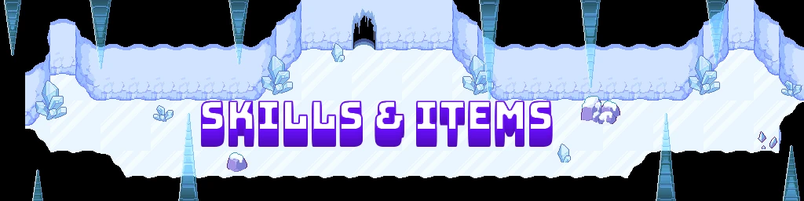
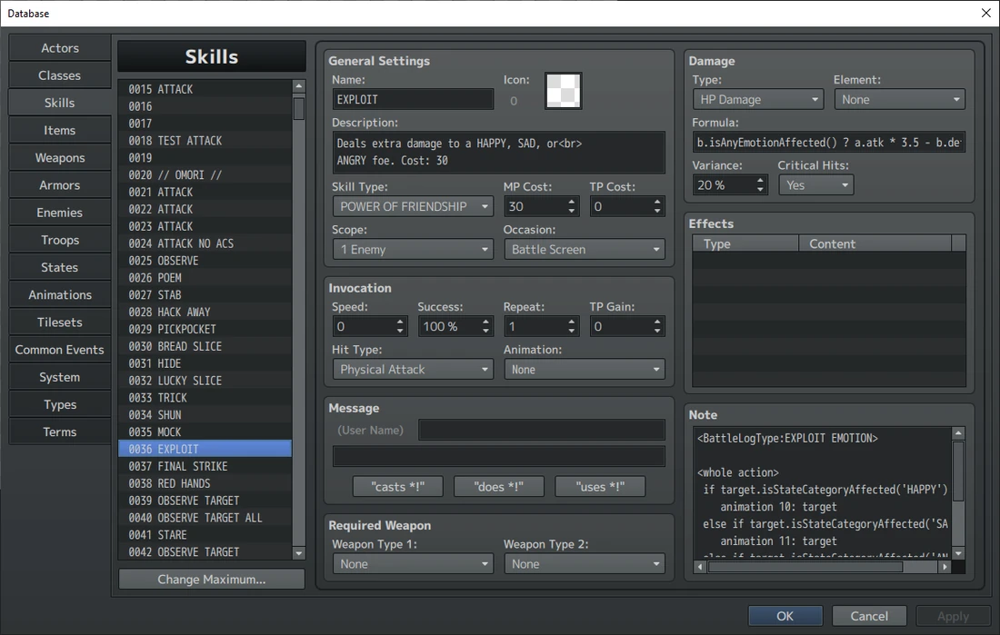

真就这么多。要是所有东西都这么简单就好了。

而现在,我们又一头扎回了复杂的深坑。不过至少这些东西更有意思——至少我这么认为。你可能已经知道 <span class="og-g">OMORI</span> 里队伍能学到的那些技能,但在 Mod 制作中,`Skills`不只是那些,而是你和你的敌人能施展的每一种攻击/行动。所以这意味着我们能拿它们干很多事。



### 技能通用配置

*(来源:TomatoRadio)*

这是 `Skills`选项卡,打开的是 Omori 的 `Exploit`。这里我会逐一详述中间一栏的所有设置。凡是我没提到的东西,在 <span class="og-g">OMORI</span> 里都没有用到,保持原样即可。

通用设置:

`Name`:不言自明 `Description`:菜单中显示的描述。别忘了写上消耗。

`Skill Type`:除了普通攻击和冷静(Calm Down)之外,所有技能都应设为 <var>Power Of Friendship</var>(友情的力量)。“害怕”状态就是这样限制技能使用的。

`MP Cost`:即果汁消耗。记得把这个数值同步更新到 `Description`里。

`Scope`:作用范围——目标是哪一方。注意,“可以同时选定友方和敌方”这一点是在 `Note Coding` 里实现的,所以这类技能请设为 <var>1 Ally</var>。

`Occasion`:如果技能可以从菜单中使用,选 <var>Always</var>;否则选 <var>Battle Screen</var>。

```text
Invocation: 
```

`Speed`:决定行动顺序时附加的速度。如果你想让某个技能优先出手,就在这里猛填 <var>9</var>。上限是 <var>2000</var>。

`Repeat`:技能动作重复的次数。这一点也可以用

也可以通过备注编码(Note Coding)实现。

`Hit Type`:所有造成伤害的技能选 <var>Physical Attack</var>,不造成伤害的技能选 <var>Certain Hit</var>。它实际决定的是技能是否计入 `Hit Rate`。

`Animation`:使用时播放的动画,会在技能目标身上播放。也可以在备注编码(Notes Coding)里以更高的精度控制。

`Message`**:**添加文字。用 `Notes Coding` 可以做得更细致。如果你要用它,记得在最前面加一个空格。

### 伤害公式

大多数技能的伤害在右上角的 `Damage`区域中计算。我会先讲 `Formula`以外的设置,再深入探讨公式本身。

\[这里最好放一张伤害设置区域的局部截图\]

`Type`**:**决定影响的是心还是果汁,以及技能是治疗还是伤害。<var>HP Drain</var>和 <var>MP Drain</var>在 <span class="og-g">OMORI</span> 里没有使用,它们会把造成的伤害回复给使用者。用备注编码可以更精确地实现这种效果。

`Element`**:**几乎总是 <var>None</var>。如果设成 <var>None</var> 以外的值,技能的情绪克制就会失效。它最好的用途是设为 <var>EMOTION</var>,用来克制带情绪的目标。

`Variance`**:**作用于攻击最终伤害的浮动值。伤害技能通常为 <var>20</var>%。

`Critical Hits`**:**不言自明

现在来讲 `Formulas`。<span class="og-g">RPG Maker MV</span> 使用一套非常特定的公式书写系统,必须严格遵守。

这套系统的第一部分,是如何指代技能的使用者和目标。它们分别被称为 `a`和 `b`。此外,如果需要用到其他队友的属性,可以通过 `$gameActors.actor(`<var>#</var>`)` 来调用,<var>#</var>是他们的 ID(<var>1</var> 是 OMORI,<var>2</var> 是奥布里,<var>3</var> 是凯尔,<var>4</var> 是希罗)。

下一部分是要计入的属性。如果想使用某个战斗单位的属性,必须先写它的名字、一个句点,再写该属性的缩写。实际写出来就像“`a.atk`”这样,表示使用者的攻击属性。

属性缩写一览:

`hp`- HP(心)

`mhp`- 最大 HP(最大心)

`mp`- MP(果汁)

`mmp`- 最大 MP(最大果汁)

`atk`- 攻击 `def`- 防御 `mat`- 魔法攻击(<span class="og-g">OMORI</span> 未使用)

`mdf`- 魔法防御(<span class="og-g">OMORI</span> 未使用)

`agi`- 敏捷(速度)

`luk`- 幸运 `tp`- TP(<span class="og-g">OMORI</span> 未使用)

```text
level - Level
```

接下来是可以使用的运算,包括`Addition`(加法)、`Subtraction`(减法)、`Multiplication`(乘法),大概还有 `Division`(除法)(在 <span class="og-g">OMORI</span>里,开发者只是用乘小数来代替),它们都使用标准的键盘符号。括号可以用来构建遵循`Order of Operations`(运算顺序)的公式。不记得这是什么的话,就去搜一下“<var>PEMDAS</var>”。

<这些公式的配色标注可以做得更好。也许可以像这样加上淡淡的高亮>

对于除角色属性外不含任何变量的基础公式,这些就够用了。比如,一道攻击,`adds`(加上)使用者的`attack`

`user`(使用者)的幸运值加上 `Hero's luck`(希罗的幸运值),`multiplies`把总和`sum`乘以 `2`,再减去`subtracts``target’s defense`(目标的防御),写出来就是:“`(a.luk + $gameActors.actor(4).luk) * 2 -``b.def`”

这些伤害公式的最后一部分,是我称之为“`State Checks`”(状态判断)的东西,它们用 if-then(条件表达式)来判断该使用哪个公式。

<这个例子是不是太复杂了?要不要换一个更简单的?我选它,是为了让读者基本看清 if-then 里每一种运算符的用法。>

```text
(a.isStateAffected(6) || a.isStateAffected(10) || a.isStateAffected(14)) ? 
a.atk * 4 - b.def : (a.isStateAffected(7) || a.isStateAffected(11) || 
a.isStateAffected(15)) ? a.atk * 5 - b.def : (a.isStateAffected(8) || 
a.isStateAffected(12) || a.isStateAffected(16)) ? a.atk * 6 - b.def : a.atk * 3 - 
b.def; 
```

这是 <span class="og-g">OMORI</span> 里这类做法最极端的例子之一——技能 `Final Strike`(最终打击),OMORI 的情绪等级越高,伤害就越高。我们一步一步来看。

```text
"(a.isStateAffected(6) || a.isStateAffected(10) || a.isStateAffected(14)) ?”
```

这段代码检查使用者(OMORI)是否带有状态 6、10 或 14,它们分别是开心、难过和生气。|| 是“或”的简写,而“?”是“那么”的简写。

所以在一个正常人读来,这段代码就是:“如果使用者带有状态 6、或状态 10、或状态 14,那么\[执行动作的其余部分。\]”

```text
"a.atk * 4 - b.def"
```

这段代码会在前面的条件成立时激活,这多亏了它前面的那个 ?。

这是 OMORI 处于 1 级情绪时的实际伤害计算:使用者(OMORI)的攻击乘 4,再减去敌人的防御。

```text
": (a.isStateAffected(7) || a.isStateAffected(11) || a.isStateAffected(15)) ?"
```

这段代码会在前面的条件不成立时激活,这多亏了这一节开头的“:”——它是“否则”的简写。这段代码做的检查和之前一样,只是这次检查的是 2 级情绪。所以这就是接下来要满足的条件。

“`a.atk * 5 - b.def`” 这段代码会在新定义的“处于 2 级情绪”条件成立时激活。代码的读法与上一条公式相同,只是使用者的攻击这次乘的是 5。

```text
": (a.isStateAffected(8) || a.isStateAffected(12) || a.isStateAffected(16)) ?"
```

这段代码和 2 级情绪的检查完全相同,只是这次换成 3 级。

“`a.atk * 6 - b.def`” 这段代码和 2 级公式完全一样,只是使用者的攻击这次乘 6。

“`: a.atk * 3 - b.def;`” 这段代码在上述所有条件都不成立时激活,也就是 OMORI 没有任何情绪的情况。伤害公式本身还是老样子,只是使用者的攻击只乘 3。

最后,任何这类状态判断公式,都必须让最后一个公式以分号(“;”)结尾。

这是个相当复杂的例子,我选它纯粹是为了演示。你可以只做一个状态判断,做简单得多的版本;也可以更进一步,加入更多判断和变量。由于它只是检查是否带有某个特定状态,你就不会局限于情绪:增益、减益和其他状态也都能判断,而且可以判断任何人,不只是使用者。比如你可以写“`$gameActor.actor(4).isStateAffected(1)`”,它会检查希罗是否阵亡。

这套系统非常灵活。

### 备注编码(Notes Coding)

现在来到制作技能最复杂的部分:`Notes` 备注栏。正如你之前所见,<span class="og-g">OMORI</span>的备注栏可以充当 <span class="og-g">JavaScript</span>宿主,外加一大堆 `Plugin Commands`,让你能做出复杂得多的技能。好在 <span class="og-g">OMORI</span> 里技能数量众多,你通过交叉对照不同的技能就能轻松学会这里的用法。这些 `notetags`有很多来自 [YEP 动作序列包(Action Sequence Packs)](http://www.yanfly.moe/wiki/Category:Action_Sequences_(MV)#Action_Sequence_Pack_1),那里会给出这些插件全部可用选项的完整清单。我只讲常见的那些。

#### 通用参数备注标签

这些备注标签可以添加到技能上,做出一些小的功能性或观感性改动。它们可以放在备注栏的任何位置,不过为了整齐,通常放在最上面。

`<BattleLogType:`<var>string</var>`>` 这个备注标签决定要显示的文字来自哪个 `.js`文件——一个名为 `Custom Battle Action Text.js`的文件。就我个人而言,我更喜欢另一种显示文字的方式,但像普通攻击这种只想显示“`User attacks Target!`”的场合,可以用它。这种情况下只要加上

```text
"<BattleLogType: ATTACK>"
```

`<AntiFail>` 有些技能做的事既不是治疗也不是伤害友方或敌方,但 <span class="og-g">RPG Maker MV</span> 仍可能显示一条“`It had no effect`”的提示。这个标签就是用来禁用它的。

`<HideInMenu>` 不言自明:把它从技能装备菜单里隐藏。你的 `Basic Attacks`(普通攻击)和 `Follow-Ups`(追击)都要用上它。

```text
<Enemy or Actor Select> The emotion skills, Sad Poem, Pep Talk, Annoy,
```

和 `Massage`(按摩)——都可以同时用在友方和敌人身上。实现靠的就是这个 `Notetag`。

#### 动作序列备注标签

这些 `notetags`可以添加到技能上,在 `Notes Coding` 中为技能增添额外的花活。它们全都必须成对放在所包含代码的前后,闭合版的标签名前要有一个 `/`,就像这样

```text
</Target Action> 
```

`<Setup Action>`(准备动作)四者中最早的一个。它发生在任何果汁被消耗之前,所以 `User animations`(使用者动画)之类的“准备动作”通常都放在这里。

`<Whole Action>`(整体动作)紧贴在主动作之前发生,会把效果同时应用到所有目标上。不过它的做法有点怪:先对其中一个目标计算动作,然后把结果原样复制给其他所有人。对于依赖逐目标变量(比如增益/减益等级)的效果,这可能导致一些问题。

`<Target Action>`(目标动作)在我看来是更好用的 `Whole Action`。它的发生时机与主动作效果完全一致,并逐个目标地生效。所以 `attack animations`(攻击动画)和 `state changes`(状态变化)之类的东西应该放在这里。不过和整体动作不同的是,你可以直观地看到效果。请务必记住:如果你使用 `Target Action`,就必须定义技能主动作的发生时机。这靠“`action effect`”这一行完成,想让招式触发多次就可以放多行,比如 `Red`

```text
Hands.
```

`<Follow/Finish Action>`(收尾动作)两个很少用到的收尾段落。当需要一个不属于`target``action`(目标动作)的收尾动作时,就用它们。我不知道 `Follow`和 `Finish`有什么区别,不过如果两者都用,`Finish`会排在 `Follow`后面。

#### 动作序列

注意:在以下所有语境中,<var>Y</var>都表示动作指向的目标。它可以填入的选项多到令人发指。重要的几个是 <var>user</var>、<var>target</var>、<var>actors</var>和 <var>enemies</var>,希望它们不言自明。再说一次,Yanfly 的插件页面列出了所有可选项。

`add state`<var>x</var>`:`<var>y</var> 向目标添加指定的状态。

`remove state`<var>x</var>`:`<var>y</var> 从目标移除指定的状态。

`animation`<var>x</var>`:`<var>y</var>播放指定的动画。<var>Y</var>就是动画播放的位置。

`wait for animation` 等待所有动画结束后再继续。偶尔会有点小 bug。

`wait:`<var>#</var> 等待设定的帧数后再继续。<span class="og-g">RPG Maker MV</span> 以 60fps 运行,所以 `wait:`<var>60</var> 就是等待一秒。

`HP`<var>± x</var>`:`<var>y(, show)</var> 增加或减少目标指定数值的心。如果在目标后面写上 <var>show</var>,就会显示伤害弹窗。

可以使用百分比。

`MP`<var>± x</var>`:`<var>y(, show)</var> 增加或减少目标指定数值的果汁。如果在目标后面写上 <var>show</var>,就会显示伤害弹窗。

可以使用百分比。

#### 文字备注标签 “`eval:`”这个 `notetag`可以添加到技能上执行 <span class="og-g">JavaScript</span>,但在 <span class="og-g">OMORI</span>里它主要用来显示文字。像这样:

```js
eval: BattleManager._logWindow.push("addText", `${user.name()} hypes up 
${target.name()}!`) 
```

这是我正在做的一个 Mod 里的一行代码,不过这不重要。重要的是:要在 <span class="og-g">OMORI's</span> 战斗框里显示细致的文字,有这些就够了。红色文字就是游戏内实际显示的内容,其中的使用者名和目标名不言自明。由于它是 `Notes coding` 的一部分,你可以决定它在技能的哪个时机播放,还可以用 if-then 语句改变所用的台词。它既简单又万能。

#### Eval 备注标签

这些是另外一些可以添加上去的 `Notetag Headers`,对象是 `Skills`。与 `Action Sequences` 不同,它们用的是纯 <span class="og-g">JavaScript</span>,这点要留意。

`<Custom Requirement>` 它为技能设置额外的使用要求。它不能阻止玩家选中该技能,但会在轮到他们行动时中止技能的执行。这是靠布尔值“<var>value</var>”来判断技能能否执行的。它主要用于 `Follow-Ups`(追击)——用来检查承接追击的人是否死亡。

### 追击(Follow-Up)

不出所料,`Follow-Ups`(追击)的运作方式与 <span class="og-g">OMORI</span> 里其他所有技能都大相径庭。本节会讲解如何搭建它们。

#### 追击的各个层级

在 <span class="og-g">OMORI</span> 中,你的追击会在抵达特定剧情节点后变强。这些升级后的追击在 `Database`(数据库)里是彼此独立的技能,因此你需要一个“`Pre-Skill`”(前置技能)来检查该使用哪个技能,然后激活它。在 <span class="og-g">OMORI</span> 里,它们被称为 `Checks`(检查技能)。

在 `Checks`真正决定使用哪个技能之前,它们都带有一个 `<Custom Requirement>` 备注标签,用来检查参与追击的队员是否死亡。如果他们死了,技能就会被锁定。你直接从现有的 `check` 里把那段要求复制粘贴过来就行。

接下来是 `Check` 本体。做法是通过一个 `Common Event`(公共事件)来完成:在 `Effect` 区域激活它。这个 `Common Event` 会走一遍 if-else 链,判断玩家是否已达成特定层级所需的剧情节点;如果达成了,就对队员使用 `Force Action`(强制行动)事件,让他们把真正的 `Follow-Up`(追击)用在 `Last Target`(最后目标)身上。大致长这样,

```text
If : StoryBeat2 is on 
Force Action : Basil, Vent 3, Last Target 
jump to label: stop 
end 
Else : 
If : StoryBeat1 is on 
Force Action : Basil, Vent 2, Last Target 
jump to label: stop 
end 
Else: 
Force Action : Basil, Vent 1, Last Target 
end 
label : stop 
```

不过,如果你的追击不会随时间推移变强(比如主机版里的贝西尔,因为他只能在两个剧情节点都过后的“最后一天”登场),那你就用不着这些 `Checks`。

#### 把追击挂到你的攻击上

烦人又磨人的部分到此结束,剩下的都简单。

要挂载追击,你需要在你的普通攻击上,为它的全部 3 个追击各添加一个这样的 `Notetag`。

`<ChainSkill:`<var>#</var>`,`<var>direction</var>`>` <var>#</var>要填 `Check` 的 ID,而不是任何一个实际追击的 ID。<var>direction</var>是激活追击需要按下的方向键:<var>up</var>、<var>down</var>、<var>left</var>和 <var>right</var>。

#### 追击备注标签 `<ChainSkillIcon:`<var>#</var>`>` 它决定 `Follow-Up` 气泡使用哪张图。你可以在 `img/system/ACS_Bubble.png` 里看到它们。如果你要新增追击,添加新追击气泡的方法请参阅 [精灵与美术](/omori/modding-guide/05-sprites-art/)页面。我在那里没讲到的一点是它们的编号方式:和 <span class="og-g">OMORI</span> 里大多数图片一样,从 0 开始,从左到右、从上到下。

`<ChainSkill`<var>[Name of a followup]</var>`>` 我不确定它们具体是干什么的,但我建议直接设成通常占用该槽位的那一个 `Follow-Up`。举个例子:贝西尔的“安慰(Comfort)”追击是他的下方向追击,而他在战斗菜单里顶替的是凯尔的位置,所以我会把 Comfort 设为

```text
<ChainSkillPassToOmori> 
```

`<EnergyCost:`<var>#</var>`>` 不言自明。除了“释放能量(Release Energy)”之外,所有追击都消耗 <var>3</var> 点能量,释放能量则要 <var>10</var> 点,不过你可以把它们随意设置(在合理范围内。我不知道设成 <var>0</var> 或高于 <var>10</var> 会发生什么,多半能正常工作,但真出了问题可别怪我没提醒)。

`<HideInMenu>` 虽然不是追击专属的标签,但请务必确保它们不会显示在技能菜单里。

### 物品

对我们来说幸运的是,物品大体上就是一次性使用的技能,所以技能那套代码大部分都能原样搬过来,因此我只讲差异点。

#### 通用设置 `Item Type`:零食和玩具选 <var>Regular Item</var>。重要物品,以及任何在菜单中隐藏的物品(比如 Hangman 钥匙,内部称为 Blackletters),选 <var>Key Item</var>。

`Price`:并不是商店里的售价,而是卖出价的两倍。是的,很怪,但 <span class="og-g">OMORI</span>就是这样。

`Consumable`:零食和玩具选 <var>Yes</var>。重要物品选 <var>No</var>。

`Element`:回复心的零食选 <var>HEART ITEMS</var>。回复果汁的零食选 <var>JUICE ITEMS</var>。两种都回复的物品选 <var>HEART ITEMS</var>。造成伤害的玩具选 <var>Physical</var>。

`Variance & Crits`:**不。没有。不适用。空值。**

`<IconIndex:`<var>#</var>`>` 菜单中使用的图标。编号方式和 <span class="og-g">OMORI</span>里其他所有东西一样。使用的图集是

```text
img/system/itemConsumables.png or img/system/itemImportant.png 
```

取决于它是普通物品还是重要物品。

`<IsToy>` 如果它是玩具,就在备注里加上这个。
