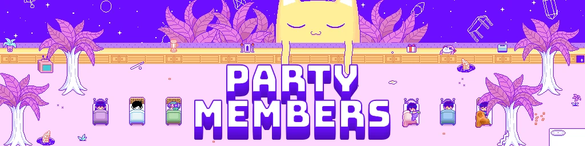
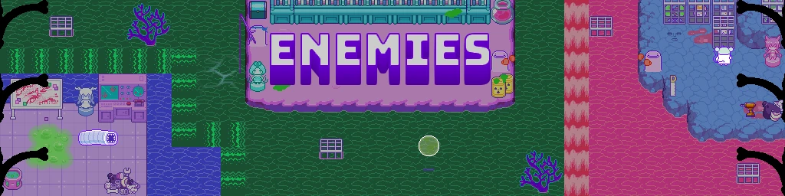
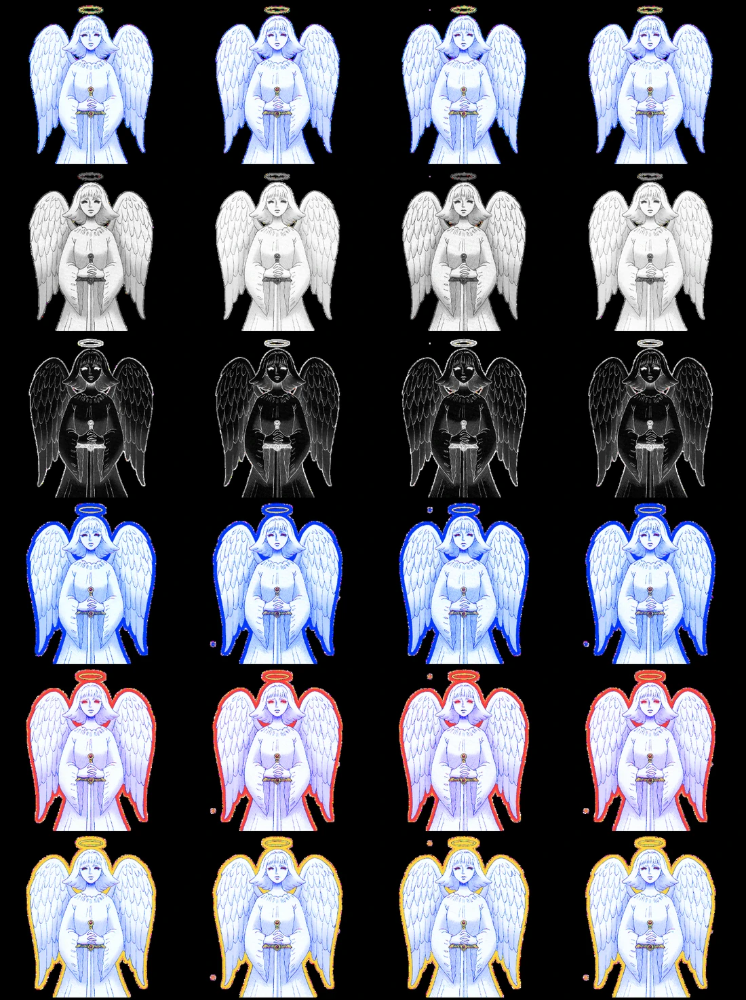
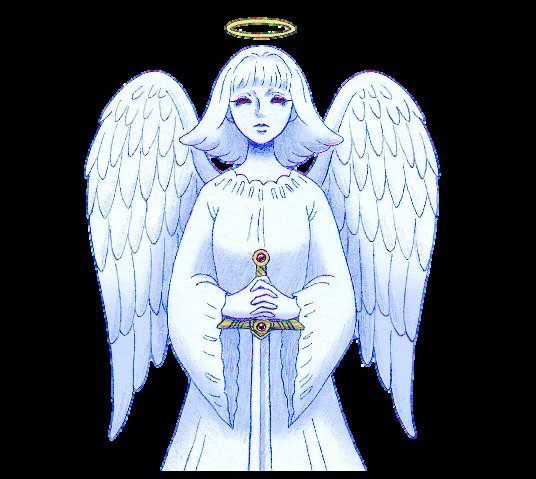
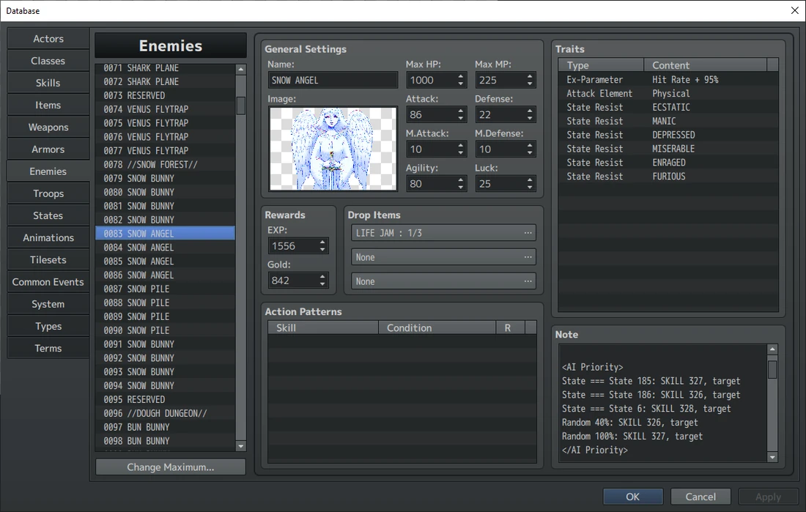
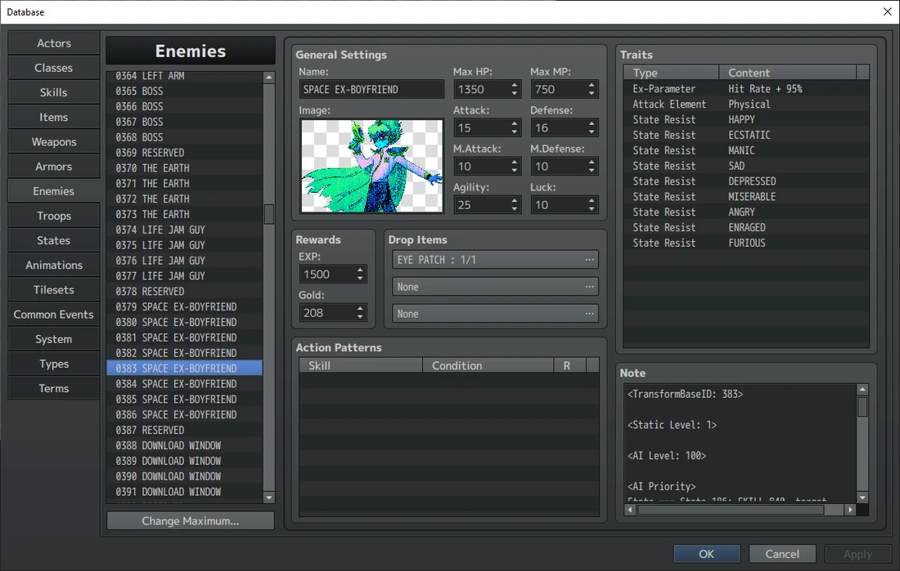
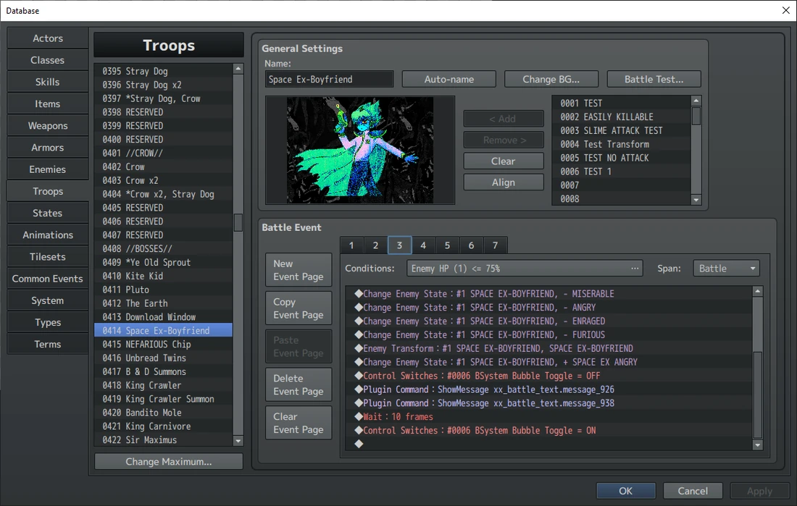

注:队伍成员本身就非常复杂,需要的东西远不止这些。他们还需要技能、装备、对话、标签照片、标签能力、战斗图像等等。但是,这些内容要么属于以下两种情况;

a. 已在本指南的其他部分讲过了 b. 取决于你具体要做什么

所以,这里我只讲角色(Actor)页签和职业(Class)页签里最基础的内容,外加如何设置移动精灵图。

### 角色(Actor)

<角色(Actor)页签截图>

这就是角色(Actor)页签,我们所有队伍成员的一部分数据就存放在这里。我来把这里的每一项都讲解一遍。

`Name`**:** 不言自明。

`Class`**:** 这更多算是 <span class="og-g">RPG Maker MV</span> 遗留下来的东西。每个队伍成员都有自己专属的 `Class`。简单来说,`Actor`是“角色”,而 `Class`是“职业”,不过再强调一次,这在 <span class="og-g">OMORI</span> 里纯属多余。

`Levels`**:** DW 角色的等级上限是 50,RW 角色的等级上限是 1。

`Character`**:** 这更多是个备选方案,因为移动图像其实是编写在 `Common Event` 里面的;但如果该事件没有运行,就会改用这里的行走精灵图。请确保没有设置头像和战斗图。

`Traits`**:** 队伍成员将始终拥有的各种 `Effects`。在 `Actors`页签里,这主要就是 `State` `Resistances`(状态抗性)。除了 OMORI 和贝西尔之外,所有人都抵抗三阶情绪,而 OMORI 抵抗害怕。这些特性与 `Database` 其余部分里的特性是同一套。你可以在

```text
States section.
```

#### 备注:

`<BattleStatusFaceName:`<var>faceset</var>`>` 角色在战斗中使用的头像集。

`<FearBattleFaceIndex:`<var>#</var>`>` 通常由桑尼使用。如果控制开关“`Neutral Face`”被打开,该队伍成员的中性表情就会被换成这里指定的那一行。

`<BattleStatusIndex:`<var>#</var>`>` 决定他们显示在战斗界面的哪个角落。<var>0</var> 表示

左上角,<var>1</var> 表示右上角,<var>2</var> 表示左下角,<var>3</var> 表示右下角 `<MenuStatusFaceName:`<var>faceset</var>`>` 供脸部图像大于 106x106 的角色使用。这些图像会在菜单里使用,以免被裁掉。惯例尺寸是 125x125。

`BattleCommandList` 的其余代码可以、也应该直接复制粘贴,只需把“`skill`”的 id 替换成该队伍成员普通攻击技能的 id。

### 职业(Class)

<职业(Class)页签截图>

这就是 `Classes`页签,我们所有队伍成员的数值都存放在这里。我来把这里的每一项都讲解一遍。

`Name`:不言自明,不过并不会在游戏中显示。

`Parameter Curves`(参数曲线):这决定了角色升级时数值如何成长。看样子开发者是手动设置每一级的数值的,我觉得这简直离谱。你可以使用 `Generate curve`(生成曲线)按钮,在那里按自己的喜好设置数值。它会要求你输入 99 级的数值,哪怕 <span class="og-g">OMORI</span>等级上限只有 50,所以直接把 50 级数值的两倍填进去就行。生成完成后,你愿意的话还可以再微调。

`Skills to Learn`(习得技能):不言自明。务必把 `Follow-Up checks`(追击判定)也加进习得技能列表里。

`Traits`:队伍成员将始终拥有的各种 `Effects`。在 `Classes`页签中,这主要是 `equipment types`(装备类型)。每个人都被分配了 <var>POWER OF</var> <var>FRIENDSHIP</var>技能类型和<var>CHARM</var>防具类型,另外每个角色都有自己专属的武器类型。如果你好奇 <var>KEL</var>类型防具是干嘛用的——那是给 RW 凯尔的宠物石头准备的。



### 移动图像 <span class="og-g">OMORI's</span>队伍成员的移动图像是通过 3 个

公共事件:Graphics Base、Graphics Climb 和 Graphics Swim。

幸运的是,这些事件里用到的所有分支都标注在 `Code`

`Comments`(代码注释)里了,所以你只需要在主脚本下面再加一段脚本,就能加入你的队伍成员。格式长这样。

```js
var bwalk = { name: 'DW_BASIL', index: 0 } 
var brun = '$DW_BASIL_RUN%(8)' 
$gameActors.actor(5).setMovementGraphics(bwalk, bwalk, brun); 
```

你唯一需要改动的只有:变量名(免得出现重名变量)、所引用的图像,以及行走精灵图的序号。

序号的算法和 <span class="og-g">OMORI</span> 里其他所有图像一样,只不过它指的是整套移动精灵图,而不是其中单独的某一帧。

*提醒:如果你试着去编辑这些事件里的原始脚本,会发现它们被截断了。这是因为 <span class="og-g">RPG Maker MV</span> 默认把 `Script Commands`(脚本指令)限制在 12 行以内。*

*OMOCAT 用了一个修改版来绕过这个限制。我猜这个改动是*

*Archeia 做的——她是 <span class="og-g">OMORI’s</span>首席程序员,同时也是 <span class="og-g">RPG Maker MV’s</span> 真正开发团队的成员。不,这个版本并没有公开,你只能将就着用,或者去弄一个 <span class="og-g">OneMaker</span>。*

## 敌人

好。你已经会做对话、事件、地图、美术(至少知道怎么排版了)、状态、装备、技能,甚至队伍成员了(勉强算是)。


你的技能库已经相当丰富了。不过现在,我要给你介绍一个比前面那些还要更可怕的东西。

```text
制作敌人。
```

*(来源:图片由 u/Whisp\_Is\_My\_Waifu 提供,和上次一样)*

这主要是因为敌人这种东西,讲起来和做起来都很费工夫。那就看看我能讲到什么程度吧!

### 图像

这部分会讲得很简短,因为我在[精灵图与](/omori/modding-guide/05-sprites-art/) [美术](/omori/modding-guide/05-sprites-art/)那一节已经解释过了。你的敌人会需要两张图像:你需要把敌人的所有帧按下图的方式排好,放进“`img/sv_actors`”文件夹。





*(来源:!battle\_snow\_angel.png,原版游戏)*

接着,你还需要单独取一帧中性状态的图像,作为独立文件放进“`img/enemies`”文件夹,如下图所示。

*(来源:!battle\_snow\_angel.png,原版游戏)*

*注:这张单帧图像只会被 `Database`(数据库)使用,玩家永远看不到它。因此就算你的敌人外观改版了,也不必修改这张图。实际上,你可以在贝西尔和陌生人的单帧精灵图上看到这一点——这两张图的设计都和实际的样子略有不同。*

### 基础参数

图像都准备好了,现在我们把它们装进一个新敌人里。首先要去的地方,就是 `Database’s`敌人页签。然后一路向下滚动到空白区域(你至少需要 4 个槽位),就可以开工了。作为演示,我就拿雪天使的页面来展示。



*(来源:TomatoRadio)*

咱们把这些东西一项一项拆开来讲:

- `Name`**:** 这是敌人的名字。哇,我知道,特别引人入胜。
- `Image`**:** 这就是那张“enemies”图像派上用场的地方。你要把它设置在这里。在编排敌群或测试动画时,你的敌人就会以这张图的样子出现在工程文件里。
- `All Stats`**:** 这些都不言自明。注意:经验值、金钱和物品掉落这几项,必须针对每种情绪分别修改,因为情绪本应影响这些掉落率。
- `Action Patterns`**:** 也就是行动模式,<span class="og-g">RPG Maker MV</span> 遗留下来的东西。<span class="og-g">OMORI</span>并不使用它。真好奇 AI 到底是在哪里设置的……
- `Traits`**:** 还是你早已熟悉、并且……多少对它产生过些感情的那个特性页签。我不知道你到底爱不爱它。总之,做敌人时你基本只会用到上面图里所示的那些特性,全都不言自明。

### 情绪

你也注意到了,每个敌人都有 4 个版本,也就是它们的各种情绪变体。敌人情绪的运作方式是:当敌人被赋予某种情绪时,游戏会调用一个函数,把敌人变身为新的版本。状态里的 `<TransformEmotion>` 备注标签就是干这个用的。这些变身所移动的槽位数量是硬编码的,所以敌人**必须**按以下顺序放置:

中性(Neutral)

开心(Happy)

难过(Sad)

生气(Angry)

而现在你就可以修改 `drops`(掉落)、`exp`(经验值)、`AI`(下面就会讲到),以及其他任何你真正想改的东西了。

### 备注

随你怎么跑,备注页签都是逃不掉的。它永远都在。

我们先从所有单行的 `notetags`(备注标签)开始。

**通用备注标签:**

- `<TransformBaseID:`<var>X</var>`>` 它会告诉敌人它自己的中性槽位是哪一个。所以你应该把它设为敌人中性形态的 ID。没错,连中性槽位自己也需要这个标签。
- `<Static Level: 1>` <span class="og-g">OMORI</span>所用插件遗留下来的一项。它的值始终为 <var>1</var>。
- `<PassiveState:`<var>X</var>`>` 可以用来给敌人附加一个被动状态。这主要用于被动型的游戏逻辑。
- `<FallOnDeath>` 这个备注标签会让敌人在被消灭时坠出屏幕。普通敌人请使用它。

**图像类备注标签:**

- `<Sideview Battler:`<var>x</var>`>` 这是“sv\_actors”文件夹里的那张图像,也就是玩家真正看到的画面。你可以放置多个这个标签,让一个敌人拥有多种可能的外观。不过你需要同时准备 /sv\_actors 和 /enemies 两套图像,而且所有版本的尺寸都必须一致。我猜你可以用它来给敌人做不同配色。
- `<Sideview Battler Frames:`<var>x</var>`>` 每一行里有多少帧。在 `OMORI` 中通常是 <var>4</var>。
- `<Sideview Battler Speed:`<var>x</var>`>` 动画播放的速度。通常是 <var>12</var>。

*注:这不是 FPS。我也不清楚它具体是什么单位,但数值越大,动画反而越慢。*

- `<Sideview Battler Size:`<var>x</var>`,`<var>y</var>`>` 这是敌人单帧的大小。基本上,直接用你“`img/enemies`”图像的尺寸就行。
- `<Sideview Width: 0>` <span class="og-g">OMORI</span>所用插件遗留下来的一项。这个值始终为 <var>0</var>

```text
 <Sideview Height: 0> Ditto.
 <Position Offset Y: 0> Ditto.
```

- `<StatusYOffset:`<var>x</var>`>` 这是状态框的垂直偏移量,状态框显示的是敌人的血量和名字。把 `Sideview Battle Size` 的 <var>Y</var> 值取负之后再稍微减小一点,就是个不错的初始值。
- `<StatusXOffset:`<var>x</var>`>` 同上,但这是水平偏移量。很少会用到。
- `<DamageOffsetY:`<var>x</var>`>` 这是会显示在敌人身上的伤害

数字的垂直偏移量。看起来,很多无生命物体类敌人(比如末日盒和水拟态)的值都是<var>30</var>。

- `<DamageOffsetX:`<var>x</var>`>` 同上,但这是水平偏移量。很少会用到。

**情绪类备注标签:**

```text
<Sideview Battler Motion> 
Name: x 
Index: y 
Loop 
</Sideview Battler Motion> 
```

这是一组标签,用于根据敌人当前所处的状态,决定显示“`sv_actors`”图像中的哪一行。

<var>X</var> 会是以下 7 种之一:

```text
 Walk/Thrust/Guard/Skill/Other/Item/Spell 
```

    - 这一行用于情绪。<var>y</var> 变量应设为敌人情绪所对应的那一行。按照插件的说明,你只需要 `Other`和 `Walk`两套,但 <span class="og-g">OMORI</span>里每个敌人把 7 套全用上了,所以你自己看着办吧。

```text
 Damage 
```

    - 这一行用于受击。通常是第 2 行,索引值是 <var>1</var>。

```text
 Dead 
```

    - 这一行用于死亡。通常是第 3 行,索引值是 <var>2</var>。
- 不写这一行——也就是说“`Name:`<var>x</var>”这一行压根就不存在。
    - 这里应该填敌人的中性行,通常是 <var>0</var>。至于为什么需要这个,我也不清楚。

#### AI 备注标签:

接下来是 AI,就是那个据说正在抢走所有人饭碗的东西。

那么,我们来看看怎么给你敌人的脑子做设置。

<span class="og-g">OMORI</span>使用 Yanfly 编写的 [Battle A.I. Core](http://www.yanfly.moe/wiki/Battle_A.I._Core_(YEP)) 插件来决定敌人的行为,所以你可以去阅读那个页面,全面了解这个插件能做什么——因为它比 <span class="og-g">OMORI</span> 实际用到的部分要强大得多。

不过,接下来才是实际的教程——它依然会比原版游戏里用到的更深入,但也更贴合 OMORI 的实际运作方式。

首先你需要这个备注标签。

```text
<AI Level: 100>
```

这个 AI 等级设置会告诉游戏:以 100% 的准确率执行你即将写下的公式。在 <span class="og-g">OMORI</span> 里,我们要的正是这个效果。

接着,我们需要创建一个 `Notetag Group`(备注标签组),使用的是

```text
<AI Priority>
```

现在,我们就可以把技能填进这个 AI 优先级组里了。

这套公式由一系列判定构成,用来决定使用哪个技能;判定会从上到下依次运行,如果某条判定未通过,就继续往下走,直到有一条通过为止。每个判定大致长这样:

```text
condition:SKILL x, target 
```

红色内容有点多,我们来稍微拆解一下。

<var>condition</var>就是技能被触发前必须满足的条件。下面是所有可用条件的列表 <var>ALWAYS</var>**:** 满足即必定发动。很适合作为一系列判定中的最后一条技能。

<var>RANDOM X%</var>**:** <span class="og-g">OMORI</span>里大部分用的就是这个。把 <var>x</var>替换成敌人使用该技能的概率百分比即可。

<var>STATE === State X</var>**:** 当某个队伍成员身上带有指定状态时触发。你会注意到,每个敌人身上都有针对状态 <var>186</var>的这一条。这正是“观察”在 <span class="og-g">OMORI</span> 中的运作方式——也就是说,如果你想用“观察”,就必须定义它被触发时敌人会使用哪些技能。

注意:对于这一条以及其他所有检查队伍相关数值的判定来说,只有满足判定条件的队伍成员才能被选为目标。

<var>STATE !== State X</var>**:** 当队伍成员身上没有指定状态时触发。

<var>SWITCH X Case</var>**:** 当指定的开关满足所列的情况(<var>ON</var> 或 <var>OFF</var>)时触发。

<var>VARIABLE X PARAM Eval</var>**:** 当指定的变量满足 eval 判定式时触发。

*注:<var>eval</var>指的是 <var>>=</var>、<var>===</var>这类基本的等式与不等式判定,并且可以引用任何脚本调用或数字。*

<var>USER stat PARAM eval</var>**:** 当使用者自身的指定数值满足 eval 判定式时触发。

<var>STAT PARAM eval</var>**:** 当某个队伍成员的指定数值满足 eval 判定式时触发。

<var>Type PARTY LEVEL eval</var>**:** 当(<var>Highest</var>、<var>Lowest</var>或 <var>Average</var>)队伍成员的等级满足 eval 判定式时触发。

<var>Party/Troop ALIVE/DEAD MEMBERS eval</var>**:** 当队伍/敌群的存活/死亡成员数量满足 eval 判定式时触发。

Troop(敌群)是 <span class="og-g">RPG Maker MV</span> 里对敌人队伍的叫法。这些内容接下来很快就会讲到。

<var>TURN eval</var>**:** 当回合数满足 eval 判定式时触发。

<var>EVAL eval</var>**:** 基本上就是一个纯粹的代码判定。

两个判定可以在中间放上 <var>+++</var>,组合在一起使用。

接下来,把你想在该条件下使用的技能按 id 填上去就行。

最后,写上你想优先选择的目标类型。可以是 <var>Target</var>**:** 从可选目标中随机挑选。

<var>Highest/Lowest Stat</var>**:** 数值最高/最低的那个目标。

好了。刚才那一大段话,大概只有一部分听着合乎逻辑,所以我来做一个带注释的示例。

`<AI Level: 100>` //这能确保我们的敌人始终遵循这套公式 `<AI Priority>` // 这是标签组的开头 `State === State 186: SKILL 344, target` //这个技能会在“观察”被使用时触发,并会随机选取一名队伍成员作为目标。

```text
Switch 21 === ON +++ Random 30%: SKILL 234, Highest HP //If the above
```

如果上一条判定未通过:在开关 21 为 ON 的情况下,这个技能有 30% 的概率被使用,并会瞄准血量最高的目标。

`ATK param > user.atk: SKILL 445, Lowest MP` //如果上面的判定都未通过:当某名队伍成员的攻击力高于使用者时,此技能就会触发;并且在攻击力更高的成员中,会瞄准 MP 较低的那一个。

`Always: SKILL 143, target` //如果上面的判定都未通过,这条技能将必定被使用,使用者会随机瞄准一名队伍成员。

`</AI Priority>` //这是标签组的结尾

好。AI 的内容就到这里。我知道它看起来相当复杂——因为它确实就这么复杂。但在实际使用中,你一次只会用到其中几条,而一旦上手,它们会变得非常好用。

### 二阶与三阶情绪

好。现在,一些眼尖的读者可能已经注意到,我一直在刻意跳过那些能到达二阶和三阶情绪的敌人——也就是太空前男友、甜心、无面包双子、太空前夫,还有……斯纳利……(我至今都不明白为什么斯纳利能感受二阶和三阶情绪,这几乎可以肯定是个疏漏)。

原因在于,它们的运作方式和你想的很不一样。如果你还记得很早之前讲状态的那一节,你就会知道 `<TransformEmotion:>` 备注标签只有针对开心、难过和生气的分支。那我们怎么才能让敌人变成更高阶的情绪呢?

嗯,有两种办法。

第一种方法简单得多,但也更原始。二阶和三阶情绪依然带有 `<TransformEmotion:>` 备注标签,所以当这些情绪被触发时,敌人会直接套用自己一阶情绪的槽位。也就是说,一个狂怒的敌人用的还是它的生气槽位。太空前夫和斯纳利就是这么运作的,而你要做的仅仅是禁用 `State Resistances`(状态抗性)而已。但问题在于,这就意味着你无法在不同情绪阶层之间做任何行为或外观上的调整,只能依赖情绪本身自带的状态变化。这也正是为什么 SXH 和斯纳利没有二阶、三阶情绪的精灵图。那么,另外三个情绪 Boss 的效果是怎么做出来的呢?

这个嘛,一开始会有点绕。

还记得我之前讲解 `<TransformEmotion:>`

备注标签的那回事吗?它的原理是:每个分支都会把敌人变身为从它的中性变体向前数固定数量 id 槽位的那个敌人。而妙就妙在这里:`<TransformEmotion:>` 备注标签里可以填任何情绪,哪怕它和该状态的实际情绪对不上号。所以,假如我另外做了一套“生气”“愤怒”“狂怒”,却把它们的 `<TransformEmotion:>` 分别设为开心、难过和生气,那我们就得到了这些情绪各自独占的敌人槽位。<span class="og-g">OMORI</span>就是这么干的。这三个 Boss 其实是两个敌人:第一版是可以感受所有普通情绪的形态;而当他们被情绪锁定之后,就会 `Transform`(变身)成装载着其多阶情绪的第二版。

那这一切要怎么设置呢?其实很简单。

首先,做出你 Boss 的第一阶段,带上它全部的普通情绪。

做完之后,紧接着在下面把该敌人的中性版本再复制一份。接下来,把后面的三个槽位做成 Boss 被锁定情绪后的一阶、二阶和三阶形态。另外,务必让这些新版本抵抗所有普通情绪的常规版本——包括它们被锁定的那一种在内,因为我们不希望普通情绪还能被加上去,那会改变 Boss 所在的槽位。

全部做完之后,应该长成这样。



*(来源:TomatoRadio)*

这样我们的 Boss 就做好了,但到底要怎么和它开打呢?这就要轮到下一节了。

### 敌群(Troops)

敌群就是你实际进行的一场场战斗。普通遇敌战和 Boss 战都设置在这里,不过普通遇敌非常简单,所以我们会从 Boss 的视角——具体来说就是多阶情绪 Boss 的视角——来讲解这个页签。

欢迎来到敌群页签!你要做的第一件事,就是把你的 Boss 加到这里面来。记得选它的中性形态。



*(来源:TomatoRadio)*

大多数 Boss 都有大约 6-8 页“`Battle Events`”(战斗事件)。它们是

在战斗中由特定条件触发的 `Events`。它们的结构和 `Common Events`(公共事件)与 `Regular Events`(普通事件)相同,所以你的工作流程也大同小异。

虽然你能做的事情五花八门,但为了简单起见,我只讲讲最常见的做法。

- `Turn 0`**:** 也就是第 0 回合,这一页用来放任何你想在战斗开始前发生的内容。对话和开场状态变化之类的东西都应该写在这里。另外值得一提的是,对于所有战斗文本:如果文本是敌人说出来的,那么控制开关“`BSytem Bubble`

`Toggle`”就应当设为 <var>ON</var>,旁白则应设为 <var>OFF</var>。我相信这就是用来开启和关闭文本框上那个箭头的东西。

- `Enemy HP <`<var>#</var>`%`**:** 一旦敌人血量降到指定值以下,这些页面就会在回合结束时激活。

由于多阶情绪的切换正是在这里完成的,我就在这里一并讲解了。如果你的 Boss 没有这套机制,可以直接跳过这一段。

    - 第一,移除敌人身上可能带有的所有普通情绪。
    - 第二,使用`Enemy` `Transform`(敌人变身)把敌人变成他们的新形态(务必选中性形态)
    - 第三,给敌人加上专属的一阶情绪。这些状态分别叫 `Space Ex-Angry`(太空前·愤怒)、`Sweet Happy`(甜心·开心)(这个状态在列表里的位置比其他几个更靠下)和 `BD Sad`(BD·难过)。
    - 至于二阶和三阶,则是移除较低的情绪、加上更高一阶的情绪。值得一提的是,这些情绪状态还各自带有 check(检查)状态。我不知道它们是干什么用的,但保险起见你还是一并加上为好。多半是某些技能或插件的游戏逻辑。
- 另外,游戏播放胜利事件也是在这里完成的。所有会让屏幕变灰的 Boss,都会在其事件页的开头使用 `Common Event`“<var>Enemy Defeat</var>”,之后任何额外的对话就可以接着播放了。
- `Actor HP <`<var>#</var>`%`**:** 当角色(通常是 OMORI)的血量低于某个阈值时,这些页面就会激活——通常就是死亡的时候。战败文本就是这样显示出来的。
- `Turn`<var>#</var>**:** 在指定的回合数激活。最常用于像贝西尔或陌生人那样的剧本式战斗。

最后,事件就是通过这些敌群来发起战斗的。你可以使用“`Battle Processing`”(战斗处理)指令,让某个敌群的战斗开始。

我想,关于 OMORI 的敌人,要讲的就是这些了。它由许多细小又关键的零件组成,所以你多半还是得自己动手多实验一番,不过这些内容应该能成为一个不错的跳板,让这一切看起来没那么吓人。
