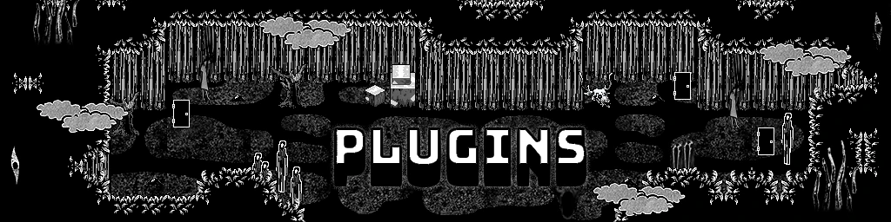

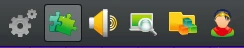

好,现在到了本指南的最后一环。到目前为止,我们基本都默认你只使用原版游戏和你自己的素材——这一点值得表扬。不过,我们毕竟是一个 Mod 制作社区,所以社区里已经为像你我这样的 Mod 作者做出了不少 Mod 和插件。本节将详细介绍如何把它们添加到你的 Mod 里,并列出一些我认为最实用的东西。

### 添加插件

插件超级好加。插件以 `.js` 文件的形式保存,放在 `js/plugins` 文件夹里。

然后在 <span class="og-g">RPG Maker MV</span> 中,打开这个标签页

^就是这个

这会打开一个新菜单,列出 <span class="og-g">OMORI</span> 的全部插件;滚动到最底部,双击空白区域,然后选中你的插件,把状态设为 <var>ON</var>。

真的就这么多。插件从上到下依次加载,所以靠下的插件会覆盖靠上的插件——这正是我们能够用插件去覆盖原版代码的原因。

接下来才是你大概率冲着来的部分:让我给你列一堆能让 Mod 制作更轻松的酷插件。喏,由本人亲自甄选:

### 开发辅助 Mod

这类 Mod 是为了辅助开发其他 Mod 而生的。

*注:本节中的所有 Mod 都不应包含进打包后的模组里。*

#### [BundleTool](https://mods.one/mod/bt):作者 Rph

一件绝对不可或缺的软件。你如果留心过就会发现,我和 FruitDragon 从来没讲过怎么打包 Mod。这件事虽然可以手动完成(做法看[这里](https://omori-modding.gitbook.io/wiki/getting-started/packaging-mods/mod.json-file)),但 <span class="og-g">BundleTool</span> 能让整个过程干净利落得多、也快得多。

要使用 <span class="og-g">BundleTool</span>,把它像普通 Mod 一样放进你的 <span class="og-g">OMORI</span> Mod 文件夹(建议这一步别同时放其他 Mod)。打开游戏后,会提示你选择试玩测试文件夹。接下来照着说明操作即可。

#### [Better $atlasData Errors](https://mods.one/mod/betteratlaserror):作者 DraughtNyan 和 Rph

这个插件会让报错信息变得详细得多,能像模像样地解释清楚是什么问题导致了崩溃。添加这个插件时,记得点住并拖动它,把它移到 “`GTP_OmoriFixes`” 的上方。

#### [Console](https://mods.one/mod/console) 和 [Console +](https://mods.one/mod/consoleplus):作者 surrealEgg、Lee 和 GlitchyZorua

一套由两个 Mod 组成的工具,能提供比原版调试菜单细致得多的调试功能。它会给你一个更精简的调试菜单,可以更改物品、技能、开关、变量,触发事件和战斗等等。

*注:Console + 的每条命令都各自保存为独立插件,所以我建议只保留 “quit” 命令(它就是直接关闭游戏),其余那些对开发实在没什么帮助。*

#### [Save Drag and Drop](https://mods.one/mod/dragdrop):作者 Rph

这个 Mod 能让你把下载好的 .rpgsave 文件直接拖到一个打开的 <span class="og-g">OMORI</span> 窗口上,即可轻松加载。如果你要针对游戏的特定段落测试改动,或者测试某个改动在游戏不同阶段是否生效,它都很好用。

各个游戏进度点的存档合集可以在[这里](https://docs.google.com/document/u/0/d/1qYsW_uXsBD0wMtmQG06UxIMfbGYuTgeu-AHzzdjCw-s/mobilebasic)找到。

#### [Quick Load on Start](https://mods.one/mod/quickload):作者 VykosX

这个 Mod 会让游戏启动时直接加载最近一次使用的存档,跳过启动画面、标题画面和存档选择。如果你经常试玩,这会帮大忙。

#### [Improved Save & Load Menu](https://mods.one/mod/saveloadplus):作者 tommy

严格来说这只是一个通用 Mod,但对做 Mod 格外有用。它能把你的存档位数量增加到电脑实际能承受的程度。对于 `Total Conversion`(全面改造模组,即 <span class="og-g">OMORI</span> 社区对 ROM 改造的说法),或那些对原版游戏改动极多、需要在游戏各阶段留下大量存档的 Mod,它都非常实用。

### 功能定制 Mod

这些 Mod 会给游戏加上肉眼可见的变化,让你能对游戏的某些方面有更强的掌控。这类 Mod 必须包含进打包后的模组里。该给的署名千万别忘了给!

#### [Enemy Z Offset](https://mods.one/mod/enemyoffsetz):作者 Riomo

这个 Mod 让你可以在敌人的备注标签里写它们的 z 坐标,让它们显示在大多数其他敌人的前面或后面。对敌人排布比较复杂的战斗很有帮助。

#### [Tiled Fixer](https://gist.github.com/rphsoftware/51cc72721c25eeea54de50850abd8ea6):作者 Rph、Draughtnyan 和 FoG

让 1.8.5 及以上版本的 <span class="og-g">Tiled</span> 可以用于 <span class="og-g">OMORI</span> 项目。另外

让 1.8.5 及以上版本的 Tiled 可以用于 OMORI 项目。另外还需要把 `TerrainTiles.json` [更新](https://github.com/FoGsesipod/Terrain-Fix)一下。

#### Badges:作者 Draughtnyan

#### [Yaml Title Screen](https://mods.one/mod/easytitlescreen):作者 FruitDragon

让用户通过 Yaml 打造自定义的 OMORI 标题画面。如果你想用原版游戏的标题素材,请改用 EasyTitleScreen(下载链接相同)。

#### Weather Extension:作者 FruitDragon

#### [Forced Action Targeting + Skill Emotion](https://mods.one/mod/weaknesstargeting) [Targeting](https://mods.one/mod/weaknesstargeting):作者 vl 和 Draughtnyan

这个 Mod 让你可以在技能上放置备注标签,改变敌人使用该技能时选取目标角色的方式。主要用途是让敌人能利用情绪,专门攻击某项数值最高或最低的角色。

#### [Tiered State Functions](https://mods.one/mod/statetier):作者 Stahl

这个 Mod 省去了添加阶层状态(情绪和增益/减益)时那一长串烦人的 if-then 命令。取而代之的是,你可以用一条 eval 命令给战斗单位增加或减少特定数量的状态阶层。此外,它还能让你把情绪或增益的阶层当作变量来引用。

*注:这个插件在 [Reverie](https://mods.one/mod/reverie) Mod 里得到了大幅更新,支持更多细节设定,我推荐改用那个版本。*

#### [More Than 4 Skills](https://github.com/rphsoftware/omori-utils/tree/master/more-than-4-skills):作者 Rph

这是 Rph 的实用插件之一,这批插件都放在一个 GitHub 仓库里。这一个允许通过一条脚本调用(可由事件触发)来指定队伍成员能装备超过 4 个技能,而且每个队伍成员都可以单独指定。

#### [Splash Extender](https://github.com/rphsoftware/omori-utils/tree/master/splash-expander):作者 Rph

又一个实用插件。它能让你往启动画面(也就是显示 Omocat 标志和内容警告的地方)添加额外的图片。

#### [Gold Counter Disabler](https://mods.one/mod/goldcounterdisabler):作者 FoG

禁用梦境世界里的金钱(蛤蜊)计数器。适合任何不打算做货币系统的 Mod。

#### [Mod Configs](https://mods.one/mod/modconfigs):作者 Snek

允许你为自己的 Mod 添加设置项,并可在主菜单中更改。对 [Customisable Difcultyfi](https://mods.one/mod/customisabledifficulty) 这类可自定义的 Mod 特别有用。

#### [Compatibility Patch for Save & Load+](https://mods.one/mod/saveloadpluscompatibility):作者 Pyro

这是一个补丁,让你无需随 Mod 一起分发本体,就能自定义 Save Load + 菜单。如果你添加了新队伍成员,或者想让你新做的区域在 <span class="og-g">Save Load +</span> 用户那里显示背景图,它就非常合适。

#### [Custom State Damage Face](https://mods.one/mod/statedamageface):作者 Riomo

这个 Mod 让你可以为每种状态单独设置受伤表情。如果你的各种状态脸差异极大,不想在切换表情时受伤脸显得太突兀,它就很有用。

#### [In-battle Choices Box Fix](https://mods.one/mod/fixbattlechoices):作者 dawn

修正战斗中选项框的位置,使其对齐方式与游戏主机版中的一致(针对 Bossman Hero)。

#### [Fixed Priority Skills](https://mods.one/mod/fixedpriorityskills):作者 vl

重新实现了先制行动技能的处理方式,因为默认方法偶尔会失灵。(我也说不清原方法到底是怎么坏的,因为我自己从没遇到过 bug,但如果你想稳一点,可以用这个。)

#### [YAML Extended](https://mods.one/mod/yamlextended):作者 WHITENOISE 和 Bajamaid

这个 Mod 允许在 `YAML` 开头播放音效、更改文字音效、以及更改 `WindowSkin`,全部通过类似于

OMORI 的脸图集(Facesets)与脸图索引(Faceindex)了。

### [OneMaker MV](https://mods.one/mod/onemakermv):作者 FoG、Rph 和 Draughtnyan

它重要到值得单独开一节来讲。<span class="og-g">OneMaker MV</span> 是给 <span class="og-g">RPG Maker MV</span> 本体装的 Mod,移除编辑器的种种限制,并添加对 <span class="og-g">OMORI</span> Mod 制作格外有帮助的额外功能。

#### 安装

由于这个工具的性质特殊,需要一番特别的设置才能正常使用。基本步骤如下:

1. 下载 [安装程序](https://mods.one/dl/ed133e09-5a67-4de7-b1c5-5cbb2f5cf7fa)(来自 <span class="og-g">mods.one</span>)。
2. 运行 7z 压缩包内的 <var>Run Installer.bat</var> 文件。
3. 下载 [OneMakerMV-Core](https://mods.one/dl/a0c7c70b-98e3-43fb-bee9-1fc73bc0d984) 插件(来自 <span class="og-g">mods.one</span>)。
4. 把它添加到你的项目里,并移到优先级列表的最顶端。

现在你就算一切就绪了!之后需要安装更新时,只要重新运行安装程序,就能拿到最新版本。

接下来看看 <span class="og-g">OneMaker</span> 的各项功能。

#### 自动显示图块地图

在标准版 <span class="og-g">RPG Maker MV</span> 里,因为图块地图是用另一个程序做的,你在编辑器里看不到它。而在 <span class="og-g">OneMaker</span> 中,只要在地图属性里勾选 `Show Tiled Maps` 复选框(它取代了 `Show Parallax` 复选框,所以多半已经默认打开),就会从 `render` 文件夹里调取地图,让你同时看到图块地图和远景图。这个文件夹会在使用 Rph 的 [Omori Map](https://github.com/rphsoftware/omori-map-preview-renderer/actions/runs/20416117980)

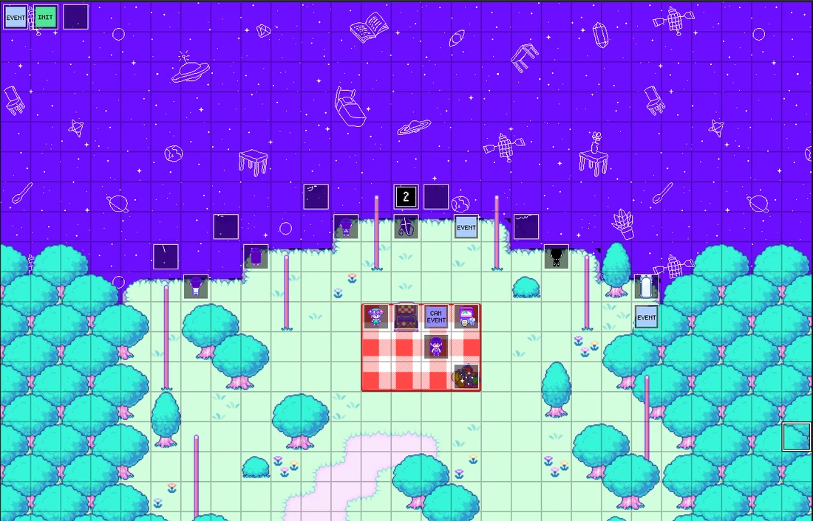

[Renderer](https://github.com/rphsoftware/omori-map-preview-renderer/actions/runs/20416117980) 时自动创建,当然也可以手动建立。要添加地图,只需按[地图制作章节](/omori/modding-guide/04-maps/)里展示的方法导出,然后挪到 `render` 里即可。

*注:导出图片时要选 100% 的缩放比例,而不是标准的 150%。(来源:TomatoRadio)*

#### 窗口尺寸增大 <span class="og-g">OneMaker</span> 极大幅地加大了 `Database` 窗口,让你在 Notes 标签页和其他用途上有宽裕得多的书写空间。如果在你的显示器上嫌太大,可以在

OneMaker 的窗口尺寸设置(Window Sizing Settings)中调整。

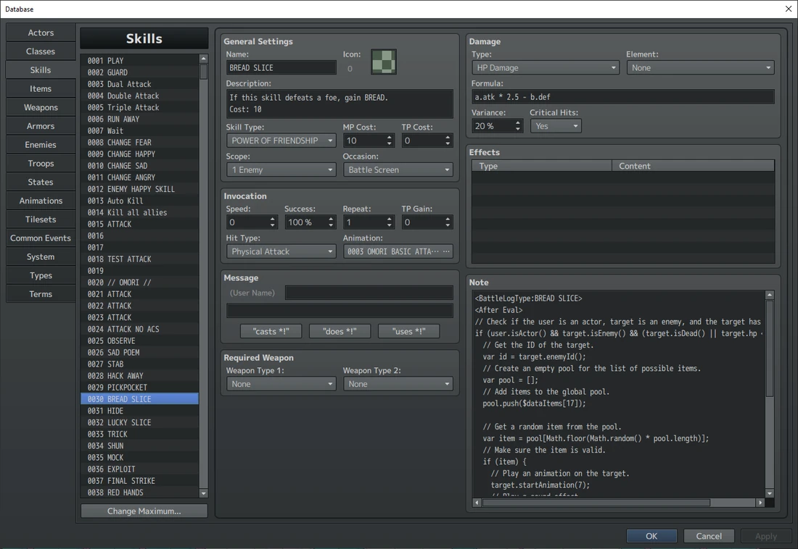

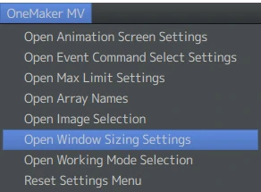

*(来源:TomatoRadio)*

*(<span class="og-g">OneMaker</span> 设置项的路径,来源:TomatoRadio)*

`Event Command` 菜单还被合并成了一个菜单,不再分拆在 4 个页面里。这一点同样可以切换。

Control Self Variable(控制独立变量)、Switch Statement(Switch 语句)和 Sound Manager(声音管理器)

这些命令只有在装有 `OneMakerMV-Core` 插件时才可用,否则会显示为灰色,不过 `Custom Advanced` 命令仍然可用。

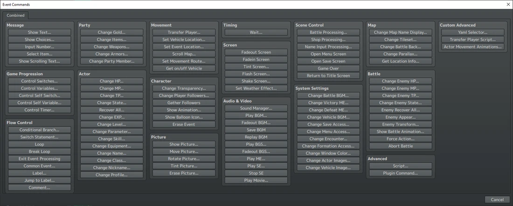

*(来源:TomatoRadio)*

#### 扩展的事件条件

事件现在多了不少可用条件。如下:

- `Variables`现在可以使用多种运算符:<var>≥</var>、<var>></var>、<var>=</var>、<var><</var>、<var>≤</var>、<var>≠</var>
- `Self Switches` 现在可以使用字母表里的所有字母
- `Self Variables` 这种原本只有脚本能碰的数据类型,现在也能在编辑器里访问了。
- `Scripts`可用于更复杂的条件。

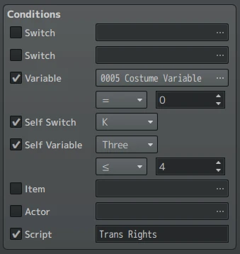

*注:条件只在 $gameMap.refresh() 函数处才会被检查。实际效果是,只有当开关/变量被更改、角色/物品被更改,或地图被加载时,脚本条件才会被检查。*

*(来源:TomatoRadio)*

#### 扩展的事件指令

各种事件指令纷纷获得了新功能或放宽了限制,同时还新增了一些全新指令!

##### 显示文字 `Show Text` 在选择脸图时现在采用 106x106 像素的网格,与 <span class="og-g">OMORI</span> 的 `Facesets` 兼容性更好。

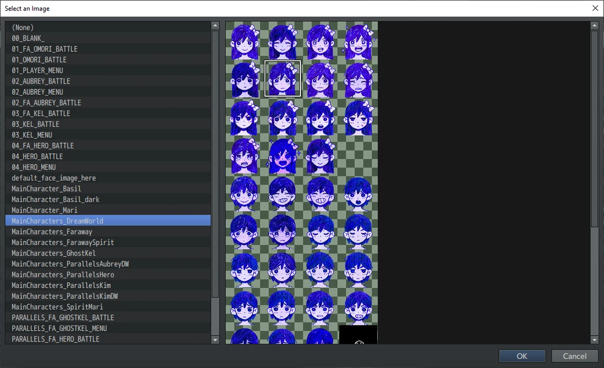

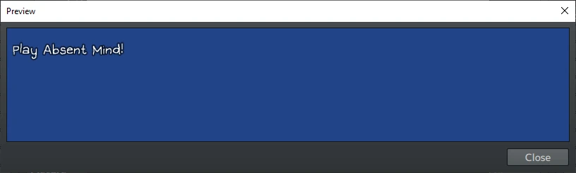

*(来源:TomatoRadio)*

预览现在也会用 <span class="og-g">OMORI</span> 的标准字体来显示了。

*(来源:TomatoRadio)(注:它不会显示修改过的字体版本,也不会显示 Stranger 的字体之类的替代字体)*

##### 控制变量 `Variables`现在可以设为等于某个 `Self Variable`。

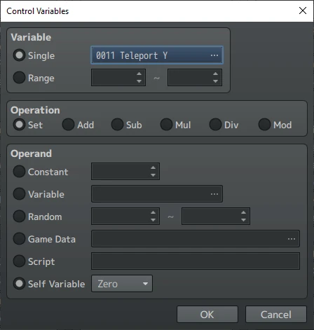

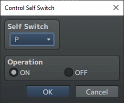

*(来源:TomatoRadio)*

##### 控制独立开关

独立开关现在可以用上全部字母了!

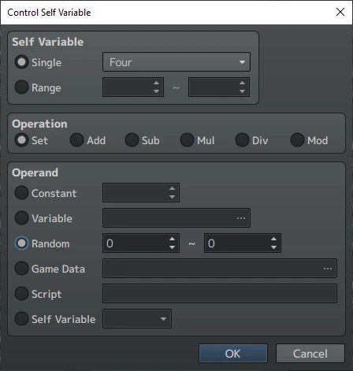

*(来源:TomatoRadio)*

##### 新增——控制独立变量 <span class="og-g">OneMaker</span> 的新功能,这条命令让你能设置 `Self Variables`——一种通常只有 `Scripts` 才能用的数据类型。它们的行为和普通 `Variables` 一模一样,只是附属于某个 `Event`,就像 `Self Switch` 那样。你一共有 10 个 `Self Variables` 槽位可用。

*(来源:TomatoRadio)*

##### 条件分支 `Conditional Branches` 现在可以检查 `Self Variables` 了。

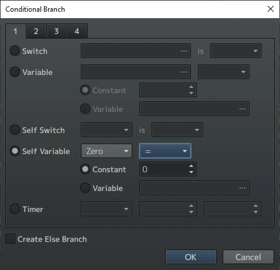

*(来源:TomatoRadio)*

##### 新增——Switch 语句

新命令 `Switch Statements` 是一份情形列表,程序求值后会运行所有匹配情形的代码。说白了,它就像一长串 If-Then 语句,只不过更简洁。

在 <span class="og-g">OneMaker</span> 里,选项就是这些。只需在 `Case’s`文本框里填入你想让输入返回的值。举例来说,如果我想为 “`Self Variable Five` 等于 ‘<var>17</var>’” 设一个情形,直接填 <var>17</var> 就行。

最后,`Default` 复选框相当于 “else”,当其他条件都不满足时就会运行。

*(注 1:`Inventory`返回你拥有的 `Item/Charm/Weapon` 数量。)*

*(注 2:`Direction`以数字形式返回。这些数字是 <span class="og-g">RPG Maker MV</span> 内部表示朝向用的:<var>2</var> 为下、<var>4</var> 为左、<var>6</var> 为右、<var>8</var> 为上。它们来源于计算器和手机上的数字小键盘。)*

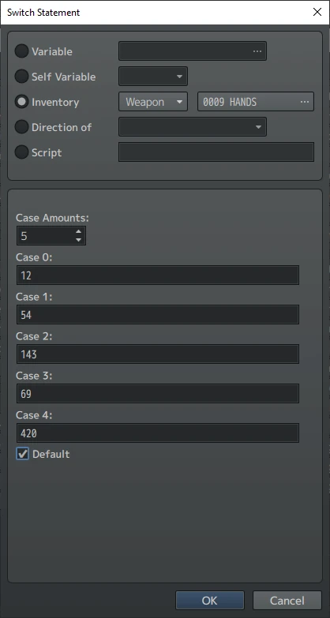

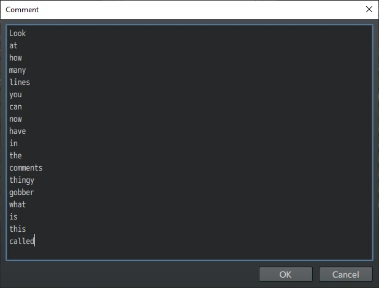

*(来源:TomatoRadio)*

##### 注释

现在你可以往 `Comments` 里加几乎无限多行了。

*(来源:TomatoRadio)*

##### 设置移动路径

现在你可以显示 `Map`,点击 `Tiles`和 `Events`来查看它们的坐标和 `IDs`,写脚本时很方便。

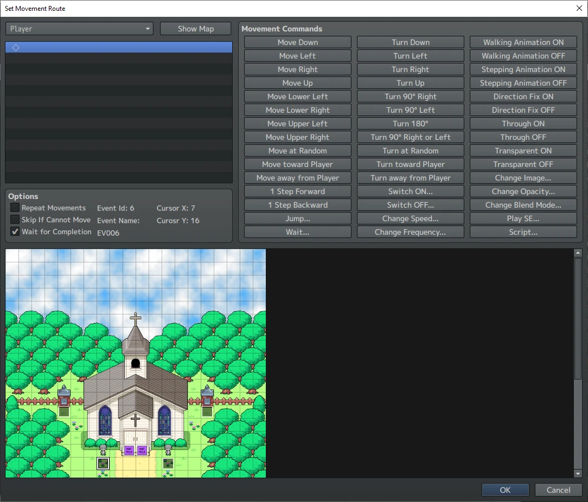

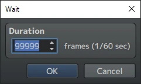

*(来源:TomatoRadio)*

##### 等待

等待时间现在最长可以设到 99999 帧,约合 27.7 分钟。

*(来源:TomatoRadio)*

##### 新增——声音管理器

新命令 `Sound Manager` 把所有音频功能都集中到一条命令里,还附赠一些原本没有的额外功能。包括:

- `Fade In` 和 `Fade OutBGM`以及 `BGS`,可指定具体时机
- `Save` 和 `Replay BGM` 以及 `BGS`,各有 <var>4</var> 个槽位
- 声音的 `Pitches` 范围现在可以是 <var>5%</var> 到 <var>200%</var>,而不是 <var>50%</var> 到

```text
150%.
```

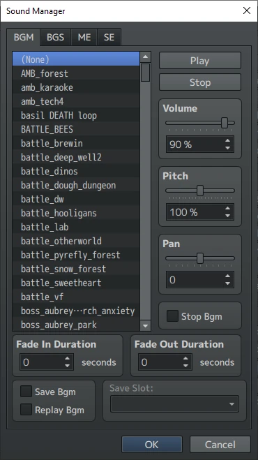

*(来源:TomatoRadio)*

##### 脚本

现在 `Script`命令里几乎可以写无限多行了。

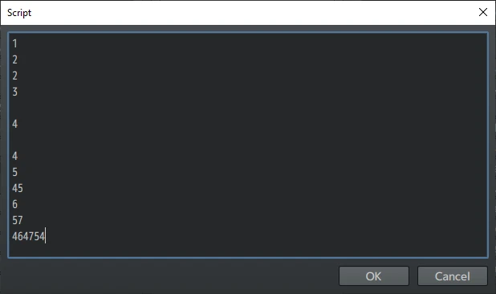

*(来源:TomatoRadio)*

##### 新增——YAML 选择器

新命令 YAML 选择器让你可以直接预览并选取 YAML 里的消息,不必再手动敲出来。在这里选择要显示的消息,还可以像这样加上选项;

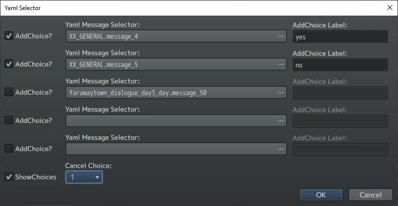

*(来源:TomatoRadio)*

然后从这个菜单里选中具体那条消息;

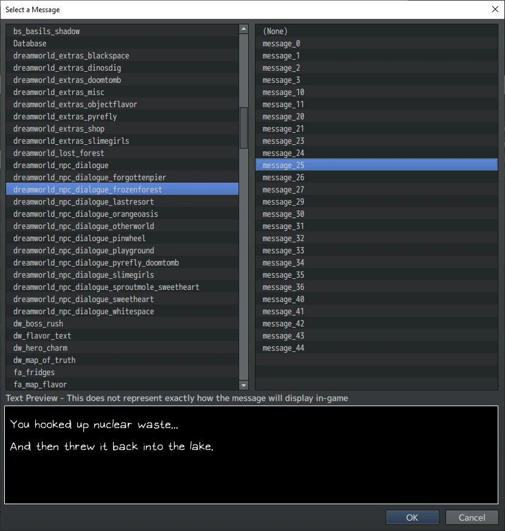

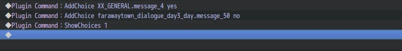

*(来源:TomatoRadio)*

接着它就会被转换成 `Plugin Command`,和原版游戏的做法一模一样!

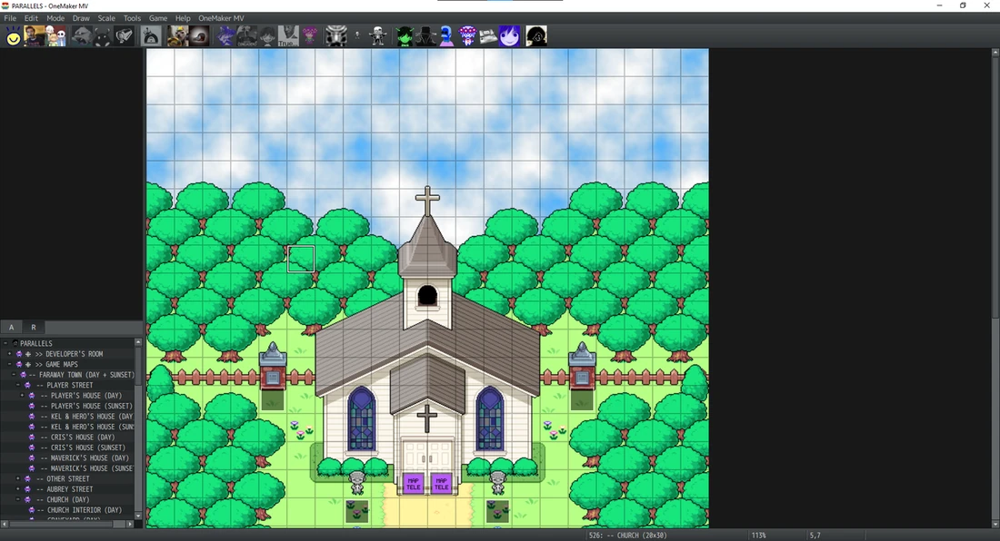

*(来源:TomatoRadio)*

##### 新增——玩家转移脚本

一条新命令,自动搞定 `Map Teleports` 的创建。只需输入你的位置和其他相关信息,它就会被转换成 `Script`。

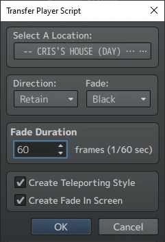

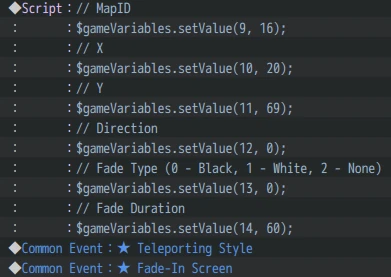

*(来源:TomatoRadio)*

##### 新增——角色移动动画

一条新命令,可以自动为你的 `Actors` 设置步行和奔跑的行走图。

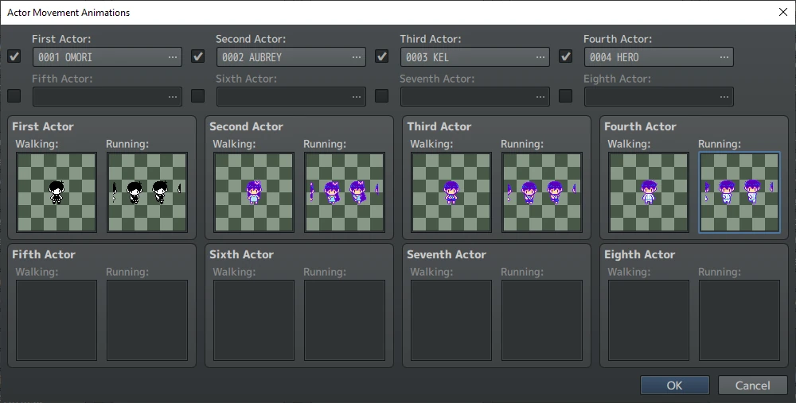

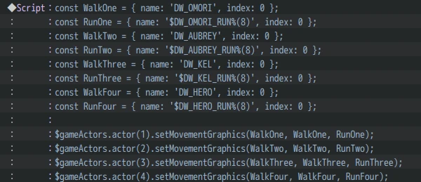

*(来源:TomatoRadio)*

#### 扩展的敌群事件条件

敌群事件获得了可用的新条件。包括:

- 开关
- 变量
- 对角色和敌人的状态检查
- 检查队伍物品栏中是否持有某件物品/武器/挂饰
- 脚本

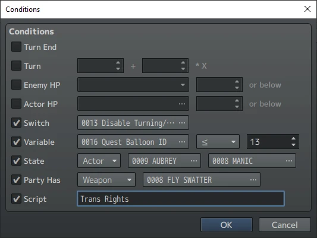

*(来源:TomatoRadio)*

#### 扩展的事件搜索器 `Event Searcher` 现在可以搜索 `Names`、`Note`、`Comments` 以及

事件的脚本(Scripts)。

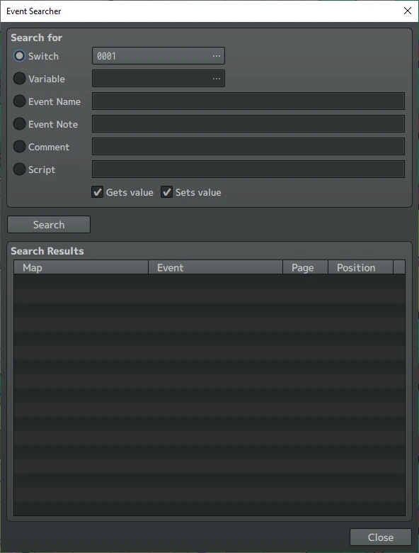

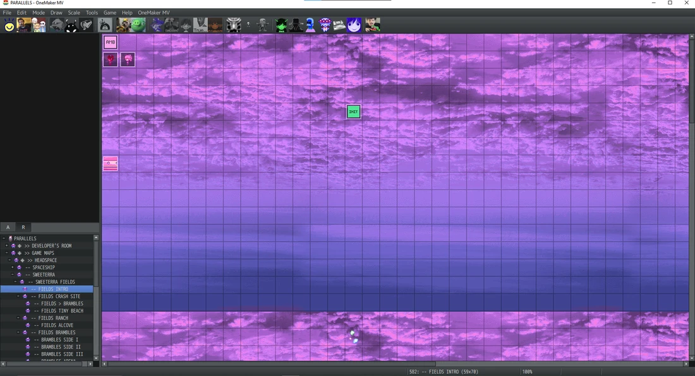

*(来源:TomatoRadio)*

#### 自定义界面 <span class="og-g">OneMaker</span> 自带三个能更换 <span class="og-g">RPG Maker</span> 界面的图像包。<var>Koffin</var>和 <var>Krypt</var>图像包用的是 <span class="og-g">Cookie Run Kingdom</span> 的 UI,<var>MZ</var> 图像包则用 <span class="og-g">RPG Maker MZ</span>(<span class="og-g">MV</span> 的后继版本)的 UI。你也可以选择 Custom 图像包,它完全空白,专供自制 UI 使用。你可以把自己的 UI 通过 `RPG Maker`

`MV/_hijack_root/qml/Images` 加进去,然后创建一个名为 <var>Custom</var> 的文件夹。

大小写不能错!

下面这张是我自己在用的图片示例:

*(来源:TomatoRadio)*

它做得相当垃圾,但正好演示了你可以在这里用任何你喜欢的图片。

如果你出于某种原因就是想用它,[链接](https://drive.google.com/file/d/1UBdwmCFE008Xwy5s0C7RiODf_loDM6t2/view?usp=sharing)在此。
