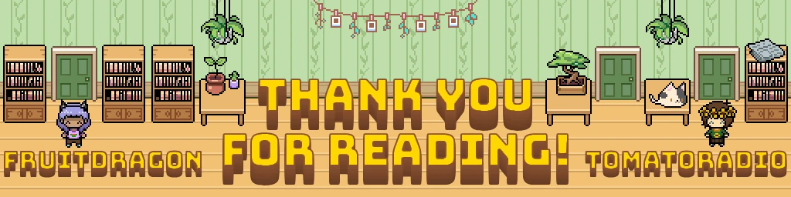

感谢你读完这本指南!我们希望,有了这本几乎覆盖 <span class="og-g">OMORI</span> Mod 制作全部核心内容的综合性指南,能让更多人入坑 Mod 制作,也让我们能在 [Mods.one](http://mods.one) 上看到更多酷东西。所以,放开手脚去做那个不知为何要以 <span class="og-g">Black Mesa</span> 为舞台的 <span class="og-g">OMORI</span> Mod 吧,做完记得跟我们汇报战果!

### 其他社区资源:

- [OMORI MODDING MASTER SHEET](https://docs.google.com/document/d/1LyoDxBbtw4MUb7HirIZEaigpbJOcbwTelby7vttIAlg/edit#heading=h.a9584kkoaaoo):最早的 <span class="og-g">OMORI</span> Mod 制作教程。
- [Omori Modding Wiki](https://omori-modding.gitbook.io/wiki/getting-started/overview):一个关于 <span class="og-g">OMORI</span> Mod 制作的维基
- [Omori Modding Resources](https://github.com/modsone/omori-modding-resources/tree/main):一个收录实用插件和链接的 <span class="og-g">Github</span> 仓库。说不定你就是从这里找到我们的!
- [Text Formatting](https://github.com/Gilbert142/gomori/wiki/Text-Formatting):一个数据库,收录了存在于

```text
OMORI.
```

- [OmoriMapRenderer](https://github.com/rphsoftware/omori-map-preview-renderer/releases/tag/0.1.0):渲染 <span class="og-g">OMORI</span> 地图,用作事件参考图。
- [All Omori Dialogue, Maps, & Switches/Variables](https://goats.dev/omori/):一个数据库,收录全部对话、地图及其事件,还有开关/变量。
- [Art Resources](https://drive.google.com/drive/folders/1vcF7JHc48zmZrEXV2bklRCMGrFio2c_8):一个 Google Drive,汇集各种 <span class="og-g">OMORI</span> 图片素材。
- [OMORI OST Info](https://docs.google.com/spreadsheets/d/1JNYYw37xuOqLewoOAWo6n4xhP9rwQzmcIw5O_IXAjJk/edit#gid=0):<span class="og-g">OMORI</span> 全部音乐的信息索引。
- [OMORI Audio Resource Index](https://docs.google.com/spreadsheets/d/1K-umUDEsxbIlxnhmtlzh_Rg42zr_zKGPNZO2UJXn-dE/edit?gid=0#gid=0):<span class="og-g">OMORI</span> 全部音频的信息索引。
- [RPG Maker MZ / MV Script Calls](https://docs.google.com/spreadsheets/d/1-Oa0cRGpjC8L5JO8vdMwOaYMKO75dtfKDOetnvh7OHs/htmlview?pli=1#gid=0):超大型脚本与脚本调用数据库,供 <span class="og-g">RPG Maker MV</span> 使用。
- [Mods.one Discord Server](https://discord.gg/EDTMF85Hnp):了解 <span class="og-g">mods.one</span> 本站动态的好去处。
- [OMORI Modding Hub Discord Server](https://discord.gg/pkBEr7ywCG):服务一切 Mod 制作需求的服务器。大多数大型 Mod 的更新和发布都在这里,游玩和制作 Mod 方面的技术支持也触手可及。

## 🎬 开发者内部内容

## **待办:**

完成图块集电子表格(TR)

撰写 GitHub 章节(FruitDragon)(进行中)

添加一个关于在 Discord 中展示 Github Commits 的小节

完成脚本章节(FD)

讲一讲自定义区域图块

在“精灵与美术”章节里添加 Windowskins 小节

在“精灵与美术”章节里添加图标小节(FD)

等仓库更新获批后,把 Stahl\_AltItemIcon 链接到文档里

完成地图章节

*加一条关于把图块地图下载成 png 用作远景事件参考的说明*

*设置动态图块*

远景图制图

添加一个“接下来做什么?”章节

修整并补上需要的横幅(TR)

把白色空间横幅上的名字从 FruiDragon 改成 FruitDragon

添加一个 Github 横幅

深井需要像真正的深井那样加上变暗覆盖层

遥远镇那边的檐台和球场需要用固定的颜色。

去掉 OO 里奇怪的阴影

修一下冰面,或者重做 FF 横幅

SGL 的角色没有变暗。而且变暗效果也不是应有的蓝色。

添加一个常见报错横幅

添加一个“接下来做什么?”横幅

## **可能要做的** **事项清单**

Plot Armor(它是一种状态,在上面提到的同一个 wiki 里有讲解)

为角色和动画制作模板。也许再给其他一些东西做模板,但那些你其实基本用不上。

*游戏里有大量 Yanfy 插件的备注标签根本没被用上,但拿来做 Mod 似乎非常万金油,我们要不要拿它们做点文章?其中一些很适合写进这里,但也有不少太进阶的东西。*

\[我可以把 Google Sites 改造成一个离谱庞大的全信息 wiki,定位是供查阅参考而非教学\]

*把这篇以评论模式发到 Mods.one 服务器,看看 Pyro 或 vl 有什么要补充的。*

## **GDoc 风格指南**

### **颜色:**

- 黑色 - 正文
- 斜体黑色 - “我们有志 Mod 制作新人”们的引言
- 斜体深灰 2 - 注释与致谢
- 蓝色 - 链接(我就是懒得把每个链接的颜色都改掉)

```text
 Purple - Code (So Notetags, Folder Paths, Etc.) <I was probably 
too liberal with this one> 
```

<var>红色——模组制作者需要自行填入的变量或其他文字</var>

<var>(基本就是那些 X)</var>

```text
 Green - Programs (OMORI, RPG Maker MV, Tiled, Steam, etc)
```
